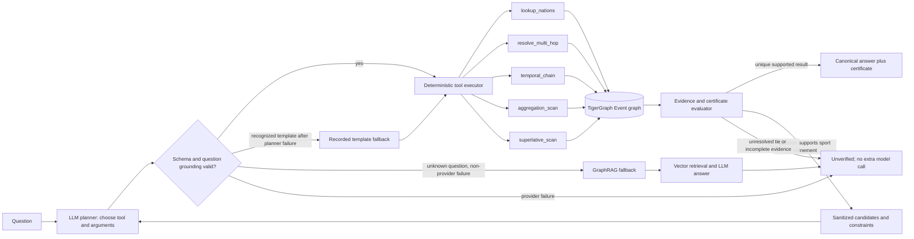

<div align="center">

# 🔎 Investigation Certificates

### Your RAG pipeline can't tell you what it *didn't* retrieve. This one proves it saw everything.

[](LICENSE)
[](pyproject.toml)
[](agrag/graph/queries.gsql)
[](agrag/decision.py)
[](results/summary_agentic_planner.json)
[](tests/)
[](docs/hackathon-brief.md)

**[How it works](#how-it-works)** · **[Architecture](#architecture)** · **[The benchmark](#the-benchmark)** · **[JEV addition](#-jev-addition)** · **[The certificate](#the-certificate)** · **[Try it](#try-it)**

</div>

<div align="center">
  
</div>

---

## Why completeness needs graph structure (historical baseline example)

> *How many athletics events at the 2004 Summer Olympics had more than 41 competitors?*

Plain RAG retrieves the top 4 chunks, reads them, and confidently answers **1**. GraphRAG expands one hop, sees 12 chunks, and confidently answers **2**.

The real answer is **20**. There were **43** matching events in the graph.

Both pipelines were wrong for the same reason, and it isn't the model: **similarity search retrieves what looks relevant, and counting questions need everything that *is* relevant.** No value of `k` fixes that. Worse, neither pipeline had any way to know it was working from 9% of the evidence — it reports the same confident tone either way.

So stop grading the answer and start proving the evidence.

## How it works

The graph already knows how many events match `sport = athletics AND games = 2004 Summer`. It's a `COUNT`. That number is a **structural bound** — the size of the complete answer set, straight from TigerGraph.

Every answer this pipeline emits ships an **Investigation Certificate**: a JSON record putting the structural bound next to the evidence the agent actually inspected. If they match, the answer is provably complete. If they don't, the certificate says so instead of hiding it.

In the default **planner** mode, the LLM chooses among five typed, allowlisted graph tools and supplies grounded arguments. Python validates that choice and the evidence; the model cannot provide a certified answer. If planning fails for a recognized benchmark question, the existing deterministic router remains available as an explicit fallback. The **template** mode keeps the earlier fixed routing for comparison. Neither mode delegates graph counts to the LLM:

| Completeness class | Question types | How it's answered | Certificate proves |
|---|---|---|---|
| **existential** | lookup, multi-hop | exact match / venue+date traversal | the entity resolved uniquely |
| **chained** | temporal | `PREV`/`NEXT` hop chain | the hop sequence was actually walked |
| **exhaustive** | aggregation, superlative | Full graph scan plus Python count over every matching event | evidence set **==** the graph's own count |

Questions the planner cannot ground stay unverified. GraphRAG recovery is reserved for non-provider failures on unknown question types; provider failures do not trigger another model call. A venue tie remains unverified unless the question itself supplies a supported sport constraint.

## Architecture



Exported image (for the demo video / slide deck / hackathon submission form): [`docs/diagrams/architecture.png`](docs/diagrams/architecture.png) (also available as [`.svg`](docs/diagrams/architecture.svg)). Rendered from [`docs/diagrams/architecture.mmd`](docs/diagrams/architecture.mmd). Full architectural rationale: [`docs/architecture-jev.md`](docs/architecture-jev.md).

The repository contains three benchmark pipelines. The current October agentic planner and template comparison each ran the 100 public questions against the refreshed graph; the RAG and GraphRAG measurements below are September historical results. The planner also ran all 50 hidden questions, which have no available gold labels:

- **RAG** — vector top-k over text chunks, one LLM call.
- **GraphRAG** — top-k chunks plus a fixed one-hop graph expansion (PREV/NEXT/same-venue), one LLM call.
- **Agentic:** default LLM planner mode selects a typed graph tool; deterministic Python executes it and evaluates evidence. The earlier template mode remains available for a direct comparison.

## 🆒 JEV addition

Integrated via PR #1, TypeSafe AI's **Jev System One** decision model ([`agrag/decision.py`](agrag/decision.py)) brings fast, non-autoregressive typed decisions into the TigerGraph Agentic GraphRAG pipeline. Instead of relying solely on heavy generative text models, Jev provides discrete typed decisions consumed by software control flow; read its actual token and latency costs from the recorded trace. Complete technical specifications are detailed in [`JEV.md`](JEV.md) and [`docs/architecture-jev.md`](docs/architecture-jev.md).

### Capabilities (Jev template mode)

Jev remains an optional typed decision model in template mode. It is not the default planner and a candidate choice is not proof that a venue/date tie is unique.

1. **Non-Template Intent Classification**
   - The primary router uses rigid regex heuristics over benchmark phrasing. Arbitrary natural language questions outside template syntax previously defaulted to unverified RAG.
   - Jev System One acts as an intent classifier across the five evidential classes (`lookup`, `multi_hop`, `temporal`, `aggregation`, `superlative`), matching **5/5** un-templated queries in a small exploratory probe; this is not a broad accuracy estimate, and current costs should be read from the recorded traces.

| Test Query | Regex Router | Jev System One Route | Result |
|---|---|---|---|
| *How many countries participated in the 1996 Summer Olympics?* | `unknown` (Unverified RAG) | `lookup` (existential) | **Pass** (conf=1.00) |
| *Tell me who took the gold medal at ExCeL on 30 July 2012* | `unknown` (Unverified RAG) | `multi_hop` (existential) | **Pass** (conf=1.00) |
| *Which athlete won the 100m sprint right before the 2012 Games?* | `unknown` (Unverified RAG) | `temporal` (chained) | **Pass** (conf=1.00) |
| *Find the number of wrestling events in 2004 with more than 20 competitors* | `unknown` (Unverified RAG) | `aggregation` (exhaustive) | **Pass** (conf=1.00) |
| *What was the largest event by participant count in 2008?* | `unknown` (Unverified RAG) | `superlative` (exhaustive) | **Pass** (conf=1.00) |

2. **Typed Candidate Decisions**
   - In template mode, Jev may rank candidate Events. The choice remains a hypothesis when more than one Event satisfies the question.
   - The certificate therefore marks unresolved ties as `unverified`, even if a decision model returns a candidate.

3. **Verifiable Certificate Step Logging**
   - Every Jev decision emits structured telemetry into the **Investigation Certificate**:

```json
{
  "tool": "jev_disambiguate",
  "note": "Jev selected a candidate; evidence remains ambiguous",
  "tokens": {"input": 697, "output": 67},
  "latency_ms": 387
}
```

### Jev Quickstart & Benchmarking

Configure in `.env`:
```env
JEV_API_KEY=your_typesafe_jev_key
JEV_MODEL=jev-latest
JEV_TIMEOUT_MS=5000
```

Run the benchmark and decision model tests:
```bash
python scripts/benchmark_jev.py          # benchmark intent routing and pub-060 disambiguation
python -m pytest tests/test_decision_jev.py # verify decision-model contract with offline test doubles
```

## The benchmark

<div align="center">
  
</div>

The chart above is the original **September 30, 2026** three-pipeline run. It predates the parser repair and Event graph refresh, so its RAG and GraphRAG numbers are historical context rather than a current same-graph comparison.

| Historical pipeline | Accuracy | Avg tokens | Avg latency |
|---|---:|---:|---:|
| RAG | 25% | 1,389 | 9.32 s |
| GraphRAG | 43% | 2,203 | 15.51 s |
| Template agentic | 99% | 18 | 0.41 s |

The template agentic pipeline uses deterministic TigerGraph tools for the five benchmark classes. Its historical result scored 100% on aggregation and superlative because those tools inspect the full sport/Games set instead of inferring a count from retrieved chunks. The original breakdown remains in [`results/summary.json`](results/summary.json).

### Current agentic runs on the refreshed graph (October 7, 2026)

The source parser now includes the 25 previously omitted Event records. TigerGraph contains **2,187 Event IDs**, exactly matching the parsed corpus; `Q942805` is present with the Olympic Tennis Centre date range and canonical gold. The vector chunks and embeddings were left untouched.

| Mode (100 public questions) | Accuracy | Avg tokens | Avg latency | Planner-selected actions | Unverified ties |
|---|---:|---:|---:|---:|---:|
| Template | 99% | 14.3 | 0.414 s | 0 | 2 |
| LLM planner | 98% | 1,148.5 | 1.769 s | 86 | 2 |

Both runs use the refreshed TigerGraph Event graph and the same Groq model. The template mode makes model selections on both ambiguous questions: it misses `pub-060` and happens to match `pub-099`; both certificates correctly stay `unverified`. Planner mode abstains on both, so its measured answer accuracy is one point lower. It selects and grounds a graph tool for 86 questions; malformed or ungrounded actions use an explicit deterministic fallback. This run demonstrates LLM-led tool selection, but it **does not improve public accuracy or efficiency** over the template mode.

The current planner outputs are [`results/agentic_planner_public.jsonl`](results/agentic_planner_public.jsonl) and [`results/agentic_planner_hidden.jsonl`](results/agentic_planner_hidden.jsonl). The current template comparison is [`results/agentic_template_public.jsonl`](results/agentic_template_public.jsonl). Hidden labels are not available, so no hidden accuracy is reported. The planner returned `Li TingSun Tiantian` for `eval-001` from `Q942805` with a verified exact venue/date pass.

The RAG and GraphRAG numbers in the chart have not been rerun after the Event refresh. Do not compare them with the current planner figures as if all three used the same graph snapshot. The existing summaries and raw files remain available as historical baseline results.

## The certificate

```json
{
  "qid": "pub-045",
  "qtype": "aggregation",
  "completeness_class": "exhaustive",
  "retrieval_mode": "structural_scan",
  "predicate": { "sport": "athletics", "games": "2004 Summer", "threshold": 41 },
  "structural_bound": 43,
  "evidence_set_size": 43,
  "completeness_check": "pass",
  "stop_reason": "planner_action_complete",
  "planning_mode": "planner",
  "selected_tool": "aggregation_scan",
  "planner_status": "selected",
  "tokens": { "total": 665 },
  "latency_ms": 1381
}
```

`structural_bound` is the size of the full graph result; `evidence_set_size` is what the agent actually inspected. They match, so this evidence set is complete — and you can check that yourself without trusting the model.

## Try it

```bash
pip install -r requirements.txt && pip install -e .
python -m pytest -q -m "not integration"  # offline suite; no TigerGraph needed
```

Point it at a live graph by copying `.env.example` to `.env` and filling in `TG_HOST` / `TG_GRAPH` / `TG_SECRET` (a TigerGraph Savanna workspace), `GROQ_API_KEY` (one key or a comma-separated same-organization key pool), and optionally `JEV_API_KEY`. Then:

```bash
python scripts/tg_setup.py --schema --queries   # install schema + GSQL queries
python scripts/tg_load.py                       # ~2,951 docs, ~20k chunks
python scripts/reconcile.py --backend tigergraph

python -m agrag.eval.run --pipeline rag       --backend tigergraph
python -m agrag.eval.run --pipeline graphrag  --backend tigergraph
python -m agrag.eval.run --pipeline agentic --agent-mode planner --backend tigergraph
python -m agrag.eval.run --pipeline agentic --agent-mode template --backend tigergraph
python -m agrag.eval.report --public results/agentic_planner_public.jsonl --out results/summary_agentic_planner.json
python -m agrag.eval.report --public results/agentic_template_public.jsonl --out results/summary_agentic_template.json

streamlit run dashboard/app.py                  # side-by-side comparison (also live: https://investigation-certificates.streamlit.app/)
```

Completeness was validated, not assumed: reconciliation ran twice — once locally against the parsed corpus before any agent code existed, and again against the loaded graph — and both records are committed in [`data/`](data/).

## Built with

Demo: https://www.loom.com/share/6c4edb59ed714f1694d1bc65cca2d934  
Live dashboard: https://investigation-certificates.streamlit.app/  
**TigerGraph Savanna** (graph + vector attributes, GSQL structural scans) · **TypeSafe AI Jev** (System One non-autoregressive decision model) · **Groq** for the LLM action planner and bounded recovery calls · **Streamlit** for the comparison dashboard. Built for the TigerGraph Agentic GraphRAG Hackathon.

Deeper reading: [architecture diagram](docs/diagrams/architecture.png) · [Jev architecture explanation](docs/architecture-jev.md) · [Jev technical notes](JEV.md) · [idea spec & council review](docs/idea-spec.md) · [literature scan](docs/research-scan-agentic-graphrag.md) · [hackathon brief](docs/hackathon-brief.md) · [build status](docs/status.md)

<div align="center">
<br>
<b>Investigation Certificates</b> — prove the evidence, don't just trust the answer.
</div>
