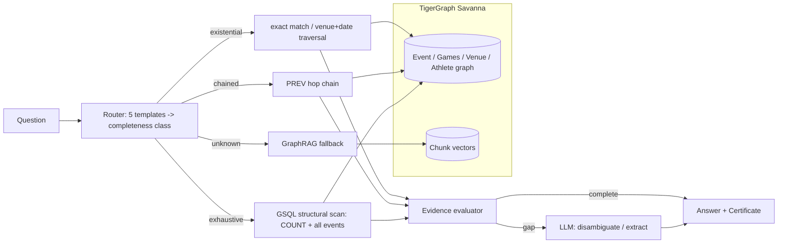

# Investigation Certificates for Agentic GraphRAG

Built for the TigerGraph Agentic GraphRAG Hackathon (Unstop). Full rules and dataset facts in `docs/hackathon-brief.md`; the idea, its literature grounding, and the LLM-council review that shaped it are in `docs/idea-spec.md` and `docs/research-scan-agentic-graphrag.md`.

## The pitch

Every answer the agentic pipeline gives ships an **Investigation Certificate**: a JSON record proving, using the graph's own structure, that the evidence behind the answer is as complete as the question requires — not just that the final answer looks right. For counting and superlative questions (which need every matching event, not just a plausible few), the certificate reports TigerGraph's own structural bound (a `COUNT` over the exact filter predicate) next to the evidence set the agent actually inspected. Plain RAG and vanilla GraphRAG have no way to know they only saw 8 of 41 matching events; this pipeline proves it did or didn't.

**Scoping note, stated plainly rather than discovered under questioning:** the question router is a benchmark-scoped heuristic — a template matcher over this hackathon's five known question types, not a general-purpose learned router. It works because this corpus's completeness is structurally expressible (an exact `sport + games` filter bounds the answer set). That property doesn't hold for every corpus, and the write-up doesn't claim otherwise.

## Architecture



Three pipelines answer the same 150 benchmark questions (100 public with gold answers, 50 hidden):

- **RAG** — vector top-k over text chunks, one LLM call.
- **GraphRAG** — top-k chunks plus a fixed one-hop graph expansion (PREV/NEXT/same-venue), one LLM call.
- **Agentic** — routes by completeness class, uses cheap deterministic graph queries where they suffice, calls the LLM only to disambiguate ties or recover a missing field, and emits a certificate.

## Reproduction

```bash
pip install -r requirements.txt
pip install -e .
python scripts/download_data.py          # or use the data/ files already in this repo
```

Copy `.env.example` to `.env` and fill in:
- `TG_HOST`, `TG_GRAPH`, `TG_SECRET` — a TigerGraph Savanna workspace with the graph and vector attribute created (`agrag/graph/schema.gsql`) and the queries installed (`agrag/graph/queries.gsql`) — paste both into the workspace's Query Editor, or use `python scripts/tg_setup.py --schema` / `--queries`.
- `GROQ_API_KEY` — free, no card required, at https://console.groq.com/keys (default provider; `.env` also supports switching to Anthropic).

Then:

```bash
python scripts/tg_smoke.py                              # confirm the connection
# If tg_smoke.py fails with a 500/502, the Savanna free-tier workspace has likely auto-suspended
# (it does this after ~60 min idle). Resume it in the Savanna dashboard, then:
python scripts/tg_wait.py                               # polls until it's back, or times out
python scripts/tg_load.py                                # load corpus.jsonl into the graph (~2,951 docs, ~20k chunks)
python scripts/reconcile.py --backend tigergraph          # council-mandated completeness check (see docs/idea-spec.md §6)
python -m agrag.eval.run --pipeline rag --backend tigergraph
python -m agrag.eval.run --pipeline graphrag --backend tigergraph
python -m agrag.eval.run --pipeline agentic --backend tigergraph
python -m agrag.eval.run --pipeline rag --backend tigergraph --questions data/eval_hidden.jsonl
python -m agrag.eval.run --pipeline graphrag --backend tigergraph --questions data/eval_hidden.jsonl
python -m agrag.eval.run --pipeline agentic --backend tigergraph --questions data/eval_hidden.jsonl
python -m agrag.eval.report
streamlit run dashboard/app.py
```

Run the test suite (no TigerGraph needed — everything except `tests/integration/` runs against an in-memory backend):

```bash
python -m pytest
```

## Certificate schema (v0)

```json
{
  "qid": "pub-045",
  "qtype": "aggregation",
  "completeness_class": "exhaustive",
  "retrieval_mode": "structural_scan",
  "predicate": {"sport": "Athletics", "games": "2004 Summer", "threshold": 41},
  "structural_bound": 41,
  "evidence_set_size": 41,
  "completeness_check": "pass",
  "docs_inspected": ["Q1", "Q2", "..."],
  "steps": [{"tool": "aggregation_scan", "note": "bound=41; regex-recovered=[]"}],
  "tokens": {"input": 0, "output": 0, "context": 0, "total": 0},
  "latency_ms": 340,
  "stop_reason": "structural_bound_met"
}
```

Every question class gets a certificate, not just counting questions — `existential` (lookup/multi-hop) certifies exact-match resolution, `chained` (temporal) certifies the PREV/NEXT hop sequence was actually walked, `exhaustive` (aggregation/superlative) certifies the evidence set equals the graph's own structural count.

## Reconciliation

Reconciliation ran twice, per `docs/idea-spec.md` §6: locally against the parsed corpus before any agent/orchestrator code existed (`data/reconciliation-local.json`), and again against the loaded TigerGraph graph after loading (`data/reconciliation-tigergraph.json`). Both are committed as evidence the completeness claim was validated, not assumed.

<!-- RESULTS_TABLE_PLACEHOLDER -->

## Repo layout

- `agrag/` — the package: infobox parsing, router, deterministic tools, certificate model, three pipelines, TigerGraph backend.
- `agrag/graph/` — GSQL schema and queries, the only place that talks to `pyTigerGraph`.
- `scripts/` — one-shot operational scripts (data download, TigerGraph setup/load/smoke test, reconciliation).
- `tests/` — unit tests against an in-memory backend; `tests/integration/` needs a live `TG_HOST`.
- `dashboard/` — Streamlit comparison dashboard.
- `docs/` — hackathon rules, literature scan, idea spec (with the LLM council's verdict), build status.
