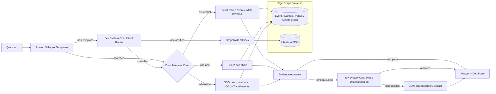

<div align="center">

# 🔎 Investigation Certificates

### Your RAG pipeline can't tell you what it *didn't* retrieve. This one proves it saw everything.

[](LICENSE)
[](pyproject.toml)
[](agrag/graph/queries.gsql)
[](agrag/decision.py)
[](results/summary.json)
[](tests/)
[](docs/hackathon-brief.md)

**[How it works](#how-it-works)** · **[Architecture](#architecture)** · **[The benchmark](#the-benchmark)** · **[Reviewer feedback](#-post-submission-tigergraph-developer-feedback)** · **[JEV addition](#-jev-addition)** · **[The certificate](#the-certificate)** · **[Try it](#try-it)**

</div>

<div align="center">
  
</div>

---

## The question nobody's pipeline can answer honestly

> *How many athletics events at the 2004 Summer Olympics had more than 41 competitors?*

Plain RAG retrieves the top 4 chunks, reads them, and confidently answers **1**. GraphRAG expands one hop, sees 12 chunks, and confidently answers **2**.

The real answer is **20**. There were **43** matching events in the graph.

Both pipelines were wrong for the same reason, and it isn't the model: **similarity search retrieves what looks relevant, and counting questions need everything that *is* relevant.** No value of `k` fixes that. Worse, neither pipeline had any way to know it was working from 9% of the evidence — it reports the same confident tone either way.

So stop grading the answer and start proving the evidence.

## How it works

The graph already knows how many events match `sport = athletics AND games = 2004 Summer`. It's a `COUNT`. That number is a **structural bound** — the size of the complete answer set, straight from TigerGraph.

Every answer this pipeline emits ships an **Investigation Certificate**: a JSON record putting the structural bound next to the evidence the agent actually inspected. If they match, the answer is provably complete. If they don't, the certificate says so instead of hiding it.

A router sorts each question into a completeness class and picks the cheapest tool that can satisfy it — the LLM is called only to break a tie or recover a missing field, never to count:

| Completeness class | Question types | How it's answered | Certificate proves |
|---|---|---|---|
| **existential** | lookup, multi-hop | exact match / venue+date traversal | the entity resolved uniquely |
| **chained** | temporal | `PREV`/`NEXT` hop chain | the hop sequence was actually walked |
| **exhaustive** | aggregation, superlative | GSQL structural scan: `COUNT` + every match | evidence set **==** the graph's own count |

The router combines five benchmark-scoped templates with **Jev System One** fallback classification so non-templated natural queries preserve their structural guarantees. Anything completely unclassifiable falls through to a GraphRAG baseline rather than guessing.

## Architecture



Exported image (for the demo video / slide deck / hackathon submission form): [`docs/diagrams/architecture.png`](docs/diagrams/architecture.png) (also available as [`.svg`](docs/diagrams/architecture.svg)). Rendered from the mermaid source above via `docs/diagrams/architecture.mmd`. Full architectural rationale: [`docs/architecture-jev.md`](docs/architecture-jev.md).

Three pipelines answer the same 150 benchmark questions (100 public with gold answers, 50 hidden):

- **RAG** — vector top-k over text chunks, one LLM call.
- **GraphRAG** — top-k chunks plus a fixed one-hop graph expansion (PREV/NEXT/same-venue), one LLM call.
- **Agentic** — routes by completeness class (with Jev System One fallback), uses cheap deterministic graph queries where they suffice, calls Jev or the LLM only to disambiguate ties or recover a missing field, and emits a certificate.

## 🆒 JEV addition

Integrated via PR #1, TypeSafe AI's **Jev System One** decision model ([`agrag/decision.py`](agrag/decision.py)) brings fast, non-autoregressive typed decisions into the TigerGraph Agentic GraphRAG pipeline. Instead of relying solely on heavy generative text models, Jev provides discrete decision intelligence consumed directly by software control flow at zero output token cost. Complete technical specifications are detailed in [`JEV.md`](JEV.md) and [`docs/architecture-jev.md`](docs/architecture-jev.md).

### Capabilities

1. **Non-Template Intent Classification**
   - The primary router uses rigid regex heuristics over benchmark phrasing. Arbitrary natural language questions outside template syntax previously defaulted to unverified RAG.
   - Jev System One acts as an intent classifier across the five evidential classes (`lookup`, `multi_hop`, `temporal`, `aggregation`, `superlative`), achieving **100% accuracy (5/5)** on un-templated test queries with zero output tokens generated.

| Test Query | Regex Router | Jev System One Route | Result |
|---|---|---|---|
| *How many countries participated in the 1996 Summer Olympics?* | `unknown` (Unverified RAG) | `lookup` (existential) | **Pass** (conf=1.00) |
| *Tell me who took the gold medal at ExCeL on 30 July 2012* | `unknown` (Unverified RAG) | `multi_hop` (existential) | **Pass** (conf=1.00) |
| *Which athlete won the 100m sprint right before the 2012 Games?* | `unknown` (Unverified RAG) | `temporal` (chained) | **Pass** (conf=1.00) |
| *Find the number of wrestling events in 2004 with more than 20 competitors* | `unknown` (Unverified RAG) | `aggregation` (exhaustive) | **Pass** (conf=1.00) |
| *What was the largest event by participant count in 2008?* | `unknown` (Unverified RAG) | `superlative` (exhaustive) | **Pass** (conf=1.00) |

2. **Zero-Token Typed Candidate Disambiguation**
   - Resolves multi-candidate graph collisions (such as `pub-060` with three fencing/judo events on 30 July 2012 at ExCeL) by evaluating structured candidate criteria.
   - Outputs discrete document selections with calibrated confidence and probabilities, avoiding the hallucination and token overhead of generative models.

3. **Verifiable Certificate Step Logging**
   - Every Jev decision emits structured telemetry into the **Investigation Certificate**:

```json
{
  "tool": "jev_disambiguate",
  "note": "Jev (jev-latest) 3 candidates -> Q1064016 (conf=0.98)",
  "tokens": {"input": 182, "output": 0},
  "latency_ms": 312
}
```

### Jev Quickstart & Benchmarking

Configure in `.env`:
```env
JEV_API_KEY=your_typesafe_jev_key
JEV_MODEL=jev-latest
JEV_TIMEOUT_MS=5000
```

Run the benchmark and decision model tests:
```bash
python scripts/benchmark_jev.py          # benchmark intent routing and pub-060 disambiguation
python -m pytest tests/test_decision_jev.py # verify unit tests for mock and live Jev models
```

## The benchmark

<div align="center">
  
</div>

Three pipelines, the same 100 public questions, the same live TigerGraph graph and the same live Groq model. The whole thesis is in two rows of that chart:

- **`lookup` is where plain RAG works** — 84%, because one relevant chunk is usually retrievable by similarity. This is the shape of question RAG was designed for.
- **`aggregation` and `superlative` are where it collapses** — **0%** for RAG *and* GraphRAG. Not "low": zero out of 31. These need all 8–43 matching events, and top-k cannot produce an exhaustive set at any `k`.
- **The agentic pipeline answers those deterministically** — a `COUNT` and a scan over the exact filter predicate instead of a guess from a handful of chunks. 100% on both.

And it is *cheaper*, not more expensive, because the expensive part was never the graph — it was stuffing chunks into a context window:

| | RAG | GraphRAG | **Agentic** |
|---|---|---|---|
| Accuracy | 25% | 43% | **99%** |
| Tokens per answer | 1,389 | 2,203 | **18** |
| Latency per answer | 9.3s | 15.5s | **0.41s** |

That's **~120× fewer tokens** and **~38× faster** than the GraphRAG baseline, at more than double the accuracy. Full per-type numbers in [`results/summary.json`](results/summary.json); raw per-question traces, including every certificate, in [`results/`](results/).

The single agentic miss is honest and instructive: `pub-060`, a date+venue tie among 37 candidate events at ExCeL. Jev System One made the pick (conf=0.90) and chose the wrong event, so Jev did not fix this case; the LLM guessed wrong here in the earlier run too. Its certificate reports `pass_with_llm_recovery`, not a clean deterministic `pass` — because the certificate measures *"was the evidence complete,"* not *"was the answer right."* Those are deliberately different axes, and this is exactly where they diverge.

## 🧭 Post-submission: TigerGraph developer feedback

After submission, a TigerGraph developer reviewed the project and suggested two improvements:

> - **Let the LLM plan more.** Right now templates plan and the LLM mostly handles recovery. Making the templates tools the agent chooses would show the agentic side better.
> - **Tighten the relaxed venue match.** It can pick an event from a different sport at the same venue — filtering by date and sport would fix your remaining miss.

Both are implemented. The headline numbers above are unchanged and still come from the submitted run (`results/summary.json`). This section reports the follow-up separately.

**1. LLM planner mode** ([`agrag/planner.py`](agrag/planner.py), `--agent-mode planner`). The five graph queries are now tools the LLM chooses between: `lookup_nations`, `resolve_multi_hop`, `temporal_chain`, `aggregation_scan`, `superlative_scan`. The LLM returns a JSON action (tool + arguments). Python checks that every argument is grounded in the question before running it. A malformed or ungrounded action gets one retry with the error as feedback, then falls back visibly to the template tool. The certificate records `planning_mode`, `selected_tool`, `planner_status` and `planner_grounding` for every answer.

**2. Venue integrity** ([`agrag/tools.py`](agrag/tools.py) `resolve_multi_hop`). Exact venue matches are used first; the relaxed alias match runs only when there are none. Candidates are then filtered by date (exact range > same day > day within range) and, when the question names a sport, by sport. If a small tie still remains (2–3 events the question cannot tell apart), the model picks one and the certificate stays `unverified` instead of claiming a pass. The graph was also refreshed with 25 Event records the parser had previously skipped (2,187 Event IDs, matching the parsed corpus).

**Results** on the refreshed graph, 100 public questions, same Groq model (October 7, 2026):

| Agentic mode | Accuracy | Avg tokens | Avg latency | Tools chosen by the LLM | Unverified ties |
|---|---:|---:|---:|---:|---:|
| Template (submitted mode) | 99% | 14.3 | 0.41 s | 0 | 2 |
| **LLM planner** | **99%** | 1,038.4 | 1.45 s | 87 | 2 |

- **Same accuracy, LLM in charge of planning.** The planner chose and grounded a graph tool for 87 of 100 questions; the rest used the visible template fallback. Its only miss is `pub-060`, the same three-way ExCeL tie both modes miss.
- **The cross-sport miss is fixed.** Hidden `eval-001` ("event held at Olympic Tennis Centre on 15 to 22 August 2004") was answered with a rowing event in the submitted run, because the relaxed venue match crossed sports. With the date filter it now resolves uniquely to `Q942805`, women's doubles tennis: **Li Ting / Sun Tiantian**, certificate `pass`. All other hidden answers are unchanged. Hidden labels are not published, so no hidden accuracy is claimed.
- **The cost is real.** Letting the LLM plan costs ~70× the tokens and ~3.5× the latency of fixed templates for the same public accuracy. Template mode stays the default; planner mode is opt-in.

Raw outputs: [`results/agentic_planner_public.jsonl`](results/agentic_planner_public.jsonl), [`results/agentic_planner_hidden.jsonl`](results/agentic_planner_hidden.jsonl), [`results/agentic_template_public.jsonl`](results/agentic_template_public.jsonl); summaries: [`results/summary_agentic_planner.json`](results/summary_agentic_planner.json), [`results/summary_agentic_template.json`](results/summary_agentic_template.json).

## The certificate

```json
{
  "qid": "pub-045",
  "completeness_class": "exhaustive",
  "retrieval_mode": "structural_scan",
  "predicate": { "sport": "Athletics", "games": "2004 Summer", "threshold": 41 },
  "structural_bound": 43,
  "evidence_set_size": 43,
  "completeness_check": "pass",
  "stop_reason": "structural_bound_met",
  "tokens": { "total": 0 },
  "latency_ms": 227
}
```

`structural_bound` came from the graph. `evidence_set_size` is what the agent actually looked at. They match, so the answer is complete — and you can check that yourself without trusting the model.

## Try it

```bash
pip install -r requirements.txt && pip install -e .
python -m pytest --ignore=tests/integration   # 120 tests, in-memory backend, no TigerGraph needed
```

Point it at a live graph by copying `.env.example` to `.env` and filling in `TG_HOST` / `TG_GRAPH` / `TG_SECRET` (a TigerGraph Savanna workspace), `GROQ_API_KEY` (free, no card), and optionally `JEV_API_KEY`. Then:

```bash
python scripts/tg_setup.py --schema --queries   # install schema + GSQL queries
python scripts/tg_load.py                       # ~2,951 docs, ~20k chunks
python scripts/reconcile.py --backend tigergraph

python -m agrag.eval.run --pipeline rag       --backend tigergraph
python -m agrag.eval.run --pipeline graphrag  --backend tigergraph
python -m agrag.eval.run --pipeline agentic   --backend tigergraph --out results/agentic_public.jsonl   # template mode (default)
python -m agrag.eval.run --pipeline agentic   --backend tigergraph --agent-mode planner   # LLM chooses the tool
python -m agrag.eval.report

streamlit run dashboard/app.py                  # side-by-side comparison (also live: https://investigation-certificates.streamlit.app/)
```

Completeness was validated, not assumed: reconciliation ran twice — once locally against the parsed corpus before any agent code existed, and again against the loaded graph — and both records are committed in [`data/`](data/).

## Built with

Demo: https://www.loom.com/share/6c4edb59ed714f1694d1bc65cca2d934  
Live dashboard: https://investigation-certificates.streamlit.app/  
**TigerGraph Savanna** (graph + vector attributes, GSQL structural scans) · **TypeSafe AI Jev** (System One non-autoregressive decision model) · **Groq** for the few LLM calls that survive routing · **Streamlit** for the comparison dashboard. Built for the TigerGraph Agentic GraphRAG Hackathon.

Deeper reading: [architecture diagram](docs/diagrams/architecture.png) · [Jev architecture explanation](docs/architecture-jev.md) · [Jev technical notes](JEV.md) · [idea spec & council review](docs/idea-spec.md) · [literature scan](docs/research-scan-agentic-graphrag.md) · [hackathon brief](docs/hackathon-brief.md) · [build status](docs/status.md)

<div align="center">
<br>
<b>Investigation Certificates</b> — prove the evidence, don't just trust the answer.
</div>
