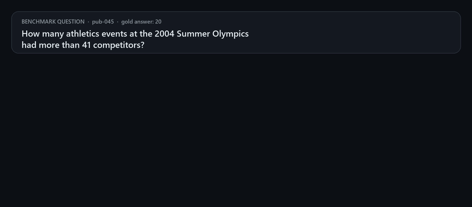
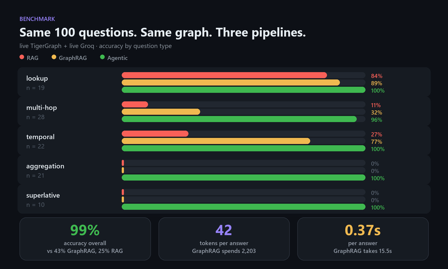

<div align="center">

# 🔎 Investigation Certificates

### Your RAG pipeline can't tell you what it *didn't* retrieve. This one proves it saw everything.

[](LICENSE)
[](pyproject.toml)
[](agrag/graph/queries.gsql)
[](results/summary.json)
[](tests/)
[](docs/hackathon-brief.md)

**[How it works](#how-it-works)** · **[The benchmark](#the-benchmark)** · **[The certificate](#the-certificate)** · **[Try it](#try-it)**

</div>

<div align="center">
  
</div>

---

## The question nobody's pipeline can answer honestly

> *How many athletics events at the 2004 Summer Olympics had more than 41 competitors?*

Plain RAG retrieves the top 4 chunks, reads them, and confidently answers **1**. GraphRAG expands one hop, sees 12 chunks, and confidently answers **2**.

The real answer is **20**. There were **43** matching events in the graph.

Both pipelines were wrong for the same reason, and it isn't the model: **similarity search retrieves what looks relevant, and counting questions need everything that *is* relevant.** No value of `k` fixes that. Worse, neither pipeline had any way to know it was working from 9% of the evidence — it reports the same confident tone either way.

So stop grading the answer and start proving the evidence.

## How it works

The graph already knows how many events match `sport = athletics AND games = 2004 Summer`. It's a `COUNT`. That number is a **structural bound** — the size of the complete answer set, straight from TigerGraph.

Every answer this pipeline emits ships an **Investigation Certificate**: a JSON record putting the structural bound next to the evidence the agent actually inspected. If they match, the answer is provably complete. If they don't, the certificate says so instead of hiding it.

A router sorts each question into a completeness class and picks the cheapest tool that can satisfy it — the LLM is called only to break a tie or recover a missing field, never to count:

| Completeness class | Question types | How it's answered | Certificate proves |
|---|---|---|---|
| **existential** | lookup, multi-hop | exact match / venue+date traversal | the entity resolved uniquely |
| **chained** | temporal | `PREV`/`NEXT` hop chain | the hop sequence was actually walked |
| **exhaustive** | aggregation, superlative | GSQL structural scan: `COUNT` + every match | evidence set **==** the graph's own count |

The router is a template matcher over this benchmark's five question types, and the completeness guarantee holds because this corpus's answer sets are structurally expressible as an exact `sport + games` filter. Anything it can't classify falls through to a GraphRAG baseline rather than guessing.

## The benchmark

<div align="center">
  
</div>

Three pipelines, the same 100 public questions, the same live TigerGraph graph and the same live Groq model. The whole thesis is in two rows of that chart:

- **`lookup` is where plain RAG works** — 84%, because one relevant chunk is usually retrievable by similarity. This is the shape of question RAG was designed for.
- **`aggregation` and `superlative` are where it collapses** — **0%** for RAG *and* GraphRAG. Not "low": zero out of 31. These need all 8–43 matching events, and top-k cannot produce an exhaustive set at any `k`.
- **The agentic pipeline answers those deterministically** — a `COUNT` and a scan over the exact filter predicate instead of a guess from a handful of chunks. 100% on both.

And it is *cheaper*, not more expensive, because the expensive part was never the graph — it was stuffing chunks into a context window:

| | RAG | GraphRAG | **Agentic** |
|---|---|---|---|
| Accuracy | 25% | 43% | **99%** |
| Tokens per answer | 1,389 | 2,203 | **42** |
| Latency per answer | 9.3s | 15.5s | **0.37s** |

That's **52× fewer tokens** and **42× faster** than the GraphRAG baseline, at more than double the accuracy. Full per-type numbers in [`results/summary.json`](results/summary.json); raw per-question traces, including every certificate, in [`results/`](results/).

The single agentic miss is honest and instructive: `pub-060`, a three-way date tie among fencing events at ExCeL, where disambiguation fell to the LLM and it guessed wrong. Its certificate reports `pass_with_llm_recovery`, not a clean deterministic `pass` — because the certificate measures *"was the evidence complete,"* not *"was the answer right."* Those are deliberately different axes, and this is exactly where they diverge.

## The certificate

```json
{
  "qid": "pub-045",
  "completeness_class": "exhaustive",
  "retrieval_mode": "structural_scan",
  "predicate": { "sport": "Athletics", "games": "2004 Summer", "threshold": 41 },
  "structural_bound": 43,
  "evidence_set_size": 43,
  "completeness_check": "pass",
  "stop_reason": "structural_bound_met",
  "tokens": { "total": 0 },
  "latency_ms": 227
}
```

`structural_bound` came from the graph. `evidence_set_size` is what the agent actually looked at. They match, so the answer is complete — and you can check that yourself without trusting the model.

## Try it

```bash
pip install -r requirements.txt && pip install -e .
python -m pytest          # 65 tests, in-memory backend, no TigerGraph needed
```

Point it at a live graph by copying `.env.example` to `.env` and filling in `TG_HOST` / `TG_GRAPH` / `TG_SECRET` (a TigerGraph Savanna workspace) plus `GROQ_API_KEY` (free, no card). Then:

```bash
python scripts/tg_setup.py --schema --queries   # install schema + GSQL queries
python scripts/tg_load.py                       # ~2,951 docs, ~20k chunks
python scripts/reconcile.py --backend tigergraph

python -m agrag.eval.run --pipeline rag       --backend tigergraph
python -m agrag.eval.run --pipeline graphrag  --backend tigergraph
python -m agrag.eval.run --pipeline agentic   --backend tigergraph
python -m agrag.eval.report

streamlit run dashboard/app.py                  # side-by-side comparison
```

Completeness was validated, not assumed: reconciliation ran twice — once locally against the parsed corpus before any agent code existed, and again against the loaded graph — and both records are committed in [`data/`](data/).

## Built with

**TigerGraph Savanna** (graph + vector attributes, GSQL structural scans) · **Groq** for the few LLM calls that survive routing · **Streamlit** for the comparison dashboard. Built for the TigerGraph Agentic GraphRAG Hackathon.

Deeper reading: [architecture diagram](docs/diagrams/architecture.png) · [idea spec & council review](docs/idea-spec.md) · [literature scan](docs/research-scan-agentic-graphrag.md) · [hackathon brief](docs/hackathon-brief.md) · [build status](docs/status.md)

<div align="center">
<br>
<b>Investigation Certificates</b> — prove the evidence, don't just trust the answer.
</div>
