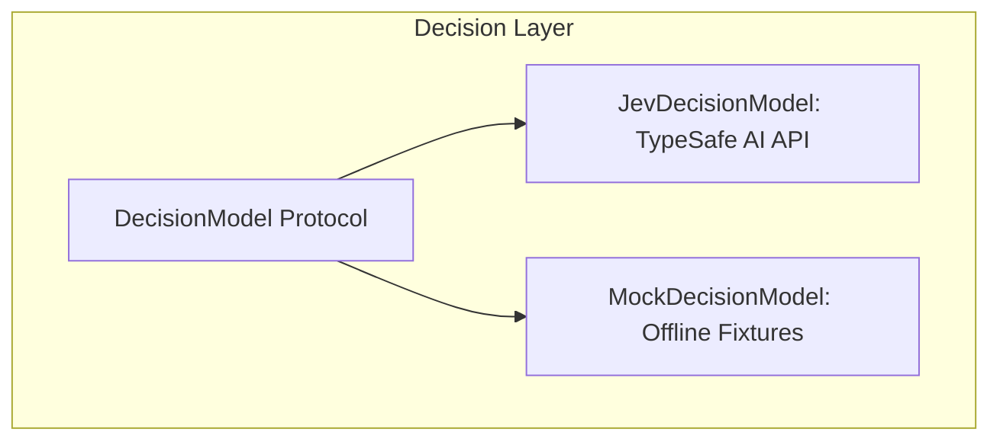
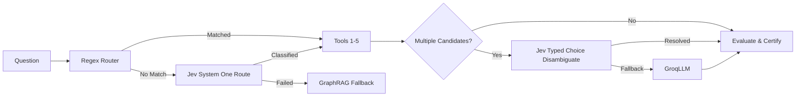

# Architecture Delta: 001-jev-system-one-integration

> **Effort:** 001-jev-system-one-integration  
> **Baseline:** `aidlc-docs/inception/02-architecture.md`  

---

## 1. Architectural Changes

### 1.1 Decision Model Protocol Layer
Added a new layer between routing and execution in [`agrag/decision.py`](file:///H:/augsepthacks/tigergraph-hack/agrag/decision.py):

### 1.2 Pipeline Integration

### 1.3 State-Questions-Answers Interface
Jev accepts an unstructured `state` string, instructions, and a mapping of `criteria` dictionary keys to descriptions. It returns structured judgments and calibrated probability distributions without autoregressive text generation.
