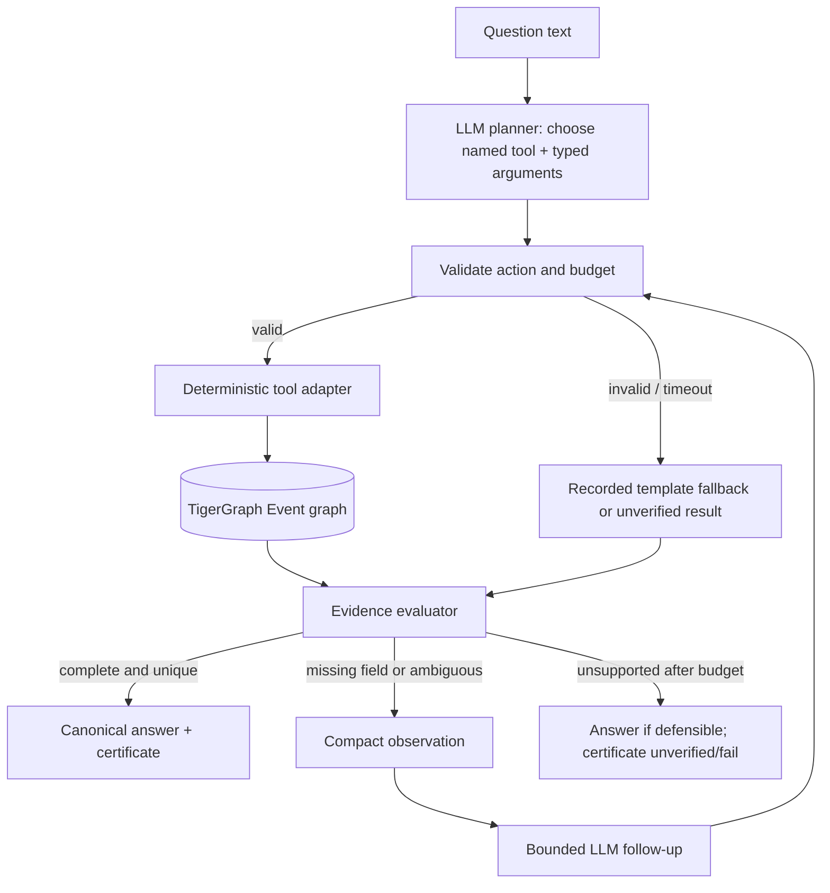

# Architecture Delta: 003-agent-planning-and-venue-integrity

> **Status:** implemented and live-validated on 2026-10-07  
> **Baseline:** `aidlc-docs/inception/02-architecture.md`  
> **Decision:** repair the graph's Event population first; then make a bounded LLM tool planner the primary agentic path.

## 1. What the reviewer is pointing at

The present control flow is `regex route → one of five tools → optional Jev/LLM recovery → certificate`. In [`agrag/pipelines/agentic.py`](../../../agrag/pipelines/agentic.py), `answer()` calls `route()` before any model. A matched template determines both the tool and all slots. `_unrouted()` can ask Jev for a class, but then still calls `GraphRagPipeline.answer()`; classification alone does not dispatch the corresponding graph tool. The visible trace is usually one tool step. That makes the system efficient and accurate on the benchmark, but it does not demonstrate an agent choosing an investigation.

Venue resolution in [`agrag/tools.py`](../../../agrag/tools.py) first asks the backend for an exact `(venue, Games)` set. If empty, it scans all events at those Games and accepts `query_venue in event_venue OR event_venue in query_venue`. Since `"" in any_string` is true, every event with a blank venue is eligible. It then sorts by a token Jaccard date score, permits zero-score ties to reach Jev/LLM, and may certify any chosen candidate as a pass. `_disambiguate()` gives Jev only the first ten candidates, without a documented ordering guarantee, and includes the candidate's `gold` in the selection prompt.

### Reproduced evidence, 2026-10-07

| Case | Existing evidence | Architectural conclusion |
|---|---|---|
| `eval-001` | Hidden output says `3 candidates (relaxed venue match)` and chooses rowing `Q735286`; source fields for that Event have empty venue and date. `Q942805`, a 2004 tennis page, contains an exact Olympic infobox for the asked venue and date, with gold `Li TingSun Tiantian`, but `event_from_doc()` rejects the page because another infobox comes first. | Filtering alone cannot retrieve a missing graph Event. Repair the parser and refresh Event vertices/edges before evaluating the fallback. The prior `eval-001` “certified valid/correct” claim is unsupported. |
| `pub-060` | Public gold is `Q1156695`/Yana Shemyakina. The exact ExCeL/30 July set also includes `Q1064016`/Kaori Matsumoto and `Q1005551`/Mansur Isaev. Jev selected `Q932145`, dated 29 July, from a broader 37-event set. | Date must be a hard eligibility check before model selection. After that, three exact-date events still remain; no sport appears in the question, so report ambiguity rather than claim structural proof. |
| Missing Event class | 25 corpus documents contain `[Infobox Olympic event]` but currently produce no `EventRecord`; the inspected examples are tennis pages with a leading tournament infobox. | The Event graph is not a complete view of the relevant corpus. Audit all 25 after parser repair and rerun reconciliation. |

## 2. Target control flow



The planner receives the question, five tool descriptions, typed argument schemas, and compact observations from any prior tool call. It does **not** receive benchmark `qtype`, the answer, gold doc IDs, or full documents. The executor alone retrieves facts and produces the final canonical answer from `EventRecord` values. The planner must never supply the final answer string.

### Planner action contract

Use the existing `LLM.complete(system, user)` interface initially; require one JSON object and validate it locally. Native provider tool calling can wait because the current `LLM` protocol supports plain completions only. A representative action is:

```json
{"tool":"resolve_multi_hop","args":{"venue":"Olympic Tennis Centre","date":"15 to 22 August 2004","year":2004,"season":"Summer"},"reason":"Find the event at this venue and date"}
```

The allowed tools are `lookup_nations(title)`, `resolve_multi_hop(venue, date, year, season?, sport?)`, `temporal_chain(event_phrase, year, season)`, `aggregation_scan(sport, year, season, threshold)`, and `superlative_scan(sport, year, season)`. Validate the tool name, exact argument names/types, year range, season enum, threshold bounds, length limits, and required fields. `sport` is optional for venue questions and needs a recorded source: explicitly named sport or a reviewed venue cue. A model invented sport must not silently narrow the set. `reason` is trace context only, not authority.

An action adapter converts validated arguments to the existing `ParsedQuestion` shape and calls the existing tool functions. The regex router remains as a **recorded fallback** after a malformed or unavailable planner response; it is not the default path for matched benchmark templates. A failure of both routes ends with an unverified result. Do not feed `q.qtype` to the planner or use it to override the selected tool. Set certificate `qtype`/completeness class from the tool actually executed, and record any mismatch with question-file metadata separately for analysis.

Use a fixed per-question budget: at most two planner calls, at most two tool executions, and at most one Jev/LLM candidate decision. A second planner call receives only a short observation such as `no matching Event after date filter`, `three same-date candidates`, or `competitors missing in Q...`, plus candidate IDs and relevant venue/date/sport fields. Repeated actions and `finish` before evidence passes are rejected. Tool execution and certificate evaluation stay deterministic. This is enough to show a real choose → observe → revise loop without introducing an agent framework days before submission.

### What remains with Jev

Jev may still rank a genuinely ambiguous, already-filtered candidate set, with its probability and latency in the trace. It cannot convert an ambiguous result into a structural guarantee. Remove `gold` from candidate-selection prompts; show IDs, titles, sport, venue and date. Never truncate an unfiltered candidate list to ten and then silently declare one of those ten the winner. First apply hard predicates; if more candidates remain than the decision input can represent, stop or request a narrower tool action.

## 3. Repair the graph source before venue logic

`parse_infobox()` currently reads only the first block. Add a helper that scans all leading infobox blocks and selects the `[Infobox Olympic event]` block for `event_from_doc()`, while retaining the old `parse_infobox()` behavior where other callers need first-block metadata. Read both `date` and `dates` into `EventRecord.date_text` with a clear precedence rule (`date` when present, otherwise `dates`). Preserve the source's `gold` string exactly. On `Q942805`, this yields Tennis / 2004 Summer / Olympic Tennis Centre / 15 to 22 August 2004 / `Li TingSun Tiantian`.

**Live graph refresh is required.** Editing `infobox.py` alone will not add Event vertices to TigerGraph. [`scripts/tg_load.py`](../../../scripts/tg_load.py) restores `events`, `prev`, and `next` from `data/embed_cache.pkl`, so running it unchanged would also reload the stale Event list. Add a small event-only refresh command that reparses `data/corpus.jsonl`, recomputes PREV links, and calls `load_events()` against the existing Document/Chunk graph. Reuse embeddings; do not re-embed or rebuild vectors. Upserts should add the missing Event, Sport, Venue, Athlete and edges. Confirm local and TigerGraph Event counts and exact `Q942805` attributes after refresh. If document `kind` matters in presentation, refresh it for the affected pages separately; it is not needed to resolve this question.

This refresh might add the 25 omitted tennis events to sport/Games scans and temporal links. That is why public reconciliation and aggregation checks must run again. Do not assume the old results still hold.

## 4. Make venue resolution evidence-safe

Implement these predicates in `resolve_multi_hop()`, identically for local and TigerGraph backends through `GraphBackend`:

1. Restrict by year/season/Games. Do not query a fabricated `None Summer`/`None Winter` Games when year extraction fails; return a typed unresolved result for replanning.
2. Try exact normalized nonempty venue first. If it yields none, use a bounded alias/subphrase comparison only when **both** normalized venue strings are nonempty. Compare token boundaries or an explicit venue alias; avoid arbitrary one-character substrings. Record `match_mode=exact|alias` and raw candidate count.
3. Apply date eligibility before ranking: parse day/month/year and common ranges (`15 to 22 August`, `15–22 August`, `30 July`, optional year). For a point query, accept the same day or a range that contains it; for a range query, prefer a matching range and reject a disjoint range. A missing event date is `unknown`, never a positive date match. Keep the original date text for audit. Where parsing is uncertain, return an ambiguous/unverified set; a positive Jaccard overlap alone is insufficient proof.
4. Apply sport only when grounded in the question or a reviewed venue cue. Normalize against known sport names, retain the source of this constraint, and never use `gold_doc_ids` or answer text to infer it. When sport is absent, leave cross-sport candidates visible. When a venue cue gives a sport but no matching Event exists, report the coverage gap instead of picking another sport.
5. Deduplicate by `doc_id`, then return a unique event only if all supplied predicates match and only one candidate remains. Otherwise return candidate IDs and reasons for the planner or Jev, with no `pass` certificate. The selected answer must come from the Event's canonical `gold` field.

For `eval-001`, parser+graph refresh makes the exact venue query return `Q942805`, so the relaxed path should not run. For `pub-060`, filtering out 29 July fixes Jev's particular wrong pick, but the 30 July tie remains. That question is underdetermined by its text. Preserve the old 99/100 score as a historical measurement until the new public run gives a measured replacement; do not promise 100/100.

## 5. Certificates, metrics, and claims

Add explicit planning and candidate provenance to the trace/certificate, preferably optional fields to keep old JSON readable: planner mode and selected tool, raw venue candidate count, count after date/sport filters, date/sport constraint sources, candidate IDs, and selection basis (`unique_exact`, `unique_alias`, `model_choice`, `none`). A planning step consumes actual model input/output tokens and latency. A `pass` for a venue question requires one eligible candidate with a supported predicate; `pass_with_fallback` can describe a unique reviewed alias match; a model choice among multiple eligible candidates is `unverified` regardless of confidence. `stop_reason` must say `ambiguous_candidates`, `no_supported_event`, `budget_exhausted`, etc., rather than `structural_bound_met` for a guess.

Keep exhaustive verification tied to the exact sport/Games Event population. The existing GSQL returns that complete set, and Python computes threshold count or max over it. A future GSQL aggregation query may improve speed, but it is outside this deadline. Protect the distinction between evidence completeness and answer correctness: even a fully enumerated ambiguous set cannot prove which individual event the question intended.

**Reporting impact:** one planning call per ordinary question will increase average token use and latency above the historical 18-token, 0.41-second agentic figures. Measure and publish the new values; do not retain the old numbers as if they describe the new mode. Keep prior result files as baseline snapshots or run the new mode to separate `--out` paths before intentionally replacing submission artifacts. Update README, diagram, dashboard summary, submission copy, and the older `eval-001` validation statement after the live run.

## 6. File-level construction map

| Priority | File(s) | Concrete change |
|---|---|---|
| P0 | `agrag/infobox.py`, `tests/test_infobox.py` | Select secondary Olympic infobox; support `dates`; test `Q942805` fields and all affected documents. |
| P0 | `scripts/tg_refresh_events.py` (new), `agrag/graph/load.py` if needed | Reparse Event records and links, upsert graph-only data without touching embeddings; verify counts and `Q942805` live. |
| P0 | `agrag/tools.py`, `tests/test_tools.py` | Safe nonempty venue alias, date-range eligibility, optional grounded sport filter, unique-only deterministic selection. |
| P1 | `agrag/planner.py` (new), `tests/test_planner.py` | Compact tool catalog, JSON action model, schema validator, prompt/observation builder, bounded planner calls. |
| P1 | `agrag/pipelines/agentic.py`, `tests/test_pipeline_agentic.py` | Planner-first loop; adapter to existing tools; Jev only after eligibility; fallback trace; real token accounting and stop reasons. |
| P1 | `agrag/certificate.py`, `agrag/eval/run.py` | Optional provenance fields and a CLI switch/output naming that permits a baseline-vs-planner comparison. |
| P2 | `README.md`, `docs/diagrams/*`, `docs/submission*`, `results/*`, `data/reconciliation-*` | Regenerate only from the final implementation and live graph; correct the old hidden-set success claim. |

## 7. Execution sequence and completion cut line

1. Preserve baseline public/hidden outputs, run offline tests, and confirm graph access.
2. Parse the secondary Olympic infobox fields and refresh only Event vertices and links.
3. Harden venue, date, and sport filters; define certificates for unresolved candidate ties.
4. Add the validated planner action contract and bounded execution loop around the five existing tools.
5. Exercise malformed actions, fallbacks, token accounting, ambiguity, and exhaustive-scan behavior with offline tests.
6. Run local reconciliation and the live TigerGraph refresh/reconciliation checks.
7. Run public and hidden agentic evaluations into separate output files; inspect traces, token use, latency, `pub-060`, and `eval-001`.
8. Update README, diagrams, dashboard, submission copy, and the effort validation report to match the measured runs.

The cut line is P0 correctness: if the planner threatens delivery, ship the repaired graph and evidence-safe venue behavior with an explicitly described template-based agent rather than a half-working planner. A planner shown in the demo must be the actual default execution path, not a prompt that echoes a regex-chosen class.

## 8. Verification matrix

| Scenario | Expected outcome |
|---|---|
| `Q942805` (second infobox) | Parsed Event with Tennis, 2004 Summer, exact venue/date, canonical gold; live TigerGraph Event exists. |
| `eval-001` | Exact venue/date resolves `Q942805`; no blank-venue rowing or cycling candidate; certificate predicate and selected ID agree. Hidden answer correctness is still not independently scored. |
| Blank venue Event at 2004 Games | Never matches `Olympic Tennis Centre` via relaxed search. |
| ExCeL, 30 July 2012 (`pub-060`) | 29 July `Q932145` excluded; three 30 July candidates exposed; no clean certificate pass from a model guess. |
| Explicit sport + date at shared venue | Only matching sport/date remains; result unique or honestly unresolved. |
| Date range with `dates` field | Range parser compares the actual interval; missing date cannot outrank it. |
| Planner selects aggregation/superlative | Complete sport/Games population is scanned; threshold/max and certificate bound still agree. |
| Planner emits malformed/unknown/repeated action | Rejected, bounded fallback or `unverified`, with trace and actual token charge. |
| Final evaluations | Public accuracy and per-class coverage measured against gold; 50 hidden records validated structurally without inventing hidden accuracy. |

## 9. Open decisions for the implementer

- A venue name that contains a sport (for example, `Olympic Tennis Centre`) is a useful **hint**, but the first implementation should record it as a cue, not silently make it an infallible sport predicate. Exact graph venue/date evidence already resolves `eval-001` once ingestion is fixed.
- Decide whether to retain a model-selected answer on an ambiguous query for benchmark coverage or return `null`; either choice must keep the certificate `unverified` and expose the candidate set. The existing public gold cannot supply the decision at runtime.
- Run live evaluation against a refreshed graph before updating any headline metric. The current result files were generated from the old Event population.


## As implemented and measured (2026-10-07)

The planner is the default `AgenticPipeline` mode; fixed routing remains selectable as `template`. `agrag/planner.py` validates an allowlisted tool and typed arguments against the question, and the pipeline executes only validated actions. Provider errors suppress a second GraphRAG model request. The trace records planner status, selected tool, arguments, deterministic tool output, and certificate evidence. Groq key failover reads the private comma-separated key pool, persists non-secret rotation state, and applies an overall request deadline.

The parser now chooses the Olympic infobox from secondary infobox blocks and reads Olympic `dates` when `date` is absent. `scripts/tg_refresh_events.py` reparsed and synchronized Event vertices and links without rebuilding chunk embeddings. The source and live graph both contain 2,187 Event IDs. The planner's 100-question public result is 98/100; template mode is 99/100 on the same refreshed graph. Planner mean usage is 1,148.5 tokens and 1.769 seconds; template mean usage is 14.3 tokens and 0.414 seconds. The planner selected a graph tool on 86 public questions. It demonstrates model-directed tool selection but does not improve accuracy or efficiency in this measurement.

`pub-060` and `pub-099` remain underdetermined venue/date ties and are `unverified` in planner mode. `eval-001` resolves to `Q942805` (`Li TingSun Tiantian`) with an exact venue/date evidence pass. The current 50-row hidden planner output is checked for schema and trace integrity only; hidden gold is unavailable, so it has no reported accuracy. RAG and GraphRAG remain September historical measurements and were not rerun on this graph snapshot.
