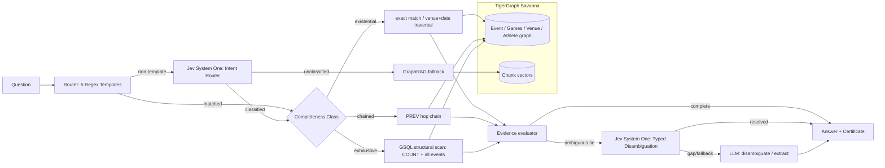

# Architecture Baseline

## Layering

1. **Pure logic layer** (`agrag/corpus.py`, `infobox.py`, `router.py`, `normalize.py`, `tools.py`, `certificate.py`) — no I/O dependency beyond reading local files. Fully unit-tested against fixtures, no TigerGraph or LLM required.
2. **Backend abstraction** (`agrag/backend.py` defines the `GraphBackend` protocol; `local_backend.py` and `graph/tg_backend.py` implement it). Every pipeline and the structural oracle depend only on the protocol, never on a concrete backend — this is what makes the LLM-free oracle and reconciliation runnable before TigerGraph even exists.
3. **Decision layer** (`agrag/decision.py`) — `DecisionModel` protocol providing non-autoregressive, typed decisions (`choice`, `noul`). Implemented by `JevDecisionModel` (TypeSafe AI Jev System One API) and `MockDecisionModel` for offline execution and tests. Used for non-templated query intent routing fallback and candidate disambiguation with calibrated probabilities and zero output token generation.
4. **LLM layer** (`agrag/llm.py`) — an `LLM` protocol with `GroqLLM` (default, free-tier, multi-key rotation), `AnthropicLLM` (alternative), and `FakeLLM` (tests). Pipelines depend only on the protocol.
5. **Pipelines** (`agrag/pipelines/`) — `RagPipeline`, `GraphRagPipeline` are fixed retrieval sequences (no branching, by design — this is what makes the three-way comparison honest). `AgenticPipeline` is the orchestrator: route (regex + Jev fallback) → dispatch class-appropriate tool → evaluate evidence → Jev / LLM disambiguation if needed → emit certificate.
6. **Evaluation layer** (`agrag/eval/`) — runner, scoring, report aggregation. Backend-agnostic (`--backend local|tigergraph`).

## Data flow for one agentic answer

1. `router.route(question)` — regex template match returns `ParsedQuestion` with `completeness_class`. If non-templated or unknown, `JevDecisionModel.choice()` classifies question intent into one of five completeness classes with calibrated confidence.
2. Class-appropriate function from `agrag/tools.py` runs against the `GraphBackend` — deterministic, zero LLM tokens for the common case.
3. If the tool result indicates ambiguity (e.g. multi-hop venue+date collision):
   - Fast path: `JevDecisionModel.choice()` evaluates candidate events against question criteria to select the winning entity with calibrated probabilities at zero generative token cost.
   - Fallback path: If Jev is unconfigured or returns None, `AgenticPipeline` calls the generative LLM for candidate extraction/disambiguation.
4. A `Certificate` is assembled: completeness class, retrieval mode (including `jev_route` or `jev_disambiguate` steps if invoked), the structural predicate used, the structural bound TigerGraph reports, the evidence set size actually inspected, and a `completeness_check` verdict (`pass` / `pass_with_llm_recovery` / `pass_with_fallback` / `fail` / `unverified`).

## Graph schema (TigerGraph, `agrag/graph/schema.gsql`)

Vertices: `Games`, `Sport`, `Venue`, `Athlete`, `Event` (the infobox as attributes), `Document`, `Chunk` (with a `VECTOR ATTRIBUTE emb(dimension=384, METRIC="COSINE")`).
Edges: `PART_OF`, `IN_SPORT`, `HELD_AT` (reverse `HOSTS`), `GOLD`, `PREV` (reverse `NEXT`), `DESCRIBED_BY`, `HAS_CHUNK`.

Seven installed queries (`agrag/graph/queries.gsql`) cover every structural need: filtered scans (`events_by_sport_games`, `events_at_games`), exact lookup (`event_by_title`, `events_by_venue`), hop traversal (`prev_event`, `event_neighborhood`), and vector search (`chunk_search`, using `vectorSearch()` with `SYNTAX v3`).

## Why this shape

The corpus's infobox structure means every one of the five question templates resolves to either an exact-match query, a bounded hop, or a filtered structural scan — never a fuzzy retrieval problem in disguise. The addition of Jev System One decision modeling ensures that natural language variations outside strict regex templates are preserved within their proper completeness class rather than falling back to unverified search, while disambiguation ties are resolved deterministically with calibrated confidence and zero token waste.
