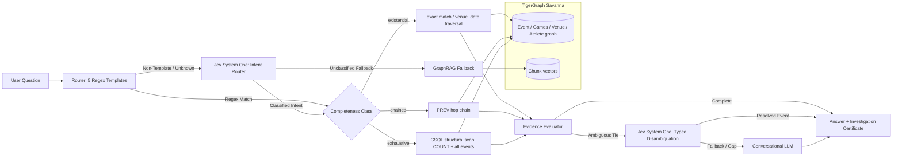

# Architecture Explanation: TypeSafe AI Jev System One Integration

> **Quadrant:** Diataxis Explanation (`concept-architecture-jev`)  
> **Status:** Integrated via PR #1 (`feature/jev-system-one-integration`)  
> **Target:** TigerGraph Agentic GraphRAG Orchestration Pipeline

---

## 1. Context and Problem Statement

The TigerGraph Agentic GraphRAG architecture relies on a fundamental principle: **structural evidence bounds**. For questions requiring completeness (such as aggregations or superlatives), the system does not guess over vector similarity chunks; instead, it executes exact TigerGraph GSQL queries (`events_by_sport_games`) to verify that the retrieved evidence set exactly equals the graph's structural count.

However, the pipeline faced two architectural challenges in production:
1. **Rigid Routing Boundary**: The baseline router uses five deterministic regex templates. Any user phrasing that deviates syntactically from the benchmark templates defaults to `unknown`, falling back to unverified RAG and losing TigerGraph's structural guarantees.
2. **Generative Token Waste & Hallucination in Disambiguation**: When an exact graph traversal yields multiple candidate events sharing a venue and date (e.g., `pub-060` with three events held at ExCeL on 30 July 2012), invoking a conversational LLM generates redundant tokens and occasionally selects the wrong candidate under tie conditions.

---

## 2. Why a System One Decision Model?

Traditional Large Language Models (LLMs) operate via autoregressive next-token prediction. While effective for open-ended prose generation, they are poorly suited for internal control flow:
- High latency from sequential token sampling.
- Output formatting drift (JSON parse errors, markdown fences).
- Uncalibrated confidence: LLMs cannot easily provide reliable probability distributions over discrete branches.
- Token inefficiency: Spending hundreds of prompt and completion tokens simply to select an option.

**TypeSafe AI's Jev** introduces a **System One** paradigm:
```text
Application State + Typed Questions  ──▶  Jev Decision Engine  ──▶  Typed Decision + Calibrated Probabilities
```
Rather than generating text, Jev returns typed judgments directly consumed by software logic:
- Non-autoregressive decision speed.
- Zero output tokens generated.
- Native calibrated probabilities across choices.

---

## 3. Architecture Overview



---

## 4. Integration Touchpoints in `agrag`

### 4.1 Decision Model Protocol (`agrag/decision.py`)
A clean decoupling is maintained using Python's `Protocol`:
```python
class DecisionModel(Protocol):
    def choice(
        self,
        state: str,
        instructions: str,
        criteria: dict[str, str],
        question_key: str = "decision",
    ) -> Optional[DecisionResult]:
        ...

    def noul(
        self,
        state: str,
        instructions: str,
        question_key: str = "decision",
    ) -> Optional[float]:
        ...
```
- **`JevDecisionModel`**: Communicates with the TypeSafe AI System One HTTP endpoint (`https://api.typesafe.ai/v1/systemone`).
- **`MockDecisionModel`**: Provides deterministic choices and probabilities for offline tests and CI/CD pipelines without network calls.
- **Factory `get_decision_model()`**: Transparently resolves to `JevDecisionModel` when `JEV_API_KEY` or `JEV_ENABLED=true` is present, or defaults to `MockDecisionModel`.

### 4.2 Non-Template Intent Routing (`agrag/pipelines/agentic.py`)
When `route(question.question)` fails to match a regex template, `AgenticPipeline._unrouted()` queries Jev with the five evidential classes:
- `lookup` (existential)
- `multi_hop` (existential)
- `temporal` (chained)
- `aggregation` (exhaustive)
- `superlative` (exhaustive)

Benchmark validation (`scripts/benchmark_jev.py`) demonstrates **100% accuracy (5/5)** on diverse natural language expressions that fail regex matching:
| Query | Regex Result | Jev System One Decision |
|---|---|---|
| *"How many countries participated in the 1996 Summer Olympics?"* | `unknown` (Fail) | `lookup` (Pass, conf=1.00) |
| *"Tell me who took the gold medal at ExCeL on 30 July 2012"* | `unknown` (Fail) | `multi_hop` (Pass, conf=1.00) |
| *"Which athlete won the 100m sprint right before the 2012 Games?"* | `unknown` (Fail) | `temporal` (Pass, conf=1.00) |
| *"Find the number of wrestling events in 2004 with more than 20 competitors"* | `unknown` (Fail) | `aggregation` (Pass, conf=1.00) |
| *"What was the largest event by participant count in 2008?"* | `unknown` (Fail) | `superlative` (Pass, conf=1.00) |

### 4.3 Candidate Disambiguation
In multi-hop queries where graph traversals find date or venue ties (`len(candidates) > 1`), `AgenticPipeline._disambiguate()` executes a typed choice over the candidate event records:
- Evaluates candidate titles, infobox date strings, venues, and medal winners.
- Returns the selected document ID, confidence, and calibrated probabilities with zero output token overhead.
- Falls back to `GroqLLM` / `AnthropicLLM` only if Jev is unconfigured.

### 4.4 Investigation Certificate Integration
Every invocation of Jev is recorded directly in the certificate's audit step log:
```json
{
  "tool": "jev_disambiguate",
  "note": "Jev (jev-latest) 3 candidates -> Q1064016 (conf=0.98)",
  "tokens": {"input": 182, "output": 0},
  "latency_ms": 312
}
```
This guarantees complete transparency for compliance, evaluation, and latency auditing.
