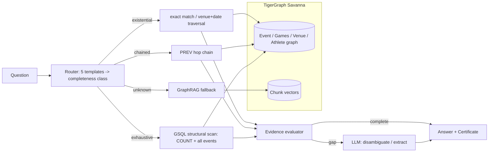

# Investigation Certificates for Agentic GraphRAG — Implementation Plan

> **For agentic workers:** REQUIRED: Use superpowers:subagent-driven-development (if subagents available) or superpowers:executing-plans to implement this plan. Steps use checkbox (`- [ ]`) syntax for tracking.

**Goal:** Ship three question-answering pipelines (RAG, GraphRAG, Agentic GraphRAG) over the hackathon's Olympic-event corpus on TigerGraph, where the agentic pipeline emits a machine-checkable Investigation Certificate per answer, plus a benchmark runner and dashboard comparing all three.

**Architecture:** A pure-Python core (infobox parser, question router, deterministic tools, certificate model, scoring) is built and tested first against a `LocalBackend` that implements the same `GraphBackend` protocol as the real `TigerGraphBackend`. The council-mandated reconciliation pass runs on the local backend before TigerGraph exists, then again against TigerGraph after loading. Pipelines take an injected backend + LLM so every pipeline is unit-testable with fakes; only `tests/integration/` talks to Savanna.

**Tech Stack:** Python 3.12, `pyTigerGraph` (TigerGraph Savanna, GSQL, vector attributes), `groq` SDK (default model `openai/gpt-oss-20b`, free tier — no card required at console.groq.com/keys) with an `anthropic` SDK path also implemented for anyone who prefers it, `sentence-transformers` (`all-MiniLM-L6-v2`, 384-dim, already installed), `pydantic` v2, `pytest`, `streamlit` (already installed), `numpy`.

**Spec:** `docs/idea-spec.md` (system design §4, build plan §5, mandatory reconciliation §6). **Dataset facts:** `docs/hackathon-brief.md` §7.

---

## File Structure

```
tigergraph-hack/
├── pyproject.toml                  # package metadata + pytest config
├── requirements.txt
├── .env.example                    # TG_HOST, TG_GRAPH, TG_SECRET, AGRAG_MODEL, ...
├── .gitignore
├── README.md
├── agrag/                          # the package
│   ├── __init__.py
│   ├── config.py                   # env-driven Settings
│   ├── corpus.py                   # Doc + JSONL loader
│   ├── infobox.py                  # infobox parser, EventRecord, title parser, prev/next link resolution
│   ├── questions.py                # Question + JSONL loader
│   ├── router.py                   # 5 question templates -> ParsedQuestion (completeness class + slots)
│   ├── normalize.py                # answer normalisation + match flags
│   ├── backend.py                  # GraphBackend Protocol, ChunkHit
│   ├── local_backend.py            # in-memory backend over parsed corpus (tests, reconciliation, dev)
│   ├── chunk.py                    # text chunking for RAG
│   ├── embed.py                    # Embedder protocol, SentenceTransformerEmbedder, FakeEmbedder
│   ├── llm.py                      # LLM protocol, GroqLLM (default), AnthropicLLM, FakeLLM, LLMResponse (with token usage)
│   ├── tools.py                    # specialised deterministic tools shared by oracle + agentic pipeline
│   ├── certificate.py              # Investigation Certificate pydantic model
│   ├── oracle.py                   # LLM-free structural oracle (reconciliation)
│   ├── pipelines/
│   │   ├── __init__.py
│   │   ├── base.py                 # PipelineResult, TokenUsage, prompts
│   │   ├── rag.py
│   │   ├── graphrag.py
│   │   └── agentic.py              # orchestrator + certificate emission
│   ├── graph/
│   │   ├── __init__.py
│   │   ├── client.py               # TigerGraphConnection factory
│   │   ├── schema.gsql             # DDL (vertices, edges, graph, vector attribute job)
│   │   ├── queries.gsql            # installed queries
│   │   ├── load.py                 # corpus -> vertices/edges/chunks upsert
│   │   └── tg_backend.py           # TigerGraphBackend (GraphBackend over installed queries)
│   └── eval/
│       ├── __init__.py
│       ├── run.py                  # CLI: run a pipeline over a question file -> results JSONL
│       ├── score.py                # per-question + per-qtype metrics
│       └── report.py               # results/*.jsonl -> results/summary.json
├── scripts/
│   ├── download_data.py            # Google Drive -> data/
│   ├── reconcile.py                # council-mandated reconciliation report
│   ├── tg_setup.py                 # run schema.gsql + queries.gsql
│   ├── tg_load.py                  # load corpus into Savanna
│   └── tg_smoke.py                 # connectivity + one query
├── dashboard/
│   └── app.py                      # streamlit
├── tests/
│   ├── conftest.py
│   ├── fixtures/
│   │   ├── make_fixtures.py        # generates mini_corpus.jsonl + mini_public.jsonl
│   │   ├── mini_corpus.jsonl
│   │   └── mini_public.jsonl
│   ├── test_corpus.py
│   ├── test_infobox.py
│   ├── test_questions.py
│   ├── test_router.py
│   ├── test_normalize.py
│   ├── test_local_backend.py
│   ├── test_chunk.py
│   ├── test_embed.py
│   ├── test_llm.py
│   ├── test_tools.py
│   ├── test_certificate.py
│   ├── test_oracle.py
│   ├── test_pipeline_rag.py
│   ├── test_pipeline_graphrag.py
│   ├── test_pipeline_agentic.py
│   ├── test_score.py
│   ├── test_reconcile.py
│   └── integration/
│       └── test_tigergraph.py      # skipped unless TG_HOST is set
├── data/                           # already present: corpus.jsonl (gitignored), eval_*.jsonl
└── docs/                           # already present
```

**Boundaries that matter:**
- `agrag/tools.py` is the single home for deterministic retrieval/reasoning steps. `oracle.py` (no LLM) and `pipelines/agentic.py` (LLM for recovery/disambiguation only) both call it. Never duplicate template logic in the pipeline.
- Pipelines depend on `GraphBackend` + `LLM` + `Embedder` protocols only. Nothing under `agrag/pipelines/` imports `pyTigerGraph`.
- `agrag/graph/` is the only place that imports `pyTigerGraph`.

---

## Conventions used in every task

- Run tests with: `python -m pytest -q` from the repo root (`H:\augsepthacks\tigergraph-hack`).
- Commit author must be `Harshdip Saha <harshdipsaha@gmail.com>` (set once in Task 1).
- Commit messages: conventional prefix (`feat:`, `test:`, `chore:`, `docs:`).
- Every module gets its test file in the same task. No task ends with failing tests.
- `data/corpus.jsonl` is 22 MB and gitignored; `data/eval_public.jsonl`, `data/eval_hidden.jsonl`, `data/dataset-README.md` are committed.

---

### Task 1: Repository scaffold, git init, dependencies

**Files:**
- Create: `pyproject.toml`, `requirements.txt`, `.gitignore`, `.env.example`, `agrag/__init__.py`, `agrag/pipelines/__init__.py`, `agrag/graph/__init__.py`, `agrag/eval/__init__.py`, `tests/conftest.py`, `tests/__init__.py`, `tests/integration/__init__.py`

- [ ] **Step 1: Initialise git with the correct author**

Run (from `H:\augsepthacks\tigergraph-hack`):
```bash
git init
git config user.name "Harshdip Saha"
git config user.email "harshdipsaha@gmail.com"
git branch -M main
```
Expected: `Initialized empty Git repository`.

- [ ] **Step 2: Write `.gitignore`**

```gitignore
__pycache__/
*.pyc
.pytest_cache/
.env
.venv/
data/corpus.jsonl
results/smoke.jsonl
.playwright-mcp/
*.egg-info/
.streamlit/
```

- [ ] **Step 3: Write `requirements.txt`**

```text
groq>=0.11
anthropic>=0.45
pyTigerGraph>=1.8
sentence-transformers>=3.0
numpy>=1.26
pydantic>=2.5
python-dotenv>=1.0
streamlit>=1.36
pandas>=2.2
pytest>=8.0
```

- [ ] **Step 4: Write `pyproject.toml`**

```toml
[project]
name = "agrag"
version = "0.1.0"
description = "Investigation Certificates for Agentic GraphRAG on TigerGraph"
requires-python = ">=3.12"

[tool.setuptools.packages.find]
include = ["agrag*"]

[tool.pytest.ini_options]
testpaths = ["tests"]
addopts = "-q"
markers = ["integration: needs a live TigerGraph (set TG_HOST)"]
```

- [ ] **Step 5: Write `.env.example`**

```text
# TigerGraph Savanna (https://tgcloud.io). Create the graph first (Task 14), then create a secret for it in the Savanna UI.
TG_HOST=https://YOUR-WORKSPACE.i.tgcloud.io
TG_GRAPH=OlympicsRAG
TG_SECRET=
# Optional: only needed if your workspace requires user/password for GSQL DDL
TG_USERNAME=
TG_PASSWORD=

# LLM provider. "groq" is free (sign up at https://console.groq.com/keys, no card required).
# Set to "anthropic" to use Claude instead (paid beyond trial credit; leave ANTHROPIC_API_KEY
# unset if you use `ant auth login`).
AGRAG_LLM_PROVIDER=groq
GROQ_API_KEY=
ANTHROPIC_API_KEY=
AGRAG_MODEL=openai/gpt-oss-20b
AGRAG_MAX_TOKENS=1024

# Embeddings
AGRAG_EMBED_MODEL=all-MiniLM-L6-v2
```

- [ ] **Step 6: Create package init files and conftest**

`agrag/__init__.py`, `agrag/pipelines/__init__.py`, `agrag/graph/__init__.py`, `agrag/eval/__init__.py`, `tests/__init__.py`, `tests/integration/__init__.py`: empty files.

`tests/conftest.py`:
```python
from pathlib import Path

import pytest

FIXTURES = Path(__file__).parent / "fixtures"


@pytest.fixture(scope="session")
def fixtures_dir() -> Path:
    return FIXTURES


@pytest.fixture(scope="session")
def mini_corpus_path(fixtures_dir: Path) -> Path:
    return fixtures_dir / "mini_corpus.jsonl"


@pytest.fixture(scope="session")
def mini_public_path(fixtures_dir: Path) -> Path:
    return fixtures_dir / "mini_public.jsonl"
```

- [ ] **Step 7: Install dependencies and verify pytest runs**

Run: `pip install -r requirements.txt && pip install -e . && python -m pytest`
Expected: `no tests ran` (exit code 5 is fine at this point).

- [ ] **Step 8: Commit**

```bash
git add .gitignore requirements.txt pyproject.toml .env.example agrag tests data/eval_public.jsonl data/eval_hidden.jsonl data/dataset-README.md docs
git commit -m "chore: scaffold agrag package, deps, docs and eval data"
```

---

### Task 2: Test fixtures (mini corpus + mini questions)

**Files:**
- Create: `tests/fixtures/make_fixtures.py`, `tests/fixtures/mini_corpus.jsonl`, `tests/fixtures/mini_public.jsonl`

The fixture mirrors the real corpus format exactly (infobox block, then prose) so every parser test runs on realistic text. One doc (Q5) has an empty `competitors` field but states the count in prose, to exercise recovery. One doc is a film distractor.

- [ ] **Step 1: Write the fixture generator**

`tests/fixtures/make_fixtures.py`:
```python
"""Regenerate mini_corpus.jsonl and mini_public.jsonl. Run: python tests/fixtures/make_fixtures.py"""
import json
from pathlib import Path

HERE = Path(__file__).parent


def event_doc(doc_id, sport, year, season, event_name, venue, date, competitors, nations, gold, gold_noc, prev, nxt, prose):
    title = f"{sport} at the {year} {season} Olympics – {event_name}"
    lines = [
        "[Infobox Olympic event]",
        f"  event: {event_name}",
        f"  games: {year} {season}",
        f"  venue: {venue}",
        f"  date: {date}",
        f"  competitors: {competitors}",
        f"  nations: {nations}",
        f"  gold: {gold}",
        f"  goldNOC: {gold_noc}",
        f"  prev: {prev}",
        f"  next: {nxt}",
        "",
        prose,
    ]
    text = "\n".join(lines)
    return {
        "doc_id": doc_id,
        "title": title,
        "url": f"https://en.wikipedia.org/wiki/{title.replace(' ', '_')}",
        "wikidata_qid": doc_id,
        "wikipedia_pageid": 0,
        "approx_tokens": len(text.split()),
        "text": text,
    }


def film_doc(doc_id, title, prose):
    text = "\n".join(["[Infobox film]", f"  name: {title}", "  released: 1994", "", prose])
    return {"doc_id": doc_id, "title": title, "url": "", "wikidata_qid": doc_id, "wikipedia_pageid": 0,
            "approx_tokens": len(text.split()), "text": text}


DOCS = [
    event_doc("Q1", "Biathlon", 2018, "Winter", "Women's sprint", "Alpensia Biathlon Centre", "10 February 2018", 87, 27,
              "Laura Dahlmeier", "GER", 2014, 2022,
              "The women's sprint biathlon competition at the 2018 Winter Olympics was held on 10 February 2018 at the Alpensia Biathlon Centre. Laura Dahlmeier of Germany won the gold medal."),
    event_doc("Q2", "Biathlon", 2018, "Winter", "Men's sprint", "Alpensia Biathlon Centre", "11 February 2018", 86, 30,
              "Arnd Peiffer", "GER", 2014, 2022,
              "The men's sprint biathlon competition at the 2018 Winter Olympics was held on 11 February 2018. Arnd Peiffer won gold."),
    event_doc("Q3", "Biathlon", 2018, "Winter", "Men's mass start", "Alpensia Biathlon Centre", "18 February 2018", 30, 14,
              "Martin Fourcade", "FRA", 2014, 2022,
              "The men's mass start was held on 18 February 2018. Martin Fourcade won."),
    event_doc("Q4", "Biathlon", 2014, "Winter", "Women's sprint", "Laura Biathlon & Ski Complex", "9 February 2014", 83, 27,
              "Anastasiya Kuzmina", "SVK", 2010, 2018,
              "The women's sprint at the 2014 Winter Olympics took place on 9 February 2014. Anastasiya Kuzmina won gold."),
    event_doc("Q5", "Biathlon", 2018, "Winter", "Women's relay", "Alpensia Biathlon Centre", "22 February 2018", "", 18,
              "Belarus", "BLR", 2014, 2022,
              "The women's relay was held on 22 February 2018. 72 competitors from 18 nations took part. Belarus won the gold medal."),
    event_doc("Q7", "Sailing", 2016, "Summer", "Women's RS:X", "Marina da Glória", "8–14 August 2016", 26, 26,
              "Charline Picon", "FRA", 2012, 2020,
              "The women's RS:X sailing event at the 2016 Summer Olympics was held at Marina da Glória. 26 sailors from 26 nations competed. Charline Picon won gold."),
    film_doc("Q6", "Forrest Gump", "Forrest Gump is a 1994 American comedy-drama film directed by Robert Zemeckis. It won six Academy Awards."),
]

QUESTIONS = [
    {"qid": "mini-001", "question": "How many nations competed in Sailing at the 2016 Summer Olympics – Women's RS:X?",
     "qtype": "lookup", "gold_doc_ids": ["Q7"], "answer": ["26"]},
    {"qid": "mini-002", "question": "Who won the gold medal in the event held at Alpensia Biathlon Centre on 11 February 2018?",
     "qtype": "multi_hop", "gold_doc_ids": ["Q2"], "answer": ["Arnd Peiffer"]},
    {"qid": "mini-003", "question": "Who won the gold medal in the women's sprint biathlon event at the Winter Olympics held immediately before 2018?",
     "qtype": "temporal", "gold_doc_ids": ["Q1", "Q4"], "answer": ["Anastasiya Kuzmina"]},
    {"qid": "mini-004", "question": "According to the provided corpus, how many biathlon events at the 2018 Winter Olympics had more than 73 competitors?",
     "qtype": "aggregation", "gold_doc_ids": ["Q1", "Q2", "Q3", "Q5"], "answer": ["2"]},
    {"qid": "mini-005", "question": "According to the provided corpus, which biathlon event at the 2018 Winter Olympics had the highest number of competitors?",
     "qtype": "superlative", "gold_doc_ids": ["Q1", "Q2", "Q3", "Q5"], "answer": ["Biathlon at the 2018 Winter Olympics – Women's sprint"]},
]


def main() -> None:
    with open(HERE / "mini_corpus.jsonl", "w", encoding="utf-8") as f:
        for d in DOCS:
            f.write(json.dumps(d, ensure_ascii=False) + "\n")
    with open(HERE / "mini_public.jsonl", "w", encoding="utf-8") as f:
        for q in QUESTIONS:
            f.write(json.dumps(q, ensure_ascii=False) + "\n")


if __name__ == "__main__":
    main()
```

- [ ] **Step 2: Generate the fixtures**

Run: `python tests/fixtures/make_fixtures.py && wc -l tests/fixtures/mini_corpus.jsonl tests/fixtures/mini_public.jsonl`
Expected: `7 tests/fixtures/mini_corpus.jsonl` and `5 tests/fixtures/mini_public.jsonl`.

- [ ] **Step 3: Commit**

```bash
git add tests/fixtures
git commit -m "test: add mini corpus and question fixtures mirroring the real dataset format"
```

---

### Task 3: Corpus loader

**Files:**
- Create: `agrag/corpus.py`
- Test: `tests/test_corpus.py`

- [ ] **Step 1: Write the failing test**

`tests/test_corpus.py`:
```python
from agrag.corpus import Doc, load_docs


def test_load_docs_reads_all_records(mini_corpus_path):
    docs = load_docs(mini_corpus_path)
    assert len(docs) == 7
    assert isinstance(docs[0], Doc)
    assert docs[0].doc_id == "Q1"
    assert docs[0].title.startswith("Biathlon at the 2018 Winter Olympics")
    assert docs[0].text.startswith("[Infobox Olympic event]")


def test_load_docs_skips_blank_lines(tmp_path):
    p = tmp_path / "c.jsonl"
    p.write_text('{"doc_id":"A","title":"t","url":"","approx_tokens":1,"text":"x"}\n\n', encoding="utf-8")
    assert [d.doc_id for d in load_docs(p)] == ["A"]
```

- [ ] **Step 2: Run test to verify it fails**

Run: `python -m pytest tests/test_corpus.py -v`
Expected: FAIL with `ModuleNotFoundError: No module named 'agrag.corpus'`

- [ ] **Step 3: Write the implementation**

`agrag/corpus.py`:
```python
from __future__ import annotations

import json
from dataclasses import dataclass
from pathlib import Path
from typing import Iterator


@dataclass(frozen=True)
class Doc:
    doc_id: str
    title: str
    url: str
    approx_tokens: int
    text: str


def iter_docs(path: str | Path) -> Iterator[Doc]:
    with open(path, encoding="utf-8") as f:
        for line in f:
            line = line.strip()
            if not line:
                continue
            d = json.loads(line)
            yield Doc(
                doc_id=d["doc_id"],
                title=d["title"],
                url=d.get("url", ""),
                approx_tokens=int(d.get("approx_tokens", 0)),
                text=d["text"],
            )


def load_docs(path: str | Path) -> list[Doc]:
    return list(iter_docs(path))
```

- [ ] **Step 4: Run test to verify it passes**

Run: `python -m pytest tests/test_corpus.py -v`
Expected: 2 passed

- [ ] **Step 5: Commit**

```bash
git add agrag/corpus.py tests/test_corpus.py
git commit -m "feat: corpus JSONL loader"
```

---

### Task 4: Infobox parser, EventRecord, prev/next link resolution

**Files:**
- Create: `agrag/infobox.py`
- Test: `tests/test_infobox.py`

Why this matters: every downstream tool reads `EventRecord`. The traps from `docs/hackathon-brief.md` §7 (non-numeric `competitors`, en-dash titles, missing `prev`) are handled here and nowhere else.

- [ ] **Step 1: Write the failing tests**

`tests/test_infobox.py`:
```python
from agrag.corpus import load_docs
from agrag.infobox import (
    EventRecord,
    event_from_doc,
    events_from_docs,
    parse_infobox,
    parse_int,
    parse_title,
    resolve_links,
)


def test_parse_infobox_reads_header_and_fields():
    text = "[Infobox Olympic event]\n  event: Men's sprint\n  competitors: 86\n\nProse here."
    header, fields = parse_infobox(text)
    assert header == "[Infobox Olympic event]"
    assert fields == {"event": "Men's sprint", "competitors": "86"}


def test_parse_infobox_without_header():
    assert parse_infobox("Plain prose") == (None, {})


def test_parse_int_handles_non_numeric():
    assert parse_int("86") == 86
    assert parse_int("") is None
    assert parse_int("23 teams") is None
    assert parse_int(None) is None


def test_parse_title_handles_en_dash_and_hyphenated_sport():
    t = parse_title("Cross-country skiing at the 2010 Winter Olympics – Men's 15 kilometre freestyle")
    assert t == ("Cross-country skiing", 2010, "Winter", "Men's 15 kilometre freestyle")
    assert parse_title("Forrest Gump") is None


def test_event_from_doc_builds_record(mini_corpus_path):
    docs = {d.doc_id: d for d in load_docs(mini_corpus_path)}
    ev = event_from_doc(docs["Q1"])
    assert isinstance(ev, EventRecord)
    assert ev.sport == "Biathlon" and ev.year == 2018 and ev.season == "Winter"
    assert ev.games == "2018 Winter"
    assert ev.event_name == "Women's sprint"
    assert ev.venue == "Alpensia Biathlon Centre"
    assert ev.competitors == 87 and ev.nations == 27
    assert ev.gold == "Laura Dahlmeier" and ev.prev_year == 2014 and ev.next_year == 2022
    assert event_from_doc(docs["Q6"]) is None  # film


def test_empty_competitors_becomes_none_but_raw_kept(mini_corpus_path):
    docs = {d.doc_id: d for d in load_docs(mini_corpus_path)}
    ev = event_from_doc(docs["Q5"])
    assert ev.competitors is None
    assert ev.competitors_raw == ""


def test_resolve_links_follows_prev_year_to_same_event(mini_corpus_path):
    events = events_from_docs(load_docs(mini_corpus_path))
    prev, nxt = resolve_links(events)
    assert prev["Q1"] == "Q4"   # 2018 women's sprint -> 2014 women's sprint
    assert nxt["Q4"] == "Q1"
    assert "Q2" not in prev      # 2014 men's sprint is not in the corpus
```

- [ ] **Step 2: Run test to verify it fails**

Run: `python -m pytest tests/test_infobox.py -v`
Expected: FAIL with `ModuleNotFoundError: No module named 'agrag.infobox'`

- [ ] **Step 3: Write the implementation**

`agrag/infobox.py`:
```python
from __future__ import annotations

import re
from dataclasses import dataclass
from typing import Iterable, Optional

from agrag.corpus import Doc

EVENT_HEADER = "[Infobox Olympic event]"
TITLE_RE = re.compile(
    r"^(?P<sport>.+?) at the (?P<year>\d{4}) (?P<season>Summer|Winter) Olympics(?: [–—-] (?P<event>.+))?$"
)
INT_RE = re.compile(r"^\d+$")


def parse_infobox(text: str) -> tuple[Optional[str], dict[str, str]]:
    """Return (header, fields) for the indented key: value block at the top of a doc."""
    if not text.startswith("["):
        return None, {}
    lines = text.split("\n")
    header = lines[0].strip()
    fields: dict[str, str] = {}
    for line in lines[1:]:
        if not line.startswith("  "):
            break
        if ":" not in line:
            continue
        key, value = line.strip().split(":", 1)
        fields[key.strip()] = value.strip()
    return header, fields


def parse_int(value: Optional[str]) -> Optional[int]:
    if value is None:
        return None
    v = value.strip()
    return int(v) if INT_RE.match(v) else None


def parse_title(title: str) -> Optional[tuple[str, int, str, str]]:
    m = TITLE_RE.match(title)
    if not m:
        return None
    return m["sport"], int(m["year"]), m["season"], (m["event"] or "").strip()


@dataclass(frozen=True)
class EventRecord:
    doc_id: str
    title: str
    sport: str
    year: int
    season: str
    event_name: str
    venue: str
    date_text: str
    competitors: Optional[int]
    competitors_raw: str
    nations: Optional[int]
    gold: str
    gold_noc: str
    prev_year: Optional[int]
    next_year: Optional[int]
    url: str

    @property
    def games(self) -> str:
        return f"{self.year} {self.season}"


def event_from_doc(doc: Doc) -> Optional[EventRecord]:
    header, ib = parse_infobox(doc.text)
    if header != EVENT_HEADER:
        return None
    parsed = parse_title(doc.title)
    if parsed is None:
        return None
    sport, year, season, event_name = parsed
    return EventRecord(
        doc_id=doc.doc_id,
        title=doc.title,
        sport=sport,
        year=year,
        season=season,
        event_name=event_name,
        venue=ib.get("venue", ""),
        date_text=ib.get("date", ""),
        competitors=parse_int(ib.get("competitors")),
        competitors_raw=ib.get("competitors", ""),
        nations=parse_int(ib.get("nations")),
        gold=ib.get("gold", ""),
        gold_noc=ib.get("goldNOC", ""),
        prev_year=parse_int(ib.get("prev")),
        next_year=parse_int(ib.get("next")),
        url=doc.url,
    )


def events_from_docs(docs: Iterable[Doc]) -> list[EventRecord]:
    out = []
    for d in docs:
        ev = event_from_doc(d)
        if ev is not None:
            out.append(ev)
    return out


def norm_key(s: str) -> str:
    return re.sub(r"\s+", " ", s.lower()).strip()


def resolve_links(events: Iterable[EventRecord]) -> tuple[dict[str, str], dict[str, str]]:
    """Map doc_id -> doc_id for PREV and NEXT using (sport, season, event_name, year)."""
    events = list(events)
    index = {(norm_key(e.sport), e.season, norm_key(e.event_name), e.year): e.doc_id for e in events}
    prev: dict[str, str] = {}
    nxt: dict[str, str] = {}
    for e in events:
        if e.prev_year is not None:
            target = index.get((norm_key(e.sport), e.season, norm_key(e.event_name), e.prev_year))
            if target:
                prev[e.doc_id] = target
        if e.next_year is not None:
            target = index.get((norm_key(e.sport), e.season, norm_key(e.event_name), e.next_year))
            if target:
                nxt[e.doc_id] = target
    return prev, nxt
```

- [ ] **Step 4: Run test to verify it passes**

Run: `python -m pytest tests/test_infobox.py -v`
Expected: 7 passed

- [ ] **Step 5: Sanity-check against the real corpus (not a unit test)**

Run:
```bash
python -c "from agrag.corpus import load_docs; from agrag.infobox import events_from_docs, resolve_links; d=load_docs('data/corpus.jsonl'); e=events_from_docs(d); p,n=resolve_links(e); print(len(d), len(e), len(p), len(n))"
```
Expected: `2951 2162 1464 1464` (verified against the real corpus while writing this plan). 1,986 events carry a `prev` year but only 1,464 resolve to a PREV edge, because event names drift between Games (weight classes renamed, events added/dropped — brief §7). That gap is not a parser bug; it is what `temporal_chain`'s fallback hop and the Task 11 reconciliation triage exist for. Record the numbers in `docs/status.md`.

- [ ] **Step 6: Commit**

```bash
git add agrag/infobox.py tests/test_infobox.py
git commit -m "feat: infobox parser, EventRecord and prev/next link resolution"
```

---

### Task 5: Question loader

**Files:**
- Create: `agrag/questions.py`
- Test: `tests/test_questions.py`

- [ ] **Step 1: Write the failing test**

`tests/test_questions.py`:
```python
from agrag.questions import Question, load_questions


def test_load_public_questions(mini_public_path):
    qs = load_questions(mini_public_path)
    assert len(qs) == 5
    q = qs[0]
    assert isinstance(q, Question)
    assert q.qid == "mini-001" and q.qtype == "lookup"
    assert q.answer == "26"
    assert q.gold_doc_ids == ("Q7",)


def test_hidden_questions_have_no_answer(tmp_path):
    p = tmp_path / "h.jsonl"
    p.write_text('{"qid":"eval-001","question":"Who?","qtype":"multi_hop"}\n', encoding="utf-8")
    q = load_questions(p)[0]
    assert q.answer is None and q.gold_doc_ids == ()
```

- [ ] **Step 2: Run test to verify it fails**

Run: `python -m pytest tests/test_questions.py -v`
Expected: FAIL with `ModuleNotFoundError`

- [ ] **Step 3: Write the implementation**

`agrag/questions.py`:
```python
from __future__ import annotations

import json
from dataclasses import dataclass
from pathlib import Path
from typing import Optional


@dataclass(frozen=True)
class Question:
    qid: str
    question: str
    qtype: str
    answer: Optional[str]
    gold_doc_ids: tuple[str, ...]


def load_questions(path: str | Path) -> list[Question]:
    out: list[Question] = []
    with open(path, encoding="utf-8") as f:
        for line in f:
            line = line.strip()
            if not line:
                continue
            d = json.loads(line)
            ans = d.get("answer")
            if isinstance(ans, list):
                ans = ans[0] if ans else None
            out.append(
                Question(
                    qid=d["qid"],
                    question=d["question"],
                    qtype=d.get("qtype", ""),
                    answer=ans,
                    gold_doc_ids=tuple(d.get("gold_doc_ids", [])),
                )
            )
    return out
```

- [ ] **Step 4: Run test to verify it passes**

Run: `python -m pytest tests/test_questions.py -v`
Expected: 2 passed

- [ ] **Step 5: Commit**

```bash
git add agrag/questions.py tests/test_questions.py
git commit -m "feat: question loader for public and hidden eval files"
```

---

### Task 6: Question router (five templates → completeness class)

**Files:**
- Create: `agrag/router.py`
- Test: `tests/test_router.py`

This is the "benchmark-scoped heuristic dispatcher" from the spec §4.2. It is regex template matching on purpose and must be documented as such in the module docstring. It never reads the `qtype` field; the test checks agreement with `qtype` on the real public set as a sanity check.

- [ ] **Step 1: Write the failing tests**

`tests/test_router.py`:
```python
from agrag.questions import load_questions
from agrag.router import ParsedQuestion, route


def test_lookup_template():
    p = route("How many nations competed in Sailing at the 2016 Summer Olympics – Women's RS:X?")
    assert p.template == "lookup" and p.completeness_class == "existential"
    assert p.slots["title"] == "Sailing at the 2016 Summer Olympics – Women's RS:X"


def test_multi_hop_template_year_inside_date():
    p = route("Who won the gold medal in the event held at Olympic Weightlifting Gymnasium on 20 September 1988?")
    assert p.template == "multi_hop" and p.completeness_class == "existential"
    assert p.slots["venue"] == "Olympic Weightlifting Gymnasium"
    assert p.slots["date"] == "20 September 1988"
    assert p.slots["year"] == 1988 and p.slots["season"] is None


def test_multi_hop_template_games_suffix():
    p = route("Who won the gold medal in the event held at Riocentro – Pavilion 4 on 11–19 August at the 2016 Summer Olympics?")
    assert p.slots["venue"] == "Riocentro – Pavilion 4"
    assert p.slots["date"] == "11–19 August"
    assert p.slots["year"] == 2016 and p.slots["season"] == "Summer"


def test_temporal_template():
    p = route("Who won the gold medal in the men's 20 kilometres walk athletics event at the Summer Olympics held immediately before 2016?")
    assert p.template == "temporal" and p.completeness_class == "chained"
    assert p.slots["event_phrase"] == "men's 20 kilometres walk athletics"
    assert p.slots["season"] == "Summer" and p.slots["year"] == 2016


def test_aggregation_template():
    p = route("According to the provided corpus, how many cross-country skiing events at the 2010 Winter Olympics had more than 62 competitors?")
    assert p.template == "aggregation" and p.completeness_class == "exhaustive"
    assert p.slots == {"sport": "cross-country skiing", "year": 2010, "season": "Winter", "threshold": 62}


def test_superlative_template():
    p = route("According to the provided corpus, which sailing event at the 2004 Summer Olympics had the highest number of competitors?")
    assert p.template == "superlative" and p.completeness_class == "exhaustive"
    assert p.slots == {"sport": "sailing", "year": 2004, "season": "Summer"}


def test_unknown_question():
    p = route("What is the capital of France?")
    assert p.template is None and p.completeness_class == "unknown" and p.confidence == "low"


def test_router_agrees_with_qtype_on_real_public_set():
    qs = load_questions("data/eval_public.jsonl")
    mismatches = [(q.qid, q.qtype, route(q.question).template) for q in qs if route(q.question).template != q.qtype]
    assert mismatches == []
```

- [ ] **Step 2: Run test to verify it fails**

Run: `python -m pytest tests/test_router.py -v`
Expected: FAIL with `ModuleNotFoundError`

- [ ] **Step 3: Write the implementation**

`agrag/router.py`:
```python
"""Benchmark-scoped question router.

This is deliberately a regex template matcher over the five question templates in the
hackathon dataset (see docs/hackathon-brief.md §7). It is NOT a general query router and
must not be described as one (docs/idea-spec.md §4.2). Its job is to map a question to an
evidential-completeness class so the orchestrator can pick the cheapest sufficient tool.
"""
from __future__ import annotations

import re
from dataclasses import dataclass, field
from typing import Any, Literal, Optional

Template = Literal["lookup", "multi_hop", "temporal", "aggregation", "superlative"]
CompletenessClass = Literal["existential", "chained", "exhaustive", "unknown"]

CLASS_OF: dict[str, CompletenessClass] = {
    "lookup": "existential",
    "multi_hop": "existential",
    "temporal": "chained",
    "aggregation": "exhaustive",
    "superlative": "exhaustive",
}

LOOKUP_RE = re.compile(r"^How many nations competed in (?P<title>.+?)\?$")
MULTI_HOP_RE = re.compile(
    r"^Who won the gold medal in the event held at (?P<venue>.+?) on (?P<date>.+?)"
    r"(?: at the (?P<year>\d{4}) (?P<season>Summer|Winter) Olympics)?\?$"
)
TEMPORAL_RE = re.compile(
    r"^Who won the gold medal in the (?P<event_phrase>.+?) event at the (?P<season>Summer|Winter) Olympics "
    r"held immediately before (?P<year>\d{4})\?$"
)
AGG_RE = re.compile(
    r"^According to the provided corpus, how many (?P<sport>.+?) events at the (?P<year>\d{4}) "
    r"(?P<season>Summer|Winter) Olympics had more than (?P<threshold>\d+) competitors\?$"
)
SUP_RE = re.compile(
    r"^According to the provided corpus, which (?P<sport>.+?) event at the (?P<year>\d{4}) "
    r"(?P<season>Summer|Winter) Olympics had the highest number of competitors\?$"
)
YEAR_RE = re.compile(r"\b(19|20)\d{2}\b")


@dataclass(frozen=True)
class ParsedQuestion:
    question: str
    template: Optional[Template]
    completeness_class: CompletenessClass
    slots: dict[str, Any] = field(default_factory=dict)
    confidence: Literal["high", "low"] = "high"


def route(question: str) -> ParsedQuestion:
    q = question.strip()

    m = LOOKUP_RE.match(q)
    if m:
        return ParsedQuestion(q, "lookup", CLASS_OF["lookup"], {"title": m["title"].strip()})

    m = MULTI_HOP_RE.match(q)
    if m:
        year = int(m["year"]) if m["year"] else None
        if year is None:
            ym = YEAR_RE.search(m["date"])
            year = int(ym.group(0)) if ym else None
        return ParsedQuestion(
            q, "multi_hop", CLASS_OF["multi_hop"],
            {"venue": m["venue"].strip(), "date": m["date"].strip(), "year": year, "season": m["season"]},
        )

    m = TEMPORAL_RE.match(q)
    if m:
        return ParsedQuestion(
            q, "temporal", CLASS_OF["temporal"],
            {"event_phrase": m["event_phrase"].strip(), "season": m["season"], "year": int(m["year"])},
        )

    m = AGG_RE.match(q)
    if m:
        return ParsedQuestion(
            q, "aggregation", CLASS_OF["aggregation"],
            {"sport": m["sport"].strip(), "year": int(m["year"]), "season": m["season"], "threshold": int(m["threshold"])},
        )

    m = SUP_RE.match(q)
    if m:
        return ParsedQuestion(
            q, "superlative", CLASS_OF["superlative"],
            {"sport": m["sport"].strip(), "year": int(m["year"]), "season": m["season"]},
        )

    return ParsedQuestion(q, None, "unknown", {}, confidence="low")
```

- [ ] **Step 4: Run test to verify it passes**

Run: `python -m pytest tests/test_router.py -v`
Expected: 8 passed. If `test_router_agrees_with_qtype_on_real_public_set` fails, print the mismatches and widen the regex for that exact phrasing; do not special-case qids.

- [ ] **Step 5: Commit**

```bash
git add agrag/router.py tests/test_router.py
git commit -m "feat: regex question router mapping the 5 templates to completeness classes"
```

---

### Task 7: Answer normalisation and matching

**Files:**
- Create: `agrag/normalize.py`
- Test: `tests/test_normalize.py`

- [ ] **Step 1: Write the failing tests**

`tests/test_normalize.py`:
```python
from agrag.normalize import match_flags, normalize


def test_normalize_strips_accents_case_and_dashes():
    assert normalize("Naim Süleymanoğlu") == "naim suleymanoglu"
    assert normalize("Fencing at the 2008 Summer Olympics – Men's épée") == "fencing at the 2008 summer olympics - men's epee"
    assert normalize("  5 ") == "5"


def test_match_flags_exact_normalized_contains():
    f = match_flags("Chen Ding", "Chen Ding")
    assert f == {"exact": True, "normalized": True, "contains": True}
    f = match_flags("chen ding", "Chen Ding")
    assert f == {"exact": False, "normalized": True, "contains": True}
    f = match_flags("The winner was Chen Ding.", "Chen Ding")
    assert f == {"exact": False, "normalized": False, "contains": True}
    f = match_flags("Wang Zhen", "Chen Ding")
    assert f == {"exact": False, "normalized": False, "contains": False}


def test_match_flags_handles_none_prediction():
    assert match_flags(None, "5") == {"exact": False, "normalized": False, "contains": False}
```

- [ ] **Step 2: Run test to verify it fails**

Run: `python -m pytest tests/test_normalize.py -v`
Expected: FAIL with `ModuleNotFoundError`

- [ ] **Step 3: Write the implementation**

`agrag/normalize.py`:
```python
from __future__ import annotations

import re
import unicodedata
from typing import Optional


def normalize(s: Optional[str]) -> str:
    if s is None:
        return ""
    s = unicodedata.normalize("NFKD", s)
    s = "".join(ch for ch in s if not unicodedata.combining(ch))
    s = s.replace("–", "-").replace("—", "-").replace("’", "'")
    s = s.lower()
    s = re.sub(r"[^\w\s'\-:/.]", " ", s)
    s = re.sub(r"\s+", " ", s).strip()
    return s


def match_flags(pred: Optional[str], gold: str) -> dict[str, bool]:
    if pred is None:
        return {"exact": False, "normalized": False, "contains": False}
    np, ng = normalize(pred), normalize(gold)
    return {
        "exact": pred.strip() == gold.strip(),
        "normalized": np == ng,
        "contains": ng != "" and ng in np,
    }
```

- [ ] **Step 4: Run test to verify it passes**

Run: `python -m pytest tests/test_normalize.py -v`
Expected: 3 passed

- [ ] **Step 5: Commit**

```bash
git add agrag/normalize.py tests/test_normalize.py
git commit -m "feat: answer normalisation and exact/normalized/contains match flags"
```

---

### Task 8: GraphBackend protocol + LocalBackend

**Files:**
- Create: `agrag/backend.py`, `agrag/local_backend.py`, `agrag/chunk.py`, `agrag/embed.py`
- Test: `tests/test_chunk.py`, `tests/test_embed.py`, `tests/test_local_backend.py`

The protocol is the seam between pure logic and TigerGraph. `LocalBackend` is built from the corpus in memory and is what tests, the oracle, and local dev use.

- [ ] **Step 1: Write the failing tests for chunking and embedding**

`tests/test_chunk.py`:
```python
from agrag.chunk import chunk_text


def test_chunk_text_splits_on_paragraphs_with_max_chars():
    text = "para one. " * 50 + "\n\n" + "para two. " * 50 + "\n\n" + "para three. " * 50
    chunks = chunk_text("D1", text, max_chars=600)
    assert all(len(c.text) <= 600 for c in chunks)
    assert [c.chunk_id for c in chunks][:2] == ["D1#0", "D1#1"]
    assert all(c.doc_id == "D1" for c in chunks)
    assert "".join(c.text for c in chunks).count("para one") == 50


def test_chunk_text_single_short_doc():
    chunks = chunk_text("D2", "short", max_chars=600)
    assert len(chunks) == 1 and chunks[0].text == "short"
```

`tests/test_embed.py`:
```python
import numpy as np

from agrag.embed import FakeEmbedder


def test_fake_embedder_is_deterministic_and_normalized():
    e = FakeEmbedder(dim=16)
    a = e.embed(["hello", "world"])
    b = e.embed(["hello", "world"])
    assert a.shape == (2, 16)
    assert np.allclose(a, b)
    assert np.allclose(np.linalg.norm(a, axis=1), 1.0)
    assert not np.allclose(a[0], a[1])
```

- [ ] **Step 2: Run tests to verify they fail**

Run: `python -m pytest tests/test_chunk.py tests/test_embed.py -v`
Expected: FAIL with `ModuleNotFoundError`

- [ ] **Step 3: Implement chunking and embedding**

`agrag/chunk.py`:
```python
from __future__ import annotations

from dataclasses import dataclass


@dataclass(frozen=True)
class Chunk:
    chunk_id: str
    doc_id: str
    ordinal: int
    text: str


def chunk_text(doc_id: str, text: str, max_chars: int = 1200) -> list[Chunk]:
    """Greedy paragraph packing; a paragraph longer than max_chars is hard-split."""
    paragraphs = [p for p in text.split("\n\n") if p.strip()]
    pieces: list[str] = []
    buf = ""
    for p in paragraphs:
        while len(p) > max_chars:
            if buf:
                pieces.append(buf)
                buf = ""
            pieces.append(p[:max_chars])
            p = p[max_chars:]
        candidate = f"{buf}\n\n{p}" if buf else p
        if len(candidate) <= max_chars:
            buf = candidate
        else:
            pieces.append(buf)
            buf = p
    if buf:
        pieces.append(buf)
    if not pieces:
        pieces = [text]
    return [Chunk(chunk_id=f"{doc_id}#{i}", doc_id=doc_id, ordinal=i, text=t) for i, t in enumerate(pieces)]
```

`agrag/embed.py`:
```python
from __future__ import annotations

import hashlib
from typing import Protocol

import numpy as np


class Embedder(Protocol):
    dim: int

    def embed(self, texts: list[str]) -> np.ndarray: ...


class FakeEmbedder:
    """Deterministic hash-based unit vectors. For tests only."""

    def __init__(self, dim: int = 32):
        self.dim = dim

    def embed(self, texts: list[str]) -> np.ndarray:
        out = np.zeros((len(texts), self.dim), dtype=np.float32)
        for i, t in enumerate(texts):
            seed = int.from_bytes(hashlib.sha256(t.encode("utf-8")).digest()[:8], "little")
            rng = np.random.default_rng(seed)
            v = rng.standard_normal(self.dim).astype(np.float32)
            out[i] = v / np.linalg.norm(v)
        return out


class SentenceTransformerEmbedder:
    """all-MiniLM-L6-v2 -> 384-dim, L2-normalised (cosine == dot product)."""

    def __init__(self, model_name: str = "all-MiniLM-L6-v2"):
        from sentence_transformers import SentenceTransformer  # lazy import: heavy

        self._model = SentenceTransformer(model_name)
        self.dim = int(self._model.get_sentence_embedding_dimension())

    def embed(self, texts: list[str]) -> np.ndarray:
        return np.asarray(
            self._model.encode(texts, normalize_embeddings=True, batch_size=64, show_progress_bar=False),
            dtype=np.float32,
        )
```

- [ ] **Step 4: Run tests to verify they pass**

Run: `python -m pytest tests/test_chunk.py tests/test_embed.py -v`
Expected: 3 passed

- [ ] **Step 5: Write the failing tests for the backend protocol + LocalBackend**

`tests/test_local_backend.py`:
```python
from agrag.corpus import load_docs
from agrag.embed import FakeEmbedder
from agrag.local_backend import LocalBackend


def make_backend(mini_corpus_path):
    return LocalBackend.from_docs(load_docs(mini_corpus_path), embedder=FakeEmbedder(dim=16))


def test_events_by_sport_games_is_case_insensitive(mini_corpus_path):
    b = make_backend(mini_corpus_path)
    evs = b.events_by_sport_games("biathlon", "2018 Winter")
    assert sorted(e.doc_id for e in evs) == ["Q1", "Q2", "Q3", "Q5"]
    assert b.events_by_sport_games("Biathlon", "1900 Summer") == []


def test_event_by_title_and_events_at_games(mini_corpus_path):
    b = make_backend(mini_corpus_path)
    ev = b.event_by_title("Sailing at the 2016 Summer Olympics – Women's RS:X")
    assert ev is not None and ev.nations == 26
    assert b.event_by_title("nope") is None
    assert len(b.events_at_games("2018 Winter")) == 4


def test_events_by_venue_exact_match(mini_corpus_path):
    b = make_backend(mini_corpus_path)
    evs = b.events_by_venue("Alpensia Biathlon Centre", "2018 Winter")
    assert sorted(e.doc_id for e in evs) == ["Q1", "Q2", "Q3", "Q5"]


def test_prev_event_uses_resolved_links(mini_corpus_path):
    b = make_backend(mini_corpus_path)
    assert b.prev_event("Q1").doc_id == "Q4"
    assert b.prev_event("Q2") is None


def test_neighborhood_returns_structured_facts(mini_corpus_path):
    b = make_backend(mini_corpus_path)
    n = b.neighborhood("Q1")
    assert n["event"].doc_id == "Q1"
    assert n["prev"].doc_id == "Q4" and n["next"] is None
    assert n["same_venue"] and all(e.doc_id != "Q1" for e in n["same_venue"])


def test_vector_search_returns_chunk_hits_with_doc_ids(mini_corpus_path):
    b = make_backend(mini_corpus_path)
    q = b.embedder.embed(["anything"])[0]
    hits = b.vector_search(q, k=3)
    assert len(hits) == 3
    assert all(h.doc_id and h.text and h.chunk_id for h in hits)
    assert hits[0].score >= hits[-1].score


def test_doc_text(mini_corpus_path):
    b = make_backend(mini_corpus_path)
    assert "Forrest Gump" in b.doc_text("Q6")
    assert b.doc_text("missing") == ""
```

- [ ] **Step 6: Run tests to verify they fail**

Run: `python -m pytest tests/test_local_backend.py -v`
Expected: FAIL with `ModuleNotFoundError`

- [ ] **Step 7: Implement the protocol and LocalBackend**

`agrag/backend.py`:
```python
from __future__ import annotations

from dataclasses import dataclass
from typing import Optional, Protocol, TypedDict

import numpy as np

from agrag.infobox import EventRecord


@dataclass(frozen=True)
class ChunkHit:
    chunk_id: str
    doc_id: str
    text: str
    score: float


class Neighborhood(TypedDict):
    event: EventRecord
    prev: Optional[EventRecord]
    next: Optional[EventRecord]
    same_venue: list[EventRecord]


class GraphBackend(Protocol):
    """Everything a pipeline may ask the graph. Implemented by LocalBackend and TigerGraphBackend."""

    def events_by_sport_games(self, sport: str, games: str) -> list[EventRecord]: ...
    def events_at_games(self, games: str) -> list[EventRecord]: ...
    def event_by_title(self, title: str) -> Optional[EventRecord]: ...
    def events_by_venue(self, venue: str, games: str) -> list[EventRecord]: ...
    def prev_event(self, doc_id: str) -> Optional[EventRecord]: ...
    def neighborhood(self, doc_id: str) -> Optional[Neighborhood]: ...
    def vector_search(self, query_vec: np.ndarray, k: int) -> list[ChunkHit]: ...
    def doc_text(self, doc_id: str) -> str: ...
```

`agrag/local_backend.py`:
```python
from __future__ import annotations

from typing import Iterable, Optional

import numpy as np

from agrag.backend import ChunkHit, Neighborhood
from agrag.chunk import Chunk, chunk_text
from agrag.corpus import Doc
from agrag.embed import Embedder
from agrag.infobox import EventRecord, events_from_docs, norm_key, resolve_links


class LocalBackend:
    def __init__(self, docs: Iterable[Doc], events: list[EventRecord], prev: dict[str, str], nxt: dict[str, str],
                 chunks: list[Chunk], matrix: np.ndarray, embedder: Embedder):
        self._docs = {d.doc_id: d for d in docs}
        self._events = {e.doc_id: e for e in events}
        self._prev, self._next = prev, nxt
        self._chunks, self._matrix = chunks, matrix
        self.embedder = embedder
        self._by_title = {e.title: e for e in events}

    @classmethod
    def from_docs(cls, docs: list[Doc], embedder: Embedder, max_chars: int = 1200) -> "LocalBackend":
        events = events_from_docs(docs)
        prev, nxt = resolve_links(events)
        chunks: list[Chunk] = []
        for d in docs:
            chunks.extend(chunk_text(d.doc_id, d.text, max_chars=max_chars))
        matrix = embedder.embed([c.text for c in chunks]) if chunks else np.zeros((0, embedder.dim), dtype=np.float32)
        return cls(docs, events, prev, nxt, chunks, matrix, embedder)

    # ---- structural queries ----
    def events_by_sport_games(self, sport: str, games: str) -> list[EventRecord]:
        s = norm_key(sport)
        return [e for e in self._events.values() if norm_key(e.sport) == s and e.games == games]

    def events_at_games(self, games: str) -> list[EventRecord]:
        return [e for e in self._events.values() if e.games == games]

    def event_by_title(self, title: str) -> Optional[EventRecord]:
        return self._by_title.get(title)

    def events_by_venue(self, venue: str, games: str) -> list[EventRecord]:
        v = norm_key(venue)
        return [e for e in self._events.values() if e.games == games and norm_key(e.venue) == v]

    def prev_event(self, doc_id: str) -> Optional[EventRecord]:
        target = self._prev.get(doc_id)
        return self._events.get(target) if target else None

    def neighborhood(self, doc_id: str) -> Optional[Neighborhood]:
        ev = self._events.get(doc_id)
        if ev is None:
            return None
        same_venue = [e for e in self.events_by_venue(ev.venue, ev.games) if e.doc_id != doc_id] if ev.venue else []
        nxt = self._events.get(self._next.get(doc_id, ""))
        return {"event": ev, "prev": self.prev_event(doc_id), "next": nxt, "same_venue": same_venue}

    # ---- text / vector ----
    def vector_search(self, query_vec: np.ndarray, k: int) -> list[ChunkHit]:
        if len(self._chunks) == 0:
            return []
        scores = self._matrix @ query_vec.astype(np.float32)
        top = np.argsort(-scores)[:k]
        return [ChunkHit(self._chunks[i].chunk_id, self._chunks[i].doc_id, self._chunks[i].text, float(scores[i])) for i in top]

    def doc_text(self, doc_id: str) -> str:
        d = self._docs.get(doc_id)
        return d.text if d else ""

    # ---- for loading into TigerGraph ----
    @property
    def events(self) -> list[EventRecord]:
        return list(self._events.values())

    @property
    def links(self) -> tuple[dict[str, str], dict[str, str]]:
        return self._prev, self._next

    @property
    def chunks(self) -> list[Chunk]:
        return self._chunks

    @property
    def matrix(self) -> np.ndarray:
        return self._matrix

    @property
    def docs(self) -> list[Doc]:
        return list(self._docs.values())
```

- [ ] **Step 8: Run tests to verify they pass**

Run: `python -m pytest tests/test_local_backend.py -v`
Expected: 7 passed

- [ ] **Step 9: Commit**

```bash
git add agrag/backend.py agrag/local_backend.py agrag/chunk.py agrag/embed.py tests/test_chunk.py tests/test_embed.py tests/test_local_backend.py
git commit -m "feat: GraphBackend protocol, in-memory LocalBackend, chunking and embedders"
```

---

### Task 9: LLM wrapper with token accounting

**Files:**
- Create: `agrag/llm.py`, `agrag/config.py`
- Test: `tests/test_llm.py`

Token counts come straight from `response.usage` so the metrics dashboard reports what the API billed, not an estimate. `FakeLLM` is scripted for tests.

- [ ] **Step 1: Write the failing tests**

`tests/test_llm.py`:
```python
import httpx

from agrag import llm as llm_module
from agrag.llm import FakeLLM, GroqLLM, LLMResponse


def test_fake_llm_returns_scripted_answers_in_order_and_counts_tokens():
    llm = FakeLLM(["first", "second"])
    r1 = llm.complete("sys", "user prompt one")
    r2 = llm.complete("sys", "user prompt two")
    assert isinstance(r1, LLMResponse) and r1.text == "first" and r2.text == "second"
    assert r1.input_tokens > 0 and r1.output_tokens == 1
    assert llm.calls == 2


def test_fake_llm_raises_when_script_exhausted():
    llm = FakeLLM([])
    try:
        llm.complete("s", "u")
    except RuntimeError as e:
        assert "exhausted" in str(e)
    else:
        raise AssertionError("expected RuntimeError")


class _Resp:
    def __init__(self, content, p=10, c=2):
        self.choices = [type("Choice", (), {"message": type("Msg", (), {"content": content})()})]
        self.usage = type("Usage", (), {"prompt_tokens": p, "completion_tokens": c})


def _rate_limit_error(reason: str):
    import groq

    resp = httpx.Response(status_code=429, request=httpx.Request("POST", "http://x"))
    return groq.RateLimitError(f"Error code: 429 - {reason}. Please try again in 0.01s.", response=resp, body=None)


def _fake_groq_factory(behaviors: dict):
    """behaviors: api_key -> zero-arg callable returning a response or raising."""

    class _Completions:
        def __init__(self, key):
            self.key = key

        def create(self, **kwargs):
            return behaviors[self.key]()

    class _Chat:
        def __init__(self, key):
            self.completions = _Completions(key)

    class _FakeGroq:
        def __init__(self, api_key=None, max_retries=0):
            self.chat = _Chat(api_key)

    return _FakeGroq


class _FakeSettings:
    groq_api_key = "key-bad,key-good"
    groq_api_keys = ["key-bad", "key-good"]
    model = "m"
    max_tokens = 50


def test_groq_llm_rotates_to_next_key_on_daily_quota_error(monkeypatch, tmp_path):
    import groq as groq_module

    calls = {"key-bad": 0, "key-good": 0}

    def bad():
        calls["key-bad"] += 1
        raise _rate_limit_error("tokens per day (TPD) limit reached")

    def good():
        calls["key-good"] += 1
        return _Resp("hello")

    monkeypatch.setattr(groq_module, "Groq", _fake_groq_factory({"key-bad": bad, "key-good": good}))
    monkeypatch.setattr(llm_module, "_KEY_STATE_FILE", tmp_path / "state.json")
    monkeypatch.setattr(llm_module, "settings", _FakeSettings())

    g = GroqLLM(max_retries=2)
    r = g.complete("sys", "user")
    assert r.text == "hello"
    assert calls == {"key-bad": 1, "key-good": 1}
    assert g.idx == 1


def test_groq_llm_waits_and_retries_same_key_on_per_minute_error(monkeypatch, tmp_path):
    import groq as groq_module

    attempts = {"n": 0}

    def flaky():
        attempts["n"] += 1
        if attempts["n"] == 1:
            raise _rate_limit_error("tokens per minute (TPM) limit reached")
        return _Resp("ok")

    monkeypatch.setattr(groq_module, "Groq", _fake_groq_factory({"key-bad": flaky, "key-good": flaky}))
    monkeypatch.setattr(llm_module, "_KEY_STATE_FILE", tmp_path / "state.json")
    monkeypatch.setattr(llm_module, "settings", _FakeSettings())

    g = GroqLLM(max_retries=2)
    r = g.complete("sys", "user")
    assert r.text == "ok" and attempts["n"] == 2 and g.idx == 0  # same key throughout, no rotation
```

- [ ] **Step 2: Run test to verify it fails**

Run: `python -m pytest tests/test_llm.py -v`
Expected: FAIL with `ModuleNotFoundError`

- [ ] **Step 3: Implement config and LLM wrapper**

`agrag/config.py`:
```python
from __future__ import annotations

import os
from dataclasses import dataclass

from dotenv import load_dotenv

load_dotenv()


@dataclass(frozen=True)
class Settings:
    tg_host: str = os.getenv("TG_HOST", "")
    tg_graph: str = os.getenv("TG_GRAPH", "OlympicsRAG")
    tg_secret: str = os.getenv("TG_SECRET", "")
    tg_username: str = os.getenv("TG_USERNAME", "")
    tg_password: str = os.getenv("TG_PASSWORD", "")
    llm_provider: str = os.getenv("AGRAG_LLM_PROVIDER", "groq")   # "groq" (free) or "anthropic"
    groq_api_key: str = os.getenv("GROQ_API_KEY", "")
    model: str = os.getenv("AGRAG_MODEL", "openai/gpt-oss-20b")
    max_tokens: int = int(os.getenv("AGRAG_MAX_TOKENS", "1024"))
    embed_model: str = os.getenv("AGRAG_EMBED_MODEL", "all-MiniLM-L6-v2")

    @property
    def groq_api_keys(self) -> list[str]:
        """GROQ_API_KEY may hold several comma-separated keys (from separate free-tier accounts) so
        GroqLLM can rotate off a key that hits its daily cap instead of blocking the whole run."""
        return [k.strip() for k in self.groq_api_key.split(",") if k.strip()]


settings = Settings()
```

`agrag/llm.py`:
```python
from __future__ import annotations

import json
import re
import time
from dataclasses import dataclass
from pathlib import Path
from typing import Protocol

from agrag.config import settings

_RETRY_AFTER_RE = re.compile(r"try again in ([\d.]+)s", re.I)
_KEY_STATE_FILE = Path("data/.groq_key_state.json")


def _load_key_state() -> dict:
    try:
        return json.loads(_KEY_STATE_FILE.read_text(encoding="utf-8"))
    except (FileNotFoundError, json.JSONDecodeError, OSError):
        return {}


def _save_key_state(state: dict) -> None:
    try:
        _KEY_STATE_FILE.parent.mkdir(parents=True, exist_ok=True)
        _KEY_STATE_FILE.write_text(json.dumps(state), encoding="utf-8")
    except OSError:
        pass  # best-effort; rotation still works within this process without persistence


@dataclass(frozen=True)
class LLMResponse:
    text: str
    input_tokens: int
    output_tokens: int


class LLM(Protocol):
    def complete(self, system: str, user: str) -> LLMResponse: ...


class FakeLLM:
    """Returns scripted answers in order. Token counts are word counts so tests can assert on them."""

    def __init__(self, answers: list[str]):
        self._answers = list(answers)
        self.calls = 0
        self.prompts: list[tuple[str, str]] = []

    def complete(self, system: str, user: str) -> LLMResponse:
        if not self._answers:
            raise RuntimeError("FakeLLM script exhausted")
        self.calls += 1
        self.prompts.append((system, user))
        text = self._answers.pop(0)
        return LLMResponse(text=text, input_tokens=len(system.split()) + len(user.split()), output_tokens=len(text.split()))


class GroqLLM:
    """Thin wrapper over the Groq chat-completions API (OpenAI-compatible). Free tier, no card required.
    Default model is settings.model; sign up at https://console.groq.com/keys.

    The free tier has two rate-limit layers, both hit in practice on this project: a tokens-per-minute cap
    (observed: 8,000 TPM) that a handful of large-context requests can exceed within seconds, and a
    tokens-per-day cap (observed: 200,000 TPD, per model, per account) that a full ~150-question eval run
    can exceed regardless of pacing. complete() handles both: a TPM 429 is waited out on the same key using
    Groq's own stated wait ("Please try again in 3.89s"); a TPD 429 rotates immediately to the next key in
    GROQ_API_KEY (settings.groq_api_keys — several comma-separated keys from separate free-tier accounts),
    since waiting out a whole day is not practical. Rotation state persists to data/.groq_key_state.json so
    each separate `python -m agrag.eval.run` process (its own Python process, hence its own GroqLLM instance)
    resumes from the last known-good key instead of blindly restarting at key 0."""

    def __init__(self, model: str | None = None, max_tokens: int | None = None, max_retries: int = 8):
        from groq import Groq  # lazy import so tests never need the SDK configured

        self.keys = settings.groq_api_keys or [settings.groq_api_key or None]
        state = _load_key_state()
        self.exhausted_until: dict[int, float] = {int(k): v for k, v in state.get("exhausted_until", {}).items()}
        self.idx = state.get("idx", 0) % len(self.keys)
        self._client = Groq(api_key=self.keys[self.idx], max_retries=0)  # we retry/rotate ourselves, deliberately
        self.model = model or settings.model
        self.max_tokens = max_tokens or settings.max_tokens
        self.max_retries = max_retries

    def _persist(self) -> None:
        _save_key_state({"idx": self.idx, "exhausted_until": {str(k): v for k, v in self.exhausted_until.items()}})

    def _switch_key(self, idx: int) -> None:
        from groq import Groq

        self.idx = idx
        self._client = Groq(api_key=self.keys[self.idx], max_retries=0)
        self._persist()

    def _next_available_key(self, now: float) -> int | None:
        for offset in range(1, len(self.keys) + 1):
            cand = (self.idx + offset) % len(self.keys)
            if self.exhausted_until.get(cand, 0.0) <= now:
                return cand
        return None

    def complete(self, system: str, user: str) -> LLMResponse:
        import groq

        attempts = 0
        while True:
            try:
                resp = self._client.chat.completions.create(
                    model=self.model,
                    max_tokens=self.max_tokens,
                    messages=[{"role": "system", "content": system}, {"role": "user", "content": user}],
                )
                text = (resp.choices[0].message.content or "").strip()
                return LLMResponse(text=text, input_tokens=resp.usage.prompt_tokens, output_tokens=resp.usage.completion_tokens)
            except groq.RateLimitError as e:
                msg = str(e)
                m = _RETRY_AFTER_RE.search(msg)
                now = time.time()
                is_daily = "tokens per day" in msg.lower() or " tpd" in msg.lower()
                wait = float(m.group(1)) + 1.0 if m else (3600.0 if is_daily else 5.0)
                if is_daily and len(self.keys) > 1:
                    self.exhausted_until[self.idx] = now + wait
                    self._persist()
                    nxt = self._next_available_key(now)
                    if nxt is not None:
                        self._switch_key(nxt)
                        continue  # retry immediately on the fresh key, no sleep
                    wait_for = max(1.0, min(self.exhausted_until.values()) - now)
                    time.sleep(wait_for)
                    self._switch_key(min(self.exhausted_until, key=self.exhausted_until.get))
                    continue
                attempts += 1
                if attempts > self.max_retries:
                    raise
                time.sleep(wait)


class AnthropicLLM:
    """Thin wrapper over the Anthropic Messages API, for anyone who prefers Claude over the free Groq default.
    Model defaults to settings.model, so override AGRAG_MODEL to a Claude model id when using this class."""

    def __init__(self, model: str | None = None, max_tokens: int | None = None):
        import anthropic  # lazy import so tests never need the SDK configured

        self._client = anthropic.Anthropic()
        self.model = model or settings.model
        self.max_tokens = max_tokens or settings.max_tokens

    def complete(self, system: str, user: str) -> LLMResponse:
        resp = self._client.messages.create(
            model=self.model,
            max_tokens=self.max_tokens,
            system=system,
            messages=[{"role": "user", "content": user}],
        )
        text = "".join(block.text for block in resp.content if block.type == "text").strip()
        return LLMResponse(text=text, input_tokens=resp.usage.input_tokens, output_tokens=resp.usage.output_tokens)


def build_llm(model: str | None = None, max_tokens: int | None = None) -> "LLM":
    """Construct the configured LLM (settings.llm_provider: "groq" default, or "anthropic")."""
    if settings.llm_provider == "anthropic":
        return AnthropicLLM(model=model, max_tokens=max_tokens)
    return GroqLLM(model=model, max_tokens=max_tokens)
```

- [ ] **Step 4: Run test to verify it passes**

Run: `python -m pytest tests/test_llm.py -v`
Expected: 4 passed

- [ ] **Step 5: Smoke the real API once (manual, needs credentials)**

Run: `python -c "from agrag.llm import build_llm; print(build_llm().complete('Answer in one word.', 'Capital of France?'))"`
Expected: `LLMResponse(text='Paris', input_tokens=<n>, output_tokens=<n>)`. This uses `GroqLLM` by default (`AGRAG_LLM_PROVIDER=groq`), reading `GROQ_API_KEY` from `.env`. To use Claude instead, set `AGRAG_LLM_PROVIDER=anthropic` and `AGRAG_MODEL` to a Claude model id in `.env` — if `ANTHROPIC_API_KEY` is unset there, run `ant auth status` first to check for an existing profile.

- [ ] **Step 6: Commit**

```bash
git add agrag/config.py agrag/llm.py tests/test_llm.py
git commit -m "feat: settings, Groq (default) and Anthropic LLM wrappers with usage-based token accounting"
```

---

### Task 10: Deterministic tools (shared by oracle and agentic pipeline)

**Files:**
- Create: `agrag/tools.py`
- Test: `tests/test_tools.py`

Each tool is one specialised step from the spec §4.1: exhaustive scan, lookup, venue+date resolution, temporal chain. Each returns a `ToolResult` carrying the evidence it inspected and a structural bound. No LLM in this module. Where deterministic resolution is not possible, the tool says so (`needs_llm=True`) and the orchestrator decides.

- [ ] **Step 1: Write the failing tests**

`tests/test_tools.py`:
```python
from agrag.corpus import load_docs
from agrag.embed import FakeEmbedder
from agrag.local_backend import LocalBackend
from agrag.router import route
from agrag.tools import (
    aggregation_scan,
    date_score,
    lookup_nations,
    recover_competitors_from_text,
    resolve_multi_hop,
    superlative_scan,
    temporal_chain,
)


def backend(mini_corpus_path):
    return LocalBackend.from_docs(load_docs(mini_corpus_path), embedder=FakeEmbedder(dim=8))


def test_lookup_nations(mini_corpus_path):
    b = backend(mini_corpus_path)
    r = lookup_nations(b, route("How many nations competed in Sailing at the 2016 Summer Olympics – Women's RS:X?"))
    assert r.answer == "26" and r.evidence == ["Q7"] and r.structural_bound == 1 and r.needs_llm is False


def test_lookup_unknown_title(mini_corpus_path):
    b = backend(mini_corpus_path)
    r = lookup_nations(b, route("How many nations competed in Curling at the 2018 Winter Olympics – Mixed doubles?"))
    assert r.answer is None and r.structural_bound == 0


def test_date_score_prefers_exact_day_month():
    assert date_score("11 February 2018", "11 February 2018") > date_score("11 February 2018", "10 February 2018")
    assert date_score("11–19 August", "11–19 August") == 1.0
    assert date_score("20 September 1988", "") == 0.0


def test_resolve_multi_hop_unique_by_date(mini_corpus_path):
    b = backend(mini_corpus_path)
    r = resolve_multi_hop(b, route("Who won the gold medal in the event held at Alpensia Biathlon Centre on 11 February 2018?"))
    assert r.answer == "Arnd Peiffer" and r.evidence == ["Q2"]
    assert r.structural_bound == 4        # four events at that venue in 2018 Winter
    assert r.needs_llm is False
    assert r.candidates and len(r.candidates) == 4


def test_resolve_multi_hop_ambiguous_flags_llm(mini_corpus_path):
    b = backend(mini_corpus_path)
    r = resolve_multi_hop(b, route("Who won the gold medal in the event held at Alpensia Biathlon Centre on February 2018?"))
    assert r.answer is None and r.needs_llm is True and len(r.candidates) == 4


def test_temporal_chain_follows_prev_edge(mini_corpus_path):
    b = backend(mini_corpus_path)
    r = temporal_chain(b, route("Who won the gold medal in the women's sprint biathlon event at the Winter Olympics held immediately before 2018?"))
    assert r.answer == "Anastasiya Kuzmina"
    assert r.evidence == ["Q1", "Q4"] and r.hops == ["Q1", "Q4"] and r.fallback_used is False


def test_temporal_chain_missing_prev_uses_fallback(mini_corpus_path):
    b = backend(mini_corpus_path)
    r = temporal_chain(b, route("Who won the gold medal in the men's sprint biathlon event at the Winter Olympics held immediately before 2018?"))
    assert r.answer is None and r.hops == ["Q2"] and r.fallback_used is True


def test_recover_competitors_from_text():
    assert recover_competitors_from_text("The relay was held. 72 competitors from 18 nations took part.") == 72
    assert recover_competitors_from_text("no numbers here") is None


def test_recover_competitors_ignores_infobox_year_line():
    text = "[Infobox Olympic event]\n  date: 22 February 2018\n  competitors: \n\n72 competitors took part."
    assert recover_competitors_from_text(text) == 72


def test_best_event_for_phrase_breaks_weight_class_ties_by_substring():
    from agrag.infobox import EventRecord
    from agrag.tools import best_event_for_phrase

    def ev(doc_id, name):
        return EventRecord(doc_id, f"Taekwondo at the 2016 Summer Olympics – {name}", "Taekwondo", 2016, "Summer",
                           name, "", "", None, "", None, "", "", None, None, "")
    events = [ev("A", "Men's 80 kg"), ev("B", "Men's +80 kg")]
    assert best_event_for_phrase(events, "men's 80 kg taekwondo").doc_id == "A"
    assert best_event_for_phrase(events, "men's +80 kg taekwondo").doc_id == "B"


def test_aggregation_scan_counts_and_recovers(mini_corpus_path):
    b = backend(mini_corpus_path)
    r = aggregation_scan(b, route("According to the provided corpus, how many biathlon events at the 2018 Winter Olympics had more than 73 competitors?"))
    assert r.structural_bound == 4 and sorted(r.evidence) == ["Q1", "Q2", "Q3", "Q5"]
    assert r.answer == "2"                       # 87 and 86 > 73; 30 and 72(recovered) are not
    assert r.recovered == {"Q5": 72} and r.unresolved == []


def test_superlative_scan(mini_corpus_path):
    b = backend(mini_corpus_path)
    r = superlative_scan(b, route("According to the provided corpus, which biathlon event at the 2018 Winter Olympics had the highest number of competitors?"))
    assert r.answer == "Biathlon at the 2018 Winter Olympics – Women's sprint"
    assert r.structural_bound == 4
```

- [ ] **Step 2: Run test to verify it fails**

Run: `python -m pytest tests/test_tools.py -v`
Expected: FAIL with `ModuleNotFoundError`

- [ ] **Step 3: Implement the tools**

`agrag/tools.py`:
```python
"""Deterministic, LLM-free retrieval and reasoning steps.

Every function takes a GraphBackend and a ParsedQuestion and returns a ToolResult that
records the evidence it inspected, the structural bound the graph reported, and whether
an LLM is needed to finish. Both the oracle (reconciliation) and the agentic orchestrator
call these; the orchestrator adds LLM recovery on top.
"""
from __future__ import annotations

import re
from dataclasses import dataclass, field
from typing import Optional

from agrag.backend import GraphBackend
from agrag.infobox import EventRecord, norm_key, parse_title
from agrag.normalize import normalize
from agrag.router import ParsedQuestion

DATE_STOP = {"on", "to", "and", "at", "the", "of", "&"}
COMPETITORS_RE = re.compile(
    r"\b(\d{1,4})\s+(?:competitors|athletes|sailors|swimmers|boxers|fencers|skiers|riders|cyclists|players|wrestlers|judoka|shooters|rowers)\b",
    re.I,
)


@dataclass
class ToolResult:
    tool: str
    answer: Optional[str]
    evidence: list[str]                      # doc_ids actually inspected
    structural_bound: int                    # what the graph says exists for the predicate
    predicate: dict
    needs_llm: bool = False
    candidates: list[EventRecord] = field(default_factory=list)
    hops: list[str] = field(default_factory=list)
    fallback_used: bool = False
    recovered: dict[str, int] = field(default_factory=dict)
    unresolved: list[str] = field(default_factory=list)
    notes: list[str] = field(default_factory=list)


def _games(pq: ParsedQuestion) -> str:
    return f"{pq.slots['year']} {pq.slots['season']}"


# ---------------- existential: lookup ----------------
def lookup_nations(b: GraphBackend, pq: ParsedQuestion) -> ToolResult:
    title = pq.slots["title"]
    ev = b.event_by_title(title)
    if ev is None:
        parsed = parse_title(title)
        if parsed:
            games = f"{parsed[1]} {parsed[2]}"
            cands = [e for e in b.events_at_games(games) if normalize(e.title) == normalize(title)]
            if len(cands) == 1:
                ev = cands[0]
    if ev is None:
        return ToolResult("lookup_nations", None, [], 0, {"title": title}, notes=["title not found"])
    answer = str(ev.nations) if ev.nations is not None else None
    return ToolResult("lookup_nations", answer, [ev.doc_id], 1, {"title": title}, needs_llm=answer is None,
                      candidates=[ev])


# ---------------- existential: multi_hop (venue + date) ----------------
def _date_tokens(s: str) -> set[str]:
    s = normalize(s).replace("-", " ").replace(",", " ").replace("(", " ").replace(")", " ")
    toks = {t for t in s.split() if t and t not in DATE_STOP}
    return {t for t in toks if not re.fullmatch(r"(19|20)\d{2}", t)}


def date_score(question_date: str, event_date: str) -> float:
    a, b = _date_tokens(question_date), _date_tokens(event_date)
    if not a or not b:
        return 0.0
    return len(a & b) / len(a | b)


def resolve_multi_hop(b: GraphBackend, pq: ParsedQuestion) -> ToolResult:
    venue, date, year, season = pq.slots["venue"], pq.slots["date"], pq.slots["year"], pq.slots["season"]
    predicate = {"venue": venue, "date": date, "year": year, "season": season}
    games_list = [f"{year} {season}"] if season else [f"{year} Summer", f"{year} Winter"]
    cands: list[EventRecord] = []
    fallback = False
    for g in games_list:
        cands.extend(b.events_by_venue(venue, g))
    if not cands:
        fallback = True
        v = norm_key(venue)
        for g in games_list:
            cands.extend(e for e in b.events_at_games(g) if v in norm_key(e.venue) or norm_key(e.venue) in v)
    if not cands:
        return ToolResult("resolve_multi_hop", None, [], 0, predicate, needs_llm=False, fallback_used=fallback,
                          notes=["no events at venue"])
    scored = sorted(((date_score(date, e.date_text), e) for e in cands), key=lambda t: -t[0])
    best_score, best = scored[0]
    tied = [e for s, e in scored if s == best_score]
    evidence = [e.doc_id for e in cands]
    if best_score > 0 and len(tied) == 1:
        return ToolResult("resolve_multi_hop", best.gold or None, [best.doc_id], len(cands), predicate,
                          candidates=cands, fallback_used=fallback)
    return ToolResult("resolve_multi_hop", None, evidence, len(cands), predicate, needs_llm=True, candidates=cands,
                      fallback_used=fallback, notes=[f"{len(tied)} candidates tied at date score {best_score:.2f}"])


# ---------------- chained: temporal ----------------
def _phrase_score(phrase: str, ev: EventRecord) -> float:
    a = set(normalize(phrase).replace("-", " ").split())
    b_ = set(normalize(f"{ev.sport} {ev.event_name}").replace("-", " ").split())
    return len(a & b_) / len(a | b_) if a and b_ else 0.0


def best_event_for_phrase(events: list[EventRecord], phrase: str, min_score: float = 0.0) -> Optional[EventRecord]:
    """Unique best token-overlap match, or None if nothing clears min_score or the top is tied."""
    if not events:
        return None
    scored = sorted(((_phrase_score(phrase, e), e) for e in events), key=lambda t: -t[0])
    top_score, top = scored[0]
    if top_score == 0 or top_score < min_score:
        return None
    tied = [e for s, e in scored if s == top_score]
    if len(tied) == 1:
        return top
    # Tie-break on raw substring: "men's 80 kg" is inside "men's 80 kg taekwondo", "men's +80 kg" is not.
    exact = [e for e in tied if e.event_name and e.event_name.lower() in phrase.lower()]
    return exact[0] if len(exact) == 1 else None


def temporal_chain(b: GraphBackend, pq: ParsedQuestion) -> ToolResult:
    phrase, season, year = pq.slots["event_phrase"], pq.slots["season"], pq.slots["year"]
    predicate = {"event_phrase": phrase, "season": season, "year": year}
    start = best_event_for_phrase(b.events_at_games(f"{year} {season}"), phrase)
    if start is None:
        return ToolResult("temporal_chain", None, [], 0, predicate, needs_llm=True, notes=["start event not resolved"])
    prev = b.prev_event(start.doc_id)
    if prev is not None:
        return ToolResult("temporal_chain", prev.gold or None, [start.doc_id, prev.doc_id], 2, predicate,
                          hops=[start.doc_id, prev.doc_id], candidates=[start, prev])
    # Fallback hop when the PREV edge is missing: look at the previous Games named in the infobox
    # (or year-4) for the same sport + event name. A high threshold (0.8) keeps this honest: it must
    # not pick "Women's sprint" for "Men's sprint" just because they share two of three words.
    fallback_year = start.prev_year or (year - 4)
    prev2 = best_event_for_phrase(b.events_at_games(f"{fallback_year} {season}"),
                                  f"{start.sport} {start.event_name}", min_score=0.8)
    if prev2 is not None:
        return ToolResult("temporal_chain", prev2.gold or None, [start.doc_id, prev2.doc_id], 2, predicate,
                          hops=[start.doc_id, prev2.doc_id], candidates=[start, prev2], fallback_used=True,
                          notes=["PREV edge missing; matched by title at previous Games"])
    return ToolResult("temporal_chain", None, [start.doc_id], 1, predicate, hops=[start.doc_id], fallback_used=True,
                      candidates=[start], needs_llm=True, notes=["PREV edge missing and no fallback match"])


# ---------------- exhaustive: aggregation / superlative ----------------
def prose_of(text: str) -> str:
    """Drop the infobox block (everything up to the first blank line). The infobox's `date:` line sits
    directly above `competitors:`, so searching the raw text would match the year as a count."""
    return text.split("\n\n", 1)[1] if text.startswith("[") and "\n\n" in text else text


def recover_competitors_from_text(text: str) -> Optional[int]:
    m = COMPETITORS_RE.search(prose_of(text))
    return int(m.group(1)) if m else None


def _scan(b: GraphBackend, pq: ParsedQuestion) -> tuple[list[EventRecord], dict[str, int], list[str]]:
    events = b.events_by_sport_games(pq.slots["sport"], _games(pq))
    recovered: dict[str, int] = {}
    unresolved: list[str] = []
    for e in events:
        if e.competitors is None:
            n = recover_competitors_from_text(b.doc_text(e.doc_id))
            if n is None:
                unresolved.append(e.doc_id)
            else:
                recovered[e.doc_id] = n
    return events, recovered, unresolved


def _competitors(e: EventRecord, recovered: dict[str, int]) -> Optional[int]:
    return e.competitors if e.competitors is not None else recovered.get(e.doc_id)


def aggregation_scan(b: GraphBackend, pq: ParsedQuestion) -> ToolResult:
    events, recovered, unresolved = _scan(b, pq)
    predicate = {"sport": pq.slots["sport"], "games": _games(pq), "threshold": pq.slots["threshold"]}
    count = sum(1 for e in events if (_competitors(e, recovered) or -1) > pq.slots["threshold"])
    return ToolResult("aggregation_scan", str(count), [e.doc_id for e in events], len(events), predicate,
                      needs_llm=bool(unresolved), candidates=events, recovered=recovered, unresolved=unresolved)


def superlative_scan(b: GraphBackend, pq: ParsedQuestion) -> ToolResult:
    events, recovered, unresolved = _scan(b, pq)
    predicate = {"sport": pq.slots["sport"], "games": _games(pq)}
    best: Optional[EventRecord] = None
    best_n = -1
    for e in events:
        n = _competitors(e, recovered)
        if n is not None and n > best_n:
            best, best_n = e, n
    return ToolResult("superlative_scan", best.title if best else None, [e.doc_id for e in events], len(events),
                      predicate, needs_llm=bool(unresolved), candidates=events, recovered=recovered, unresolved=unresolved)
```

- [ ] **Step 4: Run test to verify it passes**

Run: `python -m pytest tests/test_tools.py -v`
Expected: 12 passed

- [ ] **Step 5: Commit**

```bash
git add agrag/tools.py tests/test_tools.py
git commit -m "feat: deterministic specialised tools for all five question templates"
```

---

### Task 11: Investigation Certificate model + LLM-free oracle + reconciliation script

**Files:**
- Create: `agrag/certificate.py`, `agrag/oracle.py`, `scripts/reconcile.py`
- Test: `tests/test_certificate.py`, `tests/test_oracle.py`, `tests/test_reconcile.py`

This task delivers the council-mandated reconciliation (spec §6). It runs on the LocalBackend now (validating the parser) and, in Task 14, against TigerGraph (validating the load).

- [ ] **Step 1: Write the failing certificate test**

`tests/test_certificate.py`:
```python
import json

from agrag.certificate import Certificate, Step, TokenUsage


def test_certificate_serialises_with_all_required_fields():
    c = Certificate(
        qid="pub-045", qtype="aggregation", completeness_class="exhaustive", classification_confidence="high",
        retrieval_mode="structural_scan", predicate={"sport": "athletics", "games": "2004 Summer", "threshold": 41},
        structural_bound=41, evidence_set_size=41, completeness_check="pass", docs_inspected=["Q1"],
        steps=[Step(tool="aggregation_scan", note="41 events", tokens=TokenUsage())],
        tokens=TokenUsage(input=0, output=0), latency_ms=12, stop_reason="structural_bound_met",
    )
    d = json.loads(c.model_dump_json())
    assert d["completeness_check"] == "pass" and d["tokens"]["total"] == 0
    assert d["steps"][0]["tool"] == "aggregation_scan"


def test_certificate_rejects_bad_check_value():
    try:
        Certificate(qid="x", qtype="lookup", completeness_class="existential", classification_confidence="high",
                    retrieval_mode="m", predicate={}, structural_bound=1, evidence_set_size=1,
                    completeness_check="maybe", docs_inspected=[], steps=[], tokens=TokenUsage(), latency_ms=0,
                    stop_reason="s")
    except ValueError:
        return
    raise AssertionError("expected validation error")
```

- [ ] **Step 2: Implement the certificate model**

`agrag/certificate.py`:
```python
from __future__ import annotations

from typing import Any, Literal

from pydantic import BaseModel, Field, computed_field

CompletenessCheck = Literal["pass", "pass_with_llm_recovery", "pass_with_fallback", "fail", "unverified"]


class TokenUsage(BaseModel):
    """input/output are what the API billed (from response.usage). context is an estimate (chars/4) of the
    retrieved-context share of the prompt, reported separately because the organisers ask for it."""

    input: int = 0
    output: int = 0
    context: int = 0

    @computed_field  # type: ignore[misc]
    @property
    def total(self) -> int:
        return self.input + self.output

    def __add__(self, other: "TokenUsage") -> "TokenUsage":
        return TokenUsage(input=self.input + other.input, output=self.output + other.output,
                          context=self.context + other.context)


class Step(BaseModel):
    tool: str
    note: str = ""
    tokens: TokenUsage = Field(default_factory=TokenUsage)
    latency_ms: int = 0


class Certificate(BaseModel):
    """Per-answer, machine-checkable record of what the agent did and whether its evidence is complete."""

    qid: str
    qtype: str
    completeness_class: Literal["existential", "chained", "exhaustive", "unknown"]
    classification_confidence: Literal["high", "low"]
    retrieval_mode: str
    predicate: dict[str, Any]
    structural_bound: int
    evidence_set_size: int
    completeness_check: CompletenessCheck
    docs_inspected: list[str]
    steps: list[Step]
    tokens: TokenUsage
    latency_ms: int
    stop_reason: str
```

- [ ] **Step 3: Run certificate tests**

Run: `python -m pytest tests/test_certificate.py -v`
Expected: 2 passed

- [ ] **Step 4: Write the failing oracle + reconcile tests**

`tests/test_oracle.py`:
```python
from agrag.corpus import load_docs
from agrag.embed import FakeEmbedder
from agrag.local_backend import LocalBackend
from agrag.oracle import oracle_answer
from agrag.questions import load_questions


def test_oracle_answers_every_mini_question_without_llm(mini_corpus_path, mini_public_path):
    b = LocalBackend.from_docs(load_docs(mini_corpus_path), embedder=FakeEmbedder(dim=8))
    got = {q.qid: oracle_answer(b, q) for q in load_questions(mini_public_path)}
    assert got["mini-001"].answer == "26"
    assert got["mini-002"].answer == "Arnd Peiffer"
    assert got["mini-003"].answer == "Anastasiya Kuzmina"
    assert got["mini-004"].answer == "2"
    assert got["mini-005"].answer == "Biathlon at the 2018 Winter Olympics – Women's sprint"
    assert got["mini-004"].structural_bound == 4
```

`tests/test_reconcile.py`:
```python
import json

from agrag.corpus import load_docs
from agrag.embed import FakeEmbedder
from agrag.local_backend import LocalBackend
from agrag.questions import load_questions
from scripts.reconcile import reconcile


def test_reconcile_reports_full_agreement_on_fixture(mini_corpus_path, mini_public_path):
    b = LocalBackend.from_docs(load_docs(mini_corpus_path), embedder=FakeEmbedder(dim=8))
    report = reconcile(b, load_questions(mini_public_path), backend_name="local")
    assert report["summary"]["questions"] == 5
    assert report["summary"]["answer_match"] == 5
    assert report["summary"]["evidence_ok"] == 5
    assert all(r["status"] == "ok" for r in report["rows"])
    json.dumps(report)  # serialisable
```

- [ ] **Step 5: Run to verify they fail**

Run: `python -m pytest tests/test_oracle.py tests/test_reconcile.py -v`
Expected: FAIL with `ModuleNotFoundError`

- [ ] **Step 6: Implement the oracle**

`agrag/oracle.py`:
```python
"""LLM-free structural oracle. Used by scripts/reconcile.py to prove the graph agrees with the gold set."""
from __future__ import annotations

from agrag.backend import GraphBackend
from agrag.questions import Question
from agrag.router import route
from agrag.tools import (
    ToolResult,
    aggregation_scan,
    lookup_nations,
    resolve_multi_hop,
    superlative_scan,
    temporal_chain,
)

DISPATCH = {
    "lookup": lookup_nations,
    "multi_hop": resolve_multi_hop,
    "temporal": temporal_chain,
    "aggregation": aggregation_scan,
    "superlative": superlative_scan,
}


def oracle_answer(b: GraphBackend, q: Question) -> ToolResult:
    pq = route(q.question)
    if pq.template is None:
        return ToolResult("none", None, [], 0, {}, needs_llm=True, notes=["unrouted"])
    return DISPATCH[pq.template](b, pq)
```

- [ ] **Step 7: Implement the reconciliation script**

`scripts/__init__.py`: empty file (so tests can import `scripts.reconcile`).

`scripts/reconcile.py`:
```python
"""Council-mandated reconciliation (docs/idea-spec.md §6).

For every public question: run the LLM-free oracle, compare the answer to gold, and compare the
evidence set to gold_doc_ids. Exhaustive classes require set equality; others require gold ⊆ evidence.

Usage:
  python scripts/reconcile.py --backend local      # validates parser + router, no TigerGraph needed
  python scripts/reconcile.py --backend tigergraph # validates the loaded graph (Task 14)
"""
from __future__ import annotations

import argparse
import json
from pathlib import Path

from agrag.backend import GraphBackend
from agrag.normalize import match_flags
from agrag.questions import Question, load_questions
from agrag.oracle import oracle_answer
from agrag.router import route

EXHAUSTIVE = {"aggregation", "superlative"}


def reconcile(b: GraphBackend, questions: list[Question], backend_name: str) -> dict:
    rows = []
    for q in questions:
        r = oracle_answer(b, q)
        flags = match_flags(r.answer, q.answer or "")
        gold, ev = set(q.gold_doc_ids), set(r.evidence)
        if q.qtype in EXHAUSTIVE:
            evidence_ok = gold == ev
        else:
            evidence_ok = gold <= ev
        status = "ok" if (flags["normalized"] and evidence_ok) else "mismatch"
        rows.append({
            "qid": q.qid, "qtype": q.qtype, "template": route(q.question).template,
            "gold_answer": q.answer, "oracle_answer": r.answer, "answer_match": flags["normalized"],
            "gold_docs": sorted(gold), "evidence": sorted(ev), "structural_bound": r.structural_bound,
            "evidence_ok": evidence_ok, "missing_from_evidence": sorted(gold - ev), "extra_in_evidence": sorted(ev - gold),
            "needs_llm": r.needs_llm, "fallback_used": r.fallback_used, "notes": r.notes, "status": status,
        })
    summary = {
        "backend": backend_name,
        "questions": len(rows),
        "answer_match": sum(1 for r in rows if r["answer_match"]),
        "evidence_ok": sum(1 for r in rows if r["evidence_ok"]),
        "needs_llm": sum(1 for r in rows if r["needs_llm"]),
        "mismatch_qids": [r["qid"] for r in rows if r["status"] != "ok"],
    }
    return {"summary": summary, "rows": rows}


def main() -> None:
    ap = argparse.ArgumentParser()
    ap.add_argument("--backend", choices=["local", "tigergraph"], default="local")
    ap.add_argument("--questions", default="data/eval_public.jsonl")
    ap.add_argument("--corpus", default="data/corpus.jsonl")
    ap.add_argument("--out", default=None)
    args = ap.parse_args()

    if args.backend == "local":
        from agrag.corpus import load_docs
        from agrag.embed import FakeEmbedder
        from agrag.local_backend import LocalBackend

        backend: GraphBackend = LocalBackend.from_docs(load_docs(args.corpus), embedder=FakeEmbedder(dim=8))
    else:
        from agrag.graph.tg_backend import TigerGraphBackend

        backend = TigerGraphBackend.from_settings()

    report = reconcile(backend, load_questions(args.questions), args.backend)
    out = Path(args.out or f"data/reconciliation-{args.backend}.json")
    out.write_text(json.dumps(report, indent=2, ensure_ascii=False), encoding="utf-8")
    s = report["summary"]
    print(f"{s['backend']}: {s['answer_match']}/{s['questions']} answers match, {s['evidence_ok']}/{s['questions']} evidence ok, "
          f"{s['needs_llm']} need LLM; mismatches: {s['mismatch_qids']}")


if __name__ == "__main__":
    main()
```

- [ ] **Step 8: Run tests to verify they pass**

Run: `python -m pytest tests/test_oracle.py tests/test_reconcile.py -v`
Expected: 2 passed

- [ ] **Step 9: Run the real local reconciliation (the council's first deliverable)**

Run: `python scripts/reconcile.py --backend local`
Expected (this exact code was dry-run against the real corpus while writing the plan):
```
local: 99/100 answers match, 100/100 evidence ok, 1 need LLM; mismatches: ['pub-060']
```
with per-qtype answer matches lookup 19/19, multi_hop 27/28, temporal 22/22, aggregation 21/21, superlative 10/10, and `data/reconciliation-local.json` written. The one open case, pub-060, is three fencing events at ExCeL on the same day (date score tied at 1.00, structural bound 37); it is the designed LLM-disambiguation path in Task 13, not a parser bug.

If your numbers are lower, open the report: any row with `needs_llm=False` and `answer_match=False` is a parser/router regression — fix it in `agrag/infobox.py`, `agrag/router.py` or `agrag/tools.py` with a regression test and re-run. Record the final numbers and the `needs_llm` qids in `docs/status.md`.

- [ ] **Step 10: Commit**

```bash
git add agrag/certificate.py agrag/oracle.py scripts/__init__.py scripts/reconcile.py tests/test_certificate.py tests/test_oracle.py tests/test_reconcile.py data/reconciliation-local.json docs/status.md
git commit -m "feat: certificate model, structural oracle and local reconciliation report"
```

---

### Task 12: Pipelines — RAG and GraphRAG baselines

**Files:**
- Create: `agrag/pipelines/base.py`, `agrag/pipelines/rag.py`, `agrag/pipelines/graphrag.py`
- Test: `tests/test_pipeline_rag.py`, `tests/test_pipeline_graphrag.py`

Both baselines are fixed retrieval sequences (no branching) by design; that is what makes the three-way comparison honest.

- [ ] **Step 1: Write the failing tests**

`tests/test_pipeline_rag.py`:
```python
from agrag.corpus import load_docs
from agrag.embed import FakeEmbedder
from agrag.llm import FakeLLM
from agrag.local_backend import LocalBackend
from agrag.pipelines.base import PipelineResult
from agrag.pipelines.rag import RagPipeline
from agrag.questions import load_questions


def test_rag_pipeline_retrieves_topk_and_asks_llm(mini_corpus_path, mini_public_path):
    b = LocalBackend.from_docs(load_docs(mini_corpus_path), embedder=FakeEmbedder(dim=8))
    llm = FakeLLM(["26"])
    p = RagPipeline(backend=b, llm=llm, k=3)
    q = load_questions(mini_public_path)[0]
    r = p.answer(q)
    assert isinstance(r, PipelineResult)
    assert r.pipeline == "rag" and r.answer == "26"
    assert len(r.docs_retrieved) <= 3 and r.tokens.total > 0
    assert llm.calls == 1 and q.question in llm.prompts[0][1]
    assert r.trace[0]["tool"] == "vector_search"
```

`tests/test_pipeline_graphrag.py`:
```python
from agrag.corpus import load_docs
from agrag.embed import FakeEmbedder
from agrag.llm import FakeLLM
from agrag.local_backend import LocalBackend
from agrag.pipelines.graphrag import GraphRagPipeline
from agrag.questions import load_questions


def test_graphrag_expands_neighborhood_and_includes_structured_facts(mini_corpus_path, mini_public_path):
    b = LocalBackend.from_docs(load_docs(mini_corpus_path), embedder=FakeEmbedder(dim=8))
    llm = FakeLLM(["Arnd Peiffer"])
    p = GraphRagPipeline(backend=b, llm=llm, k=3)
    q = load_questions(mini_public_path)[1]
    r = p.answer(q)
    assert r.pipeline == "graphrag" and r.answer == "Arnd Peiffer"
    user_prompt = llm.prompts[0][1]
    assert "competitors:" in user_prompt and "gold:" in user_prompt   # structured facts were injected
    assert any(t["tool"] == "neighborhood" for t in r.trace)
    assert set(r.docs_retrieved) >= set(h for h in r.trace[0]["doc_ids"])
```

- [ ] **Step 2: Run to verify they fail**

Run: `python -m pytest tests/test_pipeline_rag.py tests/test_pipeline_graphrag.py -v`
Expected: FAIL with `ModuleNotFoundError`

- [ ] **Step 3: Implement base, RAG, GraphRAG**

`agrag/pipelines/base.py`:
```python
from __future__ import annotations

import time
from typing import Any, Optional

from pydantic import BaseModel, Field

from agrag.certificate import Certificate, TokenUsage
from agrag.infobox import EventRecord

ANSWER_SYSTEM = (
    "You answer questions about Olympic events using ONLY the provided context. "
    "Reply with the final answer string only: a person's name exactly as written in the context, "
    "a number, or an exact event title. No explanation, no punctuation after the answer. "
    "If the context is insufficient, reply exactly: UNKNOWN"
)


class PipelineResult(BaseModel):
    qid: str
    pipeline: str
    answer: Optional[str]
    docs_retrieved: list[str]
    tokens: TokenUsage = Field(default_factory=TokenUsage)
    latency_ms: int = 0
    trace: list[dict[str, Any]] = Field(default_factory=list)
    certificate: Optional[Certificate] = None


class Timer:
    def __enter__(self):
        self.t0 = time.perf_counter()
        return self

    def __exit__(self, *a):
        self.ms = int((time.perf_counter() - self.t0) * 1000)


def event_facts(e: EventRecord) -> str:
    return (
        f"[{e.title}]\n  games: {e.games}\n  venue: {e.venue}\n  date: {e.date_text}\n"
        f"  competitors: {e.competitors_raw}\n  nations: {e.nations}\n  gold: {e.gold}\n"
        f"  prev: {e.prev_year}\n  next: {e.next_year}"
    )


def clean_answer(text: str) -> Optional[str]:
    t = text.strip().strip('"').strip()
    return None if not t or t.upper() == "UNKNOWN" else t
```

`agrag/pipelines/rag.py`:
```python
from __future__ import annotations

from agrag.backend import GraphBackend
from agrag.certificate import TokenUsage
from agrag.llm import LLM
from agrag.pipelines.base import ANSWER_SYSTEM, PipelineResult, Timer, clean_answer
from agrag.questions import Question


class RagPipeline:
    """Fixed sequence: embed question -> top-k chunks -> one LLM call.

    k=4 (not 8): a full 150-question run at k=8 costs ~2,400 tokens/request in retrieved context alone,
    which exceeds Groq's free-tier 200k-tokens/day cap before the run finishes. k=4 is still a realistic
    RAG configuration and doesn't change the qualitative comparison — no k under ~40 lets top-k retrieval
    answer an aggregation question needing 41 documents."""

    name = "rag"

    def __init__(self, backend: GraphBackend, llm: LLM, k: int = 4):
        self.b, self.llm, self.k = backend, llm, k

    def answer(self, q: Question) -> PipelineResult:
        with Timer() as t:
            qvec = self.b.embedder.embed([q.question])[0]  # type: ignore[attr-defined]
            hits = self.b.vector_search(qvec, self.k)
            context = "\n\n---\n\n".join(f"(doc {h.doc_id})\n{h.text}" for h in hits)
            user = f"Context:\n{context}\n\nQuestion: {q.question}\nAnswer:"
            resp = self.llm.complete(ANSWER_SYSTEM, user)
        docs = list(dict.fromkeys(h.doc_id for h in hits))
        return PipelineResult(
            qid=q.qid, pipeline=self.name, answer=clean_answer(resp.text), docs_retrieved=docs,
            tokens=TokenUsage(input=resp.input_tokens, output=resp.output_tokens, context=len(context) // 4),
            latency_ms=t.ms,
            trace=[{"tool": "vector_search", "k": self.k, "doc_ids": docs}, {"tool": "llm_answer"}],
        )
```

`agrag/pipelines/graphrag.py`:
```python
from __future__ import annotations

from agrag.backend import GraphBackend
from agrag.certificate import TokenUsage
from agrag.llm import LLM
from agrag.pipelines.base import ANSWER_SYSTEM, PipelineResult, Timer, clean_answer, event_facts
from agrag.questions import Question


class GraphRagPipeline:
    """Fixed sequence: top-k chunks -> 1-hop graph neighbourhood of every hit -> one LLM call. No branching.

    k=3 and a same-venue cap of 2 (not 6/5): each seed can otherwise contribute up to 8 fact blocks
    (event + prev + next + 5 same-venue), and some venues host 50+ events at one Games — at k=6 that
    blew past Groq's free-tier 200k-tokens/day cap partway through a 150-question run."""

    name = "graphrag"

    SAME_VENUE_CAP = 2

    def __init__(self, backend: GraphBackend, llm: LLM, k: int = 3):
        self.b, self.llm, self.k = backend, llm, k

    def answer(self, q: Question) -> PipelineResult:
        with Timer() as t:
            qvec = self.b.embedder.embed([q.question])[0]  # type: ignore[attr-defined]
            hits = self.b.vector_search(qvec, self.k)
            seed_docs = list(dict.fromkeys(h.doc_id for h in hits))
            facts: list[str] = []
            expanded: list[str] = []
            trace = [{"tool": "vector_search", "k": self.k, "doc_ids": seed_docs}]
            for doc_id in seed_docs:
                n = self.b.neighborhood(doc_id)
                if n is None:
                    continue
                facts.append(event_facts(n["event"]))
                for rel in ("prev", "next"):
                    if n[rel] is not None:
                        facts.append(f"({rel} Games) " + event_facts(n[rel]))
                        expanded.append(n[rel].doc_id)
                for e in n["same_venue"][: self.SAME_VENUE_CAP]:
                    facts.append("(same venue) " + event_facts(e))
                    expanded.append(e.doc_id)
                trace.append({"tool": "neighborhood", "doc_id": doc_id, "expanded": len(expanded)})
            chunks = "\n\n---\n\n".join(f"(doc {h.doc_id})\n{h.text}" for h in hits)
            context = "Structured facts:\n" + "\n\n".join(facts) + f"\n\nText chunks:\n{chunks}"
            user = f"{context}\n\nQuestion: {q.question}\nAnswer:"
            resp = self.llm.complete(ANSWER_SYSTEM, user)
            trace.append({"tool": "llm_answer"})
        return PipelineResult(
            qid=q.qid, pipeline=self.name, answer=clean_answer(resp.text),
            docs_retrieved=list(dict.fromkeys(seed_docs + expanded)),
            tokens=TokenUsage(input=resp.input_tokens, output=resp.output_tokens, context=len(context) // 4),
            latency_ms=t.ms, trace=trace,
        )
```

Note: both pipelines read `backend.embedder`; `TigerGraphBackend` (Task 14) exposes the same attribute.

- [ ] **Step 4: Run tests to verify they pass**

Run: `python -m pytest tests/test_pipeline_rag.py tests/test_pipeline_graphrag.py -v`
Expected: 2 passed

- [ ] **Step 5: Commit**

```bash
git add agrag/pipelines tests/test_pipeline_rag.py tests/test_pipeline_graphrag.py
git commit -m "feat: RAG and GraphRAG baseline pipelines with fixed retrieval sequences"
```

---

### Task 13: Agentic pipeline (orchestrator + certificates)

**Files:**
- Create: `agrag/pipelines/agentic.py`
- Test: `tests/test_pipeline_agentic.py`

The orchestrator: route → dispatch the class-appropriate tool → evaluate evidence → use the LLM only for recovery (missing competitors) or disambiguation (tied candidates) → emit a certificate. Unrouted questions fall back to the GraphRAG pipeline with an `unverified` certificate (spec §7, ambiguous questions row).

- [ ] **Step 1: Write the failing tests**

`tests/test_pipeline_agentic.py`:
```python
from agrag.corpus import load_docs
from agrag.embed import FakeEmbedder
from agrag.llm import FakeLLM
from agrag.local_backend import LocalBackend
from agrag.pipelines.agentic import AgenticPipeline
from agrag.questions import Question, load_questions


def make(mini_corpus_path, answers):
    b = LocalBackend.from_docs(load_docs(mini_corpus_path), embedder=FakeEmbedder(dim=8))
    llm = FakeLLM(answers)
    return AgenticPipeline(backend=b, llm=llm), llm


def test_exhaustive_question_uses_no_llm_and_certifies_completeness(mini_corpus_path, mini_public_path):
    p, llm = make(mini_corpus_path, [])
    q = [x for x in load_questions(mini_public_path) if x.qid == "mini-004"][0]
    r = p.answer(q)
    assert r.answer == "2" and llm.calls == 0 and r.tokens.total == 0
    c = r.certificate
    assert c.completeness_class == "exhaustive" and c.retrieval_mode == "structural_scan"
    assert c.structural_bound == 4 and c.evidence_set_size == 4
    assert c.completeness_check == "pass"          # Q5 recovered by regex, not by LLM
    assert c.stop_reason == "structural_bound_met"
    assert sorted(r.docs_retrieved) == ["Q1", "Q2", "Q3", "Q5"]


def test_existential_lookup_certificate(mini_corpus_path, mini_public_path):
    p, llm = make(mini_corpus_path, [])
    q = load_questions(mini_public_path)[0]
    r = p.answer(q)
    assert r.answer == "26" and r.certificate.completeness_class == "existential"
    assert r.certificate.structural_bound == 1 and r.certificate.evidence_set_size == 1
    assert r.certificate.completeness_check == "pass"


def test_multi_hop_ambiguous_uses_llm_for_disambiguation(mini_corpus_path):
    p, llm = make(mini_corpus_path, ["Q3"])
    q = Question("t1", "Who won the gold medal in the event held at Alpensia Biathlon Centre on February 2018?", "multi_hop", None, ())
    r = p.answer(q)
    assert llm.calls == 1 and r.answer == "Martin Fourcade"
    assert r.certificate.completeness_check == "pass_with_llm_recovery"
    assert r.certificate.structural_bound == 4 and r.tokens.total > 0
    assert any(s.tool == "llm_disambiguate" for s in r.certificate.steps)


def test_chained_temporal_certificate(mini_corpus_path, mini_public_path):
    p, llm = make(mini_corpus_path, [])
    q = [x for x in load_questions(mini_public_path) if x.qid == "mini-003"][0]
    r = p.answer(q)
    assert r.answer == "Anastasiya Kuzmina"
    assert r.certificate.completeness_class == "chained" and r.certificate.completeness_check == "pass"
    assert r.certificate.retrieval_mode == "hop_chain" and r.certificate.evidence_set_size == 2


def test_unrouted_question_falls_back_to_graphrag_unverified(mini_corpus_path):
    p, llm = make(mini_corpus_path, ["Tom Hanks"])
    q = Question("t2", "Who starred in Forrest Gump?", "", None, ())
    r = p.answer(q)
    assert r.answer == "Tom Hanks" and llm.calls == 1
    assert r.certificate.completeness_class == "unknown"
    assert r.certificate.classification_confidence == "low"
    assert r.certificate.completeness_check == "unverified"
```

- [ ] **Step 2: Run to verify it fails**

Run: `python -m pytest tests/test_pipeline_agentic.py -v`
Expected: FAIL with `ModuleNotFoundError`

- [ ] **Step 3: Implement the orchestrator**

`agrag/pipelines/agentic.py`:
```python
"""Agentic GraphRAG orchestrator.

Route -> dispatch class-appropriate tool -> evaluate evidence -> LLM only for recovery or
disambiguation -> emit an Investigation Certificate. See docs/idea-spec.md §4.
"""
from __future__ import annotations

import re
from typing import Optional

from agrag.backend import GraphBackend
from agrag.certificate import Certificate, Step, TokenUsage
from agrag.infobox import EventRecord
from agrag.llm import LLM
from agrag.pipelines.base import PipelineResult, Timer, clean_answer, event_facts
from agrag.pipelines.graphrag import GraphRagPipeline
from agrag.questions import Question
from agrag.router import ParsedQuestion, route
from agrag.tools import (
    ToolResult,
    aggregation_scan,
    lookup_nations,
    resolve_multi_hop,
    superlative_scan,
    temporal_chain,
)

DISAMBIGUATE_SYSTEM = (
    "You are given a question and a numbered list of candidate Olympic events with their infobox facts. "
    "Reply with the doc id (e.g. Q123) of the single event that matches the question's venue and date. "
    "Reply with the doc id only."
)
EXTRACT_SYSTEM = (
    "Extract the total number of competitors in this Olympic event from the text. "
    "Reply with an integer only, or UNKNOWN if the text does not state it."
)
RETRIEVAL_MODE = {"lookup": "exact_match", "multi_hop": "venue_date_traversal", "temporal": "hop_chain",
                  "aggregation": "structural_scan", "superlative": "structural_scan"}


class AgenticPipeline:
    name = "agentic"

    def __init__(self, backend: GraphBackend, llm: LLM):
        self.b, self.llm = backend, llm
        self._fallback = GraphRagPipeline(backend, llm)

    # ---------- LLM helpers (the only place tokens are spent) ----------
    def _disambiguate(self, q: Question, cands: list[EventRecord]) -> tuple[Optional[EventRecord], Step]:
        listing = "\n\n".join(f"{i+1}. doc {e.doc_id}\n{event_facts(e)}" for i, e in enumerate(cands))
        with Timer() as t:
            resp = self.llm.complete(DISAMBIGUATE_SYSTEM, f"Question: {q.question}\n\nCandidates:\n{listing}")
        m = re.search(r"Q\d+", resp.text)
        chosen = next((e for e in cands if m and e.doc_id == m.group(0)), None)
        return chosen, Step(tool="llm_disambiguate", note=f"{len(cands)} candidates -> {chosen.doc_id if chosen else 'none'}",
                            tokens=TokenUsage(input=resp.input_tokens, output=resp.output_tokens), latency_ms=t.ms)

    def _extract_competitors(self, doc_id: str) -> tuple[Optional[int], Step]:
        text = self.b.doc_text(doc_id)[:6000]
        with Timer() as t:
            resp = self.llm.complete(EXTRACT_SYSTEM, text)
        m = re.search(r"\d+", resp.text)
        n = int(m.group(0)) if m else None
        return n, Step(tool="llm_extract_competitors", note=f"{doc_id} -> {n}",
                       tokens=TokenUsage(input=resp.input_tokens, output=resp.output_tokens), latency_ms=t.ms)

    # ---------- orchestration ----------
    def answer(self, q: Question) -> PipelineResult:
        pq = route(q.question)
        if pq.template is None:
            return self._unrouted(q, pq)
        with Timer() as t:
            steps: list[Step] = []
            tokens = TokenUsage()
            answer: Optional[str]
            if pq.template == "lookup":
                r = lookup_nations(self.b, pq)
                answer, check = r.answer, ("pass" if r.answer else "fail")
                steps.append(Step(tool=r.tool, note="; ".join(r.notes) or f"bound={r.structural_bound}"))
            elif pq.template == "multi_hop":
                r = resolve_multi_hop(self.b, pq)
                steps.append(Step(tool=r.tool, note=f"{len(r.candidates)} candidates" + (" (relaxed venue match)" if r.fallback_used else "")))
                answer, check = r.answer, "pass"
                if r.needs_llm and r.candidates:
                    chosen, step = self._disambiguate(q, r.candidates)
                    steps.append(step)
                    tokens = tokens + step.tokens
                    answer = chosen.gold if chosen else None
                    check = "pass_with_llm_recovery" if chosen else "fail"
                    r.evidence = [chosen.doc_id] if chosen else r.evidence
                elif r.fallback_used and answer:
                    check = "pass_with_fallback"
                elif answer is None:
                    check = "fail"
            elif pq.template == "temporal":
                r = temporal_chain(self.b, pq)
                steps.append(Step(tool=r.tool, note=f"hops={r.hops}" + ("; fallback" if r.fallback_used else "")))
                answer = r.answer
                check = "fail" if answer is None else ("pass_with_fallback" if r.fallback_used else "pass")
            else:  # aggregation / superlative
                scan = aggregation_scan if pq.template == "aggregation" else superlative_scan
                r = scan(self.b, pq)   # regex recovery of missing competitor counts already applied inside
                steps.append(Step(tool=r.tool, note=f"bound={r.structural_bound}; regex-recovered={list(r.recovered)}"))
                check = "pass"
                if r.unresolved:   # only docs where neither infobox nor regex gave a count reach the LLM
                    for doc_id in list(r.unresolved):
                        n, step = self._extract_competitors(doc_id)
                        steps.append(step)
                        tokens = tokens + step.tokens
                        if n is not None:
                            r.recovered[doc_id] = n
                    r = self._rescan_with(r, pq)
                    check = "pass_with_llm_recovery" if not r.unresolved else "fail"
                answer = r.answer
            stop_reason = "structural_bound_met" if check.startswith("pass") else "evidence_incomplete"
        cert = Certificate(
            qid=q.qid, qtype=q.qtype or pq.template, completeness_class=pq.completeness_class,
            classification_confidence=pq.confidence, retrieval_mode=RETRIEVAL_MODE[pq.template], predicate=r.predicate,
            structural_bound=r.structural_bound, evidence_set_size=len(r.evidence), completeness_check=check,
            docs_inspected=list(r.evidence), steps=steps, tokens=tokens, latency_ms=t.ms, stop_reason=stop_reason,
        )
        return PipelineResult(qid=q.qid, pipeline=self.name, answer=answer, docs_retrieved=list(r.evidence),
                              tokens=tokens, latency_ms=t.ms, trace=[s.model_dump() for s in steps], certificate=cert)

    def _rescan_with(self, r: ToolResult, pq: ParsedQuestion) -> ToolResult:
        """Recompute the exhaustive answer using r.recovered (which now includes LLM-extracted values)."""
        recovered = dict(r.recovered)
        events = r.candidates
        def n_of(e: EventRecord) -> Optional[int]:
            return e.competitors if e.competitors is not None else recovered.get(e.doc_id)
        if pq.template == "aggregation":
            r.answer = str(sum(1 for e in events if (n_of(e) or -1) > pq.slots["threshold"]))
        else:
            best = max((e for e in events if n_of(e) is not None), key=lambda e: n_of(e), default=None)
            r.answer = best.title if best else None
        r.unresolved = [e.doc_id for e in events if n_of(e) is None]
        return r

    def _unrouted(self, q: Question, pq: ParsedQuestion) -> PipelineResult:
        base = self._fallback.answer(q)
        cert = Certificate(
            qid=q.qid, qtype=q.qtype or "unknown", completeness_class="unknown", classification_confidence="low",
            retrieval_mode="graphrag_fallback", predicate={}, structural_bound=0, evidence_set_size=len(base.docs_retrieved),
            completeness_check="unverified", docs_inspected=base.docs_retrieved,
            steps=[Step(tool="graphrag_fallback", note="question did not match any template", tokens=base.tokens)],
            tokens=base.tokens, latency_ms=base.latency_ms, stop_reason="fallback_single_pass",
        )
        return PipelineResult(qid=q.qid, pipeline=self.name, answer=base.answer, docs_retrieved=base.docs_retrieved,
                              tokens=base.tokens, latency_ms=base.latency_ms, trace=base.trace, certificate=cert)
```

- [ ] **Step 4: Run tests to verify they pass**

Run: `python -m pytest tests/test_pipeline_agentic.py -v`
Expected: 5 passed. If the exhaustive test fails on `completeness_check`, confirm Q5's prose ("72 competitors from 18 nations") is being regex-recovered in `tools._scan` (that path must not touch the LLM).

- [ ] **Step 5: Run the whole suite**

Run: `python -m pytest`
Expected: 59 passed (integration tests skip without `TG_HOST`).

- [ ] **Step 6: Commit**

```bash
git add agrag/pipelines/agentic.py tests/test_pipeline_agentic.py
git commit -m "feat: agentic orchestrator with per-class Investigation Certificates"
```

---

### Task 14: TigerGraph — schema, queries, loader, backend, setup scripts

**Files:**
- Create: `agrag/graph/client.py`, `agrag/graph/schema.gsql`, `agrag/graph/queries.gsql`, `agrag/graph/load.py`, `agrag/graph/tg_backend.py`, `scripts/tg_setup.py`, `scripts/tg_load.py`, `scripts/tg_smoke.py`
- Test: `tests/integration/test_tigergraph.py` (skipped without `TG_HOST`)

Manual prerequisite (Savanna UI): sign up at https://tgcloud.io, create a workspace (TigerGraph 4.2+ so vector attributes work), note the host URL. You will create the graph with `scripts/tg_setup.py`, then create a **secret for graph `OlympicsRAG`** in the Savanna admin UI and put it in `.env`.

- [ ] **Step 1: Write the connection factory**

`agrag/graph/client.py`:
```python
from __future__ import annotations

from agrag.config import settings


def connect(graphname: str | None = None):
    """TigerGraph Savanna connection. Uses the graph secret; falls back to user/password for DDL."""
    from pyTigerGraph import TigerGraphConnection

    kwargs = dict(host=settings.tg_host, graphname=graphname or settings.tg_graph)
    if settings.tg_username:
        kwargs.update(username=settings.tg_username, password=settings.tg_password)
    if settings.tg_secret:
        kwargs.update(gsqlSecret=settings.tg_secret)
    conn = TigerGraphConnection(**kwargs)
    if settings.tg_secret:
        conn.getToken(settings.tg_secret)
    return conn
```

If `conn.getVer()` in the smoke test fails with a port/connection error, Savanna workspaces serve everything on 443: add `restppPort="443", gsPort="443"` to `kwargs` and retry.

- [ ] **Step 2: Write the schema**

`agrag/graph/schema.gsql`:
```gsql
CREATE VERTEX Games (PRIMARY_ID id STRING, year INT, season STRING)
CREATE VERTEX Sport (PRIMARY_ID name STRING)
CREATE VERTEX Venue (PRIMARY_ID name STRING)
CREATE VERTEX Athlete (PRIMARY_ID name STRING)
CREATE VERTEX Event (
  PRIMARY_ID doc_id STRING, title STRING, event_name STRING, sport STRING, games STRING,
  venue STRING, date_text STRING, competitors INT, competitors_raw STRING, nations INT,
  gold STRING, gold_noc STRING, prev_year INT, next_year INT, url STRING
)
CREATE VERTEX Document (PRIMARY_ID doc_id STRING, title STRING, kind STRING, url STRING)
CREATE VERTEX Chunk (PRIMARY_ID chunk_id STRING, doc_id STRING, ordinal INT, text STRING)

CREATE DIRECTED EDGE PART_OF (FROM Event, TO Games)
CREATE DIRECTED EDGE IN_SPORT (FROM Event, TO Sport)
CREATE DIRECTED EDGE HELD_AT (FROM Event, TO Venue) WITH REVERSE_EDGE="HOSTS"
CREATE DIRECTED EDGE GOLD (FROM Event, TO Athlete)
CREATE DIRECTED EDGE PREV (FROM Event, TO Event) WITH REVERSE_EDGE="NEXT"
CREATE DIRECTED EDGE DESCRIBED_BY (FROM Event, TO Document)
CREATE DIRECTED EDGE HAS_CHUNK (FROM Document, TO Chunk)

CREATE GRAPH OlympicsRAG(*)

CREATE GLOBAL SCHEMA_CHANGE JOB add_chunk_vector {
  ALTER VERTEX Chunk ADD VECTOR ATTRIBUTE emb(dimension=384, METRIC="COSINE");
}
RUN GLOBAL SCHEMA_CHANGE JOB add_chunk_vector
```

`competitors`, `nations`, `prev_year`, `next_year` use `-1` for "missing" (loader converts `None` → `-1`, backend converts back).

- [ ] **Step 3: Write the installed queries**

`agrag/graph/queries.gsql`:
```gsql
USE GRAPH OlympicsRAG

CREATE OR REPLACE QUERY events_by_sport_games(STRING sport, STRING games) FOR GRAPH OlympicsRAG {
  Start = {Event.*};
  R = SELECT e FROM Start:e WHERE lower(e.sport) == lower(sport) AND e.games == games;
  PRINT R;
}

CREATE OR REPLACE QUERY events_at_games(STRING games) FOR GRAPH OlympicsRAG {
  Start = {Event.*};
  R = SELECT e FROM Start:e WHERE e.games == games;
  PRINT R;
}

CREATE OR REPLACE QUERY event_by_title(STRING title) FOR GRAPH OlympicsRAG {
  Start = {Event.*};
  R = SELECT e FROM Start:e WHERE e.title == title;
  PRINT R;
}

CREATE OR REPLACE QUERY events_by_venue(STRING venue, STRING games) FOR GRAPH OlympicsRAG {
  Start = {Event.*};
  R = SELECT e FROM Start:e WHERE lower(e.venue) == lower(venue) AND e.games == games;
  PRINT R;
}

CREATE OR REPLACE QUERY prev_event(VERTEX<Event> ev) FOR GRAPH OlympicsRAG {
  Start = {ev};
  P = SELECT t FROM Start:s -(PREV:x)- Event:t;
  PRINT P;
}

CREATE OR REPLACE QUERY event_neighborhood(VERTEX<Event> ev) FOR GRAPH OlympicsRAG {
  Start = {ev};
  P = SELECT t FROM Start:s -(PREV:x)- Event:t;
  N = SELECT t FROM Start:s -(NEXT:x)- Event:t;
  V = SELECT v FROM Start:s -(HELD_AT:x)- Venue:v;
  SameVenue = SELECT t FROM V:v -(HOSTS:x)- Event:t;
  PRINT Start, P, N, SameVenue;
}

CREATE OR REPLACE QUERY chunk_search(LIST<float> query_vector, INT k) FOR GRAPH OlympicsRAG SYNTAX v3 {
  MapAccum<Vertex, Float> @@distances;
  v = vectorSearch({Chunk.emb}, query_vector, k, {distance_map: @@distances});
  PRINT v;
  PRINT @@distances;
}

INSTALL QUERY ALL
```

Notes for the implementer: `SameVenue` returns every event at that venue across all Games and includes the start event itself; the backend filters to the same Games and drops the start event in Python (see Step 6). `SYNTAX v3` is required by `vectorSearch`. If the workspace rejects `lower()`, store lowercase copies (`sport_lc`, `venue_lc`) at load time and compare against them.

- [ ] **Step 4: Write setup and smoke scripts**

Two ways to run the DDL. **Preferred (no API uncertainty):** open the GSQL editor in the Savanna workspace UI, paste `agrag/graph/schema.gsql`, run it; then create a secret for graph `OlympicsRAG` (Savanna → workspace → Admin/Secrets), put it in `.env` as `TG_SECRET`; then paste `agrag/graph/queries.gsql` and run it (query installation takes a few minutes). **Scripted alternative** (needs `TG_USERNAME`/`TG_PASSWORD` for the schema step because a graph secret cannot exist before the graph does):

`scripts/tg_setup.py`:
```python
"""Run schema.gsql (--schema) or queries.gsql (--queries) against the workspace.

  python scripts/tg_setup.py --schema    # needs TG_USERNAME/TG_PASSWORD; creates graph OlympicsRAG
  python scripts/tg_setup.py --queries   # needs TG_SECRET for OlympicsRAG; installs all queries
"""
import argparse
from pathlib import Path

from agrag.graph.client import connect

GRAPH_DIR = Path(__file__).resolve().parents[1] / "agrag" / "graph"

if __name__ == "__main__":
    ap = argparse.ArgumentParser()
    ap.add_argument("--schema", action="store_true")
    ap.add_argument("--queries", action="store_true")
    args = ap.parse_args()
    if args.schema:
        conn = connect(graphname="")  # DDL is global
        print(conn.gsql((GRAPH_DIR / "schema.gsql").read_text(encoding="utf-8")))
        print("Next: create a secret for graph OlympicsRAG in the Savanna UI, set TG_SECRET in .env, then --queries")
    if args.queries:
        conn = connect()
        print(conn.gsql((GRAPH_DIR / "queries.gsql").read_text(encoding="utf-8")))
```

`scripts/tg_smoke.py`:
```python
from agrag.graph.client import connect

if __name__ == "__main__":
    conn = connect()
    print("version:", conn.getVer())
    print("vertex types:", conn.getVertexTypes())
    print("Event count:", conn.getVertexCount("Event"))
```

Run: schema (UI paste or `python scripts/tg_setup.py --schema`) → create secret in UI → fill `.env` → queries (UI paste or `python scripts/tg_setup.py --queries`) → `python scripts/tg_smoke.py`
Expected: version string, the seven vertex types, `Event count: 0`.

- [ ] **Step 5: Write the loader**

`agrag/graph/load.py`:
```python
from __future__ import annotations

from typing import Iterable

import numpy as np

from agrag.chunk import Chunk
from agrag.corpus import Doc
from agrag.infobox import EventRecord, parse_infobox

BATCH = 500


def _i(v):
    return -1 if v is None else int(v)


def _batches(items: list, n: int = BATCH) -> Iterable[list]:
    for i in range(0, len(items), n):
        yield items[i:i + n]


def load_events(conn, events: list[EventRecord], prev: dict[str, str]) -> None:
    games = {(e.games, e.year, e.season) for e in events}
    conn.upsertVertices("Games", [(g, {"year": y, "season": s}) for g, y, s in games])
    conn.upsertVertices("Sport", [(s, {}) for s in {e.sport for e in events}])
    conn.upsertVertices("Venue", [(v, {}) for v in {e.venue for e in events if e.venue}])
    conn.upsertVertices("Athlete", [(a, {}) for a in {e.gold for e in events if e.gold}])
    for batch in _batches(events):
        conn.upsertVertices("Event", [(e.doc_id, {
            "title": e.title, "event_name": e.event_name, "sport": e.sport, "games": e.games, "venue": e.venue,
            "date_text": e.date_text, "competitors": _i(e.competitors), "competitors_raw": e.competitors_raw,
            "nations": _i(e.nations), "gold": e.gold, "gold_noc": e.gold_noc, "prev_year": _i(e.prev_year),
            "next_year": _i(e.next_year), "url": e.url}) for e in batch])
        conn.upsertEdges("Event", "PART_OF", "Games", [(e.doc_id, e.games, {}) for e in batch])
        conn.upsertEdges("Event", "IN_SPORT", "Sport", [(e.doc_id, e.sport, {}) for e in batch])
        conn.upsertEdges("Event", "HELD_AT", "Venue", [(e.doc_id, e.venue, {}) for e in batch if e.venue])
        conn.upsertEdges("Event", "GOLD", "Athlete", [(e.doc_id, e.gold, {}) for e in batch if e.gold])
        conn.upsertEdges("Event", "DESCRIBED_BY", "Document", [(e.doc_id, e.doc_id, {}) for e in batch])
    conn.upsertEdges("Event", "PREV", "Event", [(a, b, {}) for a, b in prev.items()])


def load_documents(conn, docs: list[Doc]) -> None:
    rows = []
    for d in docs:
        header, _ = parse_infobox(d.text)
        rows.append((d.doc_id, {"title": d.title, "kind": header or "none", "url": d.url}))
    for batch in _batches(rows):
        conn.upsertVertices("Document", batch)


def load_chunks(conn, chunks: list[Chunk], matrix: np.ndarray) -> None:
    for i in range(0, len(chunks), 200):
        batch = chunks[i:i + 200]
        conn.upsertVertices("Chunk", [(c.chunk_id, {
            "doc_id": c.doc_id, "ordinal": c.ordinal, "text": c.text,
            "emb": [float(x) for x in matrix[i + j]]}) for j, c in enumerate(batch)])
        conn.upsertEdges("Document", "HAS_CHUNK", "Chunk", [(c.doc_id, c.chunk_id, {}) for c in batch])
```

`scripts/tg_load.py`:
```python
"""Load data/corpus.jsonl into TigerGraph. ~2,951 docs, ~20k chunks; embedding takes a few minutes on CPU."""
from agrag.corpus import load_docs
from agrag.embed import SentenceTransformerEmbedder
from agrag.graph.client import connect
from agrag.graph.load import load_chunks, load_documents, load_events
from agrag.local_backend import LocalBackend

if __name__ == "__main__":
    docs = load_docs("data/corpus.jsonl")
    local = LocalBackend.from_docs(docs, embedder=SentenceTransformerEmbedder())
    conn = connect()
    load_documents(conn, local.docs)
    prev, _ = local.links
    load_events(conn, local.events, prev)
    load_chunks(conn, local.chunks, local.matrix)
    print("Event:", conn.getVertexCount("Event"), "Chunk:", conn.getVertexCount("Chunk"), "PREV:", conn.getEdgeCount("PREV"))
```

Run: `python scripts/tg_load.py`
Expected: `Event: 2162 Chunk: <~20000> PREV: <same as Task 4 step 5>`. If the `Chunk` upsert rejects the `emb` list, the REST payload shape must be `{"emb": {"value": [..]}}` — pyTigerGraph wraps plain values as `{"value": v}`; if your version does not, upsert chunks via `conn.upsertVertexDataFrame` or a direct `requests.post(f"{host}/restpp/graph/OlympicsRAG", json={"vertices": {"Chunk": {...}}})` with the exact shape from the vector docs.

- [ ] **Step 6: Implement TigerGraphBackend**

`agrag/graph/tg_backend.py`:
```python
from __future__ import annotations

from typing import Optional

import numpy as np

from agrag.backend import ChunkHit, Neighborhood
from agrag.embed import Embedder, SentenceTransformerEmbedder
from agrag.graph.client import connect
from agrag.infobox import EventRecord


def _opt(v) -> Optional[int]:
    return None if v is None or int(v) < 0 else int(v)


def _is_vertex_type_mismatch(e: Exception) -> bool:
    """True when TigerGraph rejected a vertex id because it isn't an Event — e.g. a vector_search hit
    landed on a distractor Document (film/person) with no corresponding Event vertex. LocalBackend
    returns None/[] for this case (see local_backend.py); TigerGraphBackend must match that contract
    instead of letting the query exception propagate and crash the caller."""
    return "Failed to convert user vertex id" in str(e)


def event_from_vertex(v: dict) -> EventRecord:
    a = v["attributes"]
    year, season = a["games"].split(" ", 1)
    return EventRecord(
        doc_id=v["v_id"], title=a["title"], sport=a["sport"], year=int(year), season=season,
        event_name=a["event_name"], venue=a["venue"], date_text=a["date_text"], competitors=_opt(a["competitors"]),
        competitors_raw=a["competitors_raw"], nations=_opt(a["nations"]), gold=a["gold"], gold_noc=a["gold_noc"],
        prev_year=_opt(a["prev_year"]), next_year=_opt(a["next_year"]), url=a["url"],
    )


class TigerGraphBackend:
    def __init__(self, conn, embedder: Embedder):
        self.conn, self.embedder = conn, embedder
        self._text_cache: dict[str, str] = {}

    @classmethod
    def from_settings(cls, embedder: Embedder | None = None) -> "TigerGraphBackend":
        return cls(connect(), embedder or SentenceTransformerEmbedder())

    def _events(self, query: str, params: dict, key: str = "R") -> list[EventRecord]:
        try:
            res = self.conn.runInstalledQuery(query, params)
        except Exception as e:
            if _is_vertex_type_mismatch(e):
                return []
            raise
        block = next((b for b in res if key in b), {})
        return [event_from_vertex(v) for v in block.get(key, [])]

    def events_by_sport_games(self, sport: str, games: str) -> list[EventRecord]:
        return self._events("events_by_sport_games", {"sport": sport, "games": games})

    def events_at_games(self, games: str) -> list[EventRecord]:
        return self._events("events_at_games", {"games": games})

    def event_by_title(self, title: str) -> Optional[EventRecord]:
        evs = self._events("event_by_title", {"title": title})
        return evs[0] if evs else None

    def events_by_venue(self, venue: str, games: str) -> list[EventRecord]:
        return self._events("events_by_venue", {"venue": venue, "games": games})

    def prev_event(self, doc_id: str) -> Optional[EventRecord]:
        # VERTEX<Event> params take a 1-tuple; a plain string is deprecated and silently falls back
        # to a slower GET-based retry on every call (confirmed against a live workspace).
        evs = self._events("prev_event", {"ev": (doc_id,)}, key="P")
        return evs[0] if evs else None

    def neighborhood(self, doc_id: str) -> Optional[Neighborhood]:
        try:
            res = self.conn.runInstalledQuery("event_neighborhood", {"ev": (doc_id,)})
        except Exception as e:
            if _is_vertex_type_mismatch(e):
                return None
            raise
        get = lambda k: next((b[k] for b in res if k in b), [])
        start = get("Start")
        if not start:
            return None
        prev, nxt = get("P"), get("N")
        ev = event_from_vertex(start[0])
        same_venue = [event_from_vertex(v) for v in get("SameVenue")]
        return {
            "event": ev,
            "prev": event_from_vertex(prev[0]) if prev else None,
            "next": event_from_vertex(nxt[0]) if nxt else None,
            "same_venue": [e for e in same_venue if e.games == ev.games and e.doc_id != ev.doc_id],
        }

    def vector_search(self, query_vec: np.ndarray, k: int) -> list[ChunkHit]:
        res = self.conn.runInstalledQuery("chunk_search", {"query_vector": [float(x) for x in query_vec], "k": k})
        verts = next((b["v"] for b in res if "v" in b), [])
        dist_block = next((b["@@distances"] for b in res if "@@distances" in b), {})
        dist: dict[str, float] = {}
        if isinstance(dist_block, dict):                 # MapAccum printed as {vertex_id: distance}
            dist = {str(k_): float(v_) for k_, v_ in dist_block.items()}
        elif isinstance(dist_block, list):               # or as [{"v_id":..., "value":...}]
            for d in dist_block:
                if isinstance(d, dict) and "v_id" in d:
                    dist[d["v_id"]] = float(d.get("value", 0.0))
        # smaller distance = better; negate so callers can sort descending like LocalBackend
        hits = [ChunkHit(v["v_id"], v["attributes"]["doc_id"], v["attributes"]["text"], -dist.get(v["v_id"], 0.0)) for v in verts]
        return sorted(hits, key=lambda h: -h.score)[:k]

    def doc_text(self, doc_id: str) -> str:
        """Rebuild the document text from its ordered chunks (cached per process)."""
        if doc_id in self._text_cache:
            return self._text_cache[doc_id]
        chunks = self.conn.getEdges("Document", doc_id, "HAS_CHUNK")
        ids = [e["to_id"] for e in chunks]
        verts = self.conn.getVerticesById("Chunk", ids) if ids else []
        verts = sorted(verts, key=lambda v: v["attributes"]["ordinal"])
        text = "\n\n".join(v["attributes"]["text"] for v in verts)
        self._text_cache[doc_id] = text
        return text
```

`getEdges(sourceVertexType, sourceVertexId, edgeType)` and `getVerticesById(vertexType, vertexIds)` are standard pyTigerGraph calls; `getEdges` rows carry `to_id`.

- [ ] **Step 7: Integration test (skipped without TG_HOST)**

`tests/integration/test_tigergraph.py`:
```python
import os

import pytest
from dotenv import load_dotenv

load_dotenv()  # populate os.environ from .env before the skip check below reads it

pytestmark = pytest.mark.integration
if not os.getenv("TG_HOST"):
    pytest.skip("TG_HOST not set", allow_module_level=True)

from agrag.embed import FakeEmbedder
from agrag.graph.tg_backend import TigerGraphBackend


@pytest.fixture(scope="module")
def tg():
    return TigerGraphBackend.from_settings(embedder=FakeEmbedder(dim=384))


def test_structural_scan_matches_brief(tg):
    evs = tg.events_by_sport_games("biathlon", "2018 Winter")
    assert len(evs) == 11                       # docs/hackathon-brief.md §7 recomputation
    assert sum(1 for e in evs if (e.competitors or -1) > 73) == 5


def test_lookup_and_prev(tg):
    ev = tg.event_by_title("Athletics at the 2016 Summer Olympics – Men's 20 kilometres walk")
    assert ev is not None and ev.nations == 40
    assert tg.prev_event(ev.doc_id).gold == "Chen Ding"


def test_vector_search_returns_k(tg):
    hits = tg.vector_search(FakeEmbedder(dim=384).embed(["biathlon sprint"])[0], k=5)
    assert len(hits) == 5 and all(h.text for h in hits)


def test_neighborhood_and_prev_event_return_none_for_non_event_doc(tg):
    """Q1183979 is a distractor Document (not an Event) that a real vector_search on a hidden question
    surfaced as a top-3 hit — TigerGraph rejects it as a VERTEX<Event> param with 'Failed to convert
    user vertex id', which must be caught and turned into None (matching LocalBackend's contract),
    not left to crash the caller."""
    assert tg.neighborhood("Q1183979") is None
    assert tg.prev_event("Q1183979") is None
```

Run: `python -m pytest tests/integration -v`
Expected: 4 passed against the loaded workspace (skipped when `TG_HOST` is unset).

- [ ] **Step 8: Run the reconciliation against TigerGraph (council deliverable, spec §6)**

Run: `python scripts/reconcile.py --backend tigergraph`
Expected: the same summary numbers as the local run in Task 11 step 9 (99/100 answers, 100/100 evidence, pub-060 needs LLM). Any difference is a load bug (missing edge, wrong attribute, `lower()` mismatch) — fix in `load.py`/`queries.gsql` and re-run until local and TigerGraph reports agree. Commit `data/reconciliation-tigergraph.json`.

- [ ] **Step 9: Commit**

```bash
git add agrag/graph scripts/tg_setup.py scripts/tg_load.py scripts/tg_smoke.py tests/integration data/reconciliation-tigergraph.json docs/status.md
git commit -m "feat: TigerGraph schema, installed queries, loader and backend; reconciliation passes on Savanna"
```

---

### Task 15: Evaluation runner, scoring, report

**Files:**
- Create: `agrag/eval/run.py`, `agrag/eval/score.py`, `agrag/eval/report.py`
- Test: `tests/test_score.py`

- [ ] **Step 1: Write the failing test**

`tests/test_score.py`:
```python
from agrag.certificate import TokenUsage
from agrag.eval.score import score_result, summarize
from agrag.pipelines.base import PipelineResult
from agrag.questions import Question


def test_score_result_computes_match_and_coverage():
    q = Question("q1", "?", "aggregation", "5", ("A", "B", "C", "D"))
    r = PipelineResult(qid="q1", pipeline="rag", answer="5", docs_retrieved=["A", "B", "Z"], tokens=TokenUsage(input=10, output=2))
    s = score_result(q, r)
    assert s["normalized"] is True and s["coverage"] == 0.5 and s["tokens_total"] == 12
    assert s["qtype"] == "aggregation" and s["pipeline"] == "rag"


def test_summarize_groups_by_pipeline_and_qtype():
    rows = [
        {"pipeline": "rag", "qtype": "lookup", "normalized": True, "coverage": 1.0, "tokens_total": 10, "latency_ms": 5, "cert_pass": None},
        {"pipeline": "rag", "qtype": "lookup", "normalized": False, "coverage": 0.0, "tokens_total": 30, "latency_ms": 5, "cert_pass": None},
        {"pipeline": "agentic", "qtype": "lookup", "normalized": True, "coverage": 1.0, "tokens_total": 0, "latency_ms": 1, "cert_pass": True},
    ]
    s = summarize(rows)
    assert s["rag"]["lookup"]["n"] == 2 and s["rag"]["lookup"]["accuracy"] == 0.5 and s["rag"]["lookup"]["avg_tokens"] == 20
    assert s["agentic"]["lookup"]["cert_pass_rate"] == 1.0
    assert s["rag"]["_all"]["n"] == 2
```

- [ ] **Step 2: Run to verify it fails**

Run: `python -m pytest tests/test_score.py -v`
Expected: FAIL with `ModuleNotFoundError`

- [ ] **Step 3: Implement scoring, runner, report**

`agrag/eval/score.py`:
```python
from __future__ import annotations

from collections import defaultdict

from agrag.normalize import match_flags
from agrag.pipelines.base import PipelineResult
from agrag.questions import Question


def score_result(q: Question, r: PipelineResult) -> dict:
    flags = match_flags(r.answer, q.answer or "") if q.answer is not None else {"exact": None, "normalized": None, "contains": None}
    gold = set(q.gold_doc_ids)
    coverage = (len(gold & set(r.docs_retrieved)) / len(gold)) if gold else None
    cert = r.certificate
    return {
        "qid": q.qid, "qtype": q.qtype, "pipeline": r.pipeline, "answer": r.answer, "gold": q.answer,
        **flags, "coverage": coverage, "docs_retrieved": len(r.docs_retrieved), "gold_docs": len(gold),
        "tokens_input": r.tokens.input, "tokens_output": r.tokens.output, "tokens_context": r.tokens.context,
        "tokens_total": r.tokens.total, "latency_ms": r.latency_ms,
        "cert_class": cert.completeness_class if cert else None,
        "cert_check": cert.completeness_check if cert else None,
        "cert_pass": (cert.completeness_check.startswith("pass")) if cert else None,
        "cert_bound": cert.structural_bound if cert else None,
        "cert_evidence": cert.evidence_set_size if cert else None,
    }


def summarize(rows: list[dict]) -> dict:
    groups: dict[str, dict[str, list[dict]]] = defaultdict(lambda: defaultdict(list))
    for r in rows:
        groups[r["pipeline"]][r["qtype"]].append(r)
        groups[r["pipeline"]]["_all"].append(r)
    out: dict = {}
    for pipeline, by_type in groups.items():
        out[pipeline] = {}
        for qtype, rs in by_type.items():
            scored = [r for r in rs if r["normalized"] is not None]
            cov = [r["coverage"] for r in rs if r.get("coverage") is not None]
            certs = [r["cert_pass"] for r in rs if r.get("cert_pass") is not None]
            out[pipeline][qtype] = {
                "n": len(rs),
                "accuracy": (sum(1 for r in scored if r["normalized"]) / len(scored)) if scored else None,
                "avg_coverage": (sum(cov) / len(cov)) if cov else None,
                "avg_tokens": sum(r["tokens_total"] for r in rs) / len(rs),
                "avg_latency_ms": sum(r["latency_ms"] for r in rs) / len(rs),
                "cert_pass_rate": (sum(1 for c in certs if c) / len(certs)) if certs else None,
            }
    return out
```

`agrag/eval/run.py`:
```python
"""Run one pipeline over a question file and write results JSONL.

  python -m agrag.eval.run --pipeline agentic --backend tigergraph --questions data/eval_public.jsonl
  python -m agrag.eval.run --pipeline rag --backend local --questions tests/fixtures/mini_public.jsonl --fake-llm
"""
from __future__ import annotations

import argparse
import json
from pathlib import Path

from agrag.eval.score import score_result
from agrag.questions import load_questions


def build_backend(kind: str, corpus: str):
    if kind == "local":
        from agrag.corpus import load_docs
        from agrag.embed import SentenceTransformerEmbedder
        from agrag.local_backend import LocalBackend

        return LocalBackend.from_docs(load_docs(corpus), embedder=SentenceTransformerEmbedder())
    from agrag.graph.tg_backend import TigerGraphBackend

    return TigerGraphBackend.from_settings()


def build_pipeline(name: str, backend, llm):
    from agrag.pipelines.agentic import AgenticPipeline
    from agrag.pipelines.graphrag import GraphRagPipeline
    from agrag.pipelines.rag import RagPipeline

    classes = {"rag": RagPipeline, "graphrag": GraphRagPipeline, "agentic": AgenticPipeline}
    return classes[name](backend, llm)


def main() -> None:
    ap = argparse.ArgumentParser()
    ap.add_argument("--pipeline", choices=["rag", "graphrag", "agentic"], required=True)
    ap.add_argument("--backend", choices=["local", "tigergraph"], default="tigergraph")
    ap.add_argument("--questions", default="data/eval_public.jsonl")
    ap.add_argument("--corpus", default="data/corpus.jsonl")
    ap.add_argument("--out", default=None)
    ap.add_argument("--limit", type=int, default=None)
    ap.add_argument("--fake-llm", action="store_true", help="script UNKNOWN answers; for smoke runs only")
    args = ap.parse_args()

    if args.fake_llm:
        from agrag.llm import FakeLLM
        llm = FakeLLM(["UNKNOWN"] * 10_000)
    else:
        from agrag.llm import build_llm
        llm = build_llm()   # honors AGRAG_LLM_PROVIDER (groq by default, or anthropic)

    backend = build_backend(args.backend, args.corpus)
    pipe = build_pipeline(args.pipeline, backend, llm)
    qs = load_questions(args.questions)[: args.limit]
    tag = Path(args.questions).stem.replace("eval_", "")
    out = Path(args.out or f"results/{args.pipeline}_{tag}.jsonl")
    out.parent.mkdir(parents=True, exist_ok=True)
    with open(out, "w", encoding="utf-8") as f:
        for i, q in enumerate(qs, 1):
            r = pipe.answer(q)
            row = {"question": q.question, "result": r.model_dump(), "score": score_result(q, r)}
            f.write(json.dumps(row, ensure_ascii=False) + "\n")
            print(f"[{i}/{len(qs)}] {q.qid} {q.qtype:12s} -> {r.answer!r} (gold {q.answer!r}) tokens={r.tokens.total}")
    print("wrote", out)


if __name__ == "__main__":
    main()
```

`agrag/eval/report.py`:
```python
"""Aggregate results/*_public.jsonl into results/summary.json (per pipeline, per qtype)."""
from __future__ import annotations

import glob
import json
from pathlib import Path

from agrag.eval.score import summarize


def load_rows(pattern: str = "results/*_public.jsonl") -> list[dict]:
    rows = []
    for path in glob.glob(pattern):
        with open(path, encoding="utf-8") as f:
            rows.extend(json.loads(line)["score"] for line in f if line.strip())
    return rows


if __name__ == "__main__":
    rows = load_rows()
    summary = summarize(rows)
    Path("results/summary.json").write_text(json.dumps(summary, indent=2), encoding="utf-8")
    for pipeline, by_type in summary.items():
        a = by_type["_all"]
        print(f"{pipeline:9s} n={a['n']:3d} acc={a['accuracy']:.2f} cov={a['avg_coverage']:.2f} tokens={a['avg_tokens']:.0f}")
```

- [ ] **Step 4: Run tests**

Run: `python -m pytest tests/test_score.py -v`
Expected: 2 passed

- [ ] **Step 5: Smoke the runner on the fixture with a fake LLM and the local backend**

Run: `python -m agrag.eval.run --pipeline agentic --backend local --corpus tests/fixtures/mini_corpus.jsonl --questions tests/fixtures/mini_public.jsonl --fake-llm --out results/smoke.jsonl`
Expected: 5 lines printed, four or five correct answers, `wrote results/smoke.jsonl`. (Downloads the MiniLM model on first run.)

- [ ] **Step 6: Run the full public benchmark on TigerGraph, all three pipelines**

Run (real LLM; free on Groq's default free tier at hackathon scale — this benchmark's ~150 questions per pipeline stay well under Groq's per-minute token/request caps):
```bash
python -m agrag.eval.run --pipeline rag --backend tigergraph
python -m agrag.eval.run --pipeline graphrag --backend tigergraph
python -m agrag.eval.run --pipeline agentic --backend tigergraph
python -m agrag.eval.report
```
Expected: three `results/*_public.jsonl` files and a printed table. The agentic pipeline should have the highest accuracy and coverage on `aggregation`/`superlative` and the lowest tokens overall. If the agentic accuracy on any qtype is below the local reconciliation's answer-match rate for that qtype, a TigerGraph query is returning something different from the LocalBackend — diff a failing qid's evidence against `data/reconciliation-tigergraph.json`.

- [ ] **Step 7: Run the hidden set (submission artifact)**

```bash
python -m agrag.eval.run --pipeline rag --backend tigergraph --questions data/eval_hidden.jsonl
python -m agrag.eval.run --pipeline graphrag --backend tigergraph --questions data/eval_hidden.jsonl
python -m agrag.eval.run --pipeline agentic --backend tigergraph --questions data/eval_hidden.jsonl
```
Expected: `results/*_hidden.jsonl`, each row carrying answer, tokens, trace, and (agentic) the certificate. These are the raw outputs the organisers ask for; keep them in the repo (they are small).

- [ ] **Step 8: Commit**

```bash
git add agrag/eval tests/test_score.py results/*.jsonl results/summary.json
git commit -m "feat: evaluation runner, scoring and summary report; public and hidden results"
```

---

### Task 16: Dashboard

**Files:**
- Create: `dashboard/app.py`

- [ ] **Step 1: Write the app**

`dashboard/app.py`:
```python
"""streamlit run dashboard/app.py"""
import json

import pandas as pd
import streamlit as st

from agrag.eval.report import load_rows
from agrag.eval.score import summarize

st.set_page_config(page_title="Investigation Certificates", layout="wide")
st.title("RAG vs GraphRAG vs Agentic GraphRAG — Olympic corpus benchmark")

rows = load_rows()
if not rows:
    st.warning("No results yet. Run agrag.eval.run for each pipeline first.")
    st.stop()
df = pd.DataFrame(rows)
summary = summarize(rows)

st.header("Accuracy by question type")
acc = df[df["normalized"].notna()].groupby(["qtype", "pipeline"])["normalized"].mean().unstack()
st.bar_chart(acc)

st.header("Evidence coverage (retrieved ∩ gold / gold)")
cov = df[df["coverage"].notna()].groupby(["qtype", "pipeline"])["coverage"].mean().unstack()
st.bar_chart(cov)

st.header("Tokens per answer")
st.bar_chart(df.groupby(["qtype", "pipeline"])["tokens_total"].mean().unstack())

st.header("Certificates (agentic)")
ag = df[df["pipeline"] == "agentic"]
if not ag.empty:
    c1, c2, c3 = st.columns(3)
    c1.metric("certificate pass rate", f"{ag['cert_pass'].mean():.0%}")
    c2.metric("questions with zero LLM tokens", int((ag["tokens_total"] == 0).sum()))
    c3.metric("avg structural bound (exhaustive)", f"{ag[ag['cert_class']=='exhaustive']['cert_bound'].mean():.1f}")
    st.dataframe(ag[["qid", "qtype", "cert_class", "cert_check", "cert_bound", "cert_evidence", "tokens_total", "answer", "gold"]])

st.header("Per-question comparison (docs retrieved vs. structural bound)")
pivot = df.pivot_table(index=["qid", "qtype", "gold", "gold_docs"], columns="pipeline",
                       values=["answer", "docs_retrieved", "coverage", "cert_bound", "tokens_total"], aggfunc="first")
st.dataframe(pivot)

st.header("Summary JSON")
st.json(summary)
```

- [ ] **Step 2: Run it**

Run: `streamlit run dashboard/app.py`
Expected: browser opens with four charts and the certificate table populated from `results/*_public.jsonl`. Take screenshots for the demo.

- [ ] **Step 3: Commit**

```bash
git add dashboard/app.py
git commit -m "feat: streamlit metrics dashboard comparing the three pipelines"
```

---

### Task 17: README, architecture diagram, data download script, status update

**Files:**
- Create: `README.md`, `scripts/download_data.py`
- Modify: `docs/status.md`

- [ ] **Step 1: Data download script (so a judge can reproduce without the 22 MB file in git)**

The four file IDs below were read from the organiser's Drive folder (`10C0hzRaHlm00VYPFbjapKtWj0EPmLvQ9`) on 2026-09-05 and used to download the files now in `data/`. If the organisers re-upload, re-derive them: open the folder in a browser, right-click a file → "Get link", the ID is the `/d/<id>/` segment.

`scripts/download_data.py`:
```python
"""Download the hackathon dataset from the organiser's Google Drive into data/."""
import urllib.request
from pathlib import Path

FILES = {
    "corpus.jsonl": "1g-XApuwcZfD2tYF6di9QLmFFl_TPe5OO",
    "eval_public.jsonl": "1wpIdvUDOJDfG5c1A_o6IXi_uHpRTY8cG",
    "eval_hidden.jsonl": "1L-3Aum_nZ0FsGwVpWv_IpzREzALYRm2E",
    "dataset-README.md": "1_HCR_uvmqsE4o-z72bUnzKfXUdo9IxyO",
}

if __name__ == "__main__":
    Path("data").mkdir(exist_ok=True)
    for name, file_id in FILES.items():
        url = f"https://drive.google.com/uc?export=download&id={file_id}"
        print("downloading", name)
        urllib.request.urlretrieve(url, Path("data") / name)
    print("done")
```

- [ ] **Step 2: README with architecture diagram**

`README.md` must contain: one-paragraph pitch (from `docs/idea-spec.md` §1), the honest scoping note (§4.2: benchmark-scoped heuristic router), quickstart (`pip install -r requirements.txt`, `python scripts/download_data.py`, `.env`, `tg_setup`, `tg_load`, `reconcile --backend tigergraph`, `eval.run` ×3, `eval.report`, `streamlit run`), the certificate JSON example from spec §4.3, the results table pasted from `results/summary.json`, and this mermaid diagram:



- [ ] **Step 3: Update `docs/status.md`**

Set phase to "built", record: reconciliation numbers (local and TigerGraph), the results table, known limitations (unrouted questions, unresolved competitor counts), and the Round 2 hooks (validity intervals on `PREV`/`NEXT`, source authority) as next work. State explicitly (here and in the README) that reconciliation ran twice: locally against the parsed corpus before any agent code (Task 11), and against the loaded TigerGraph graph after loading (Task 14) — that ordering is a deliberate adaptation of spec §6, so it should be stated rather than discovered under judge questioning.

- [ ] **Step 4: Commit**

```bash
git add README.md scripts/download_data.py docs/status.md
git commit -m "docs: README with architecture, reproduction steps and results; status update"
```

---

## Out of scope for this plan (deliberately)

- Round 2 "reasoning over time" extension (validity intervals, conflict ledger). Design hooks are noted in the spec; build only after Round 1 ships.
- TigerGraph MCP integration for development speed (optional per organisers).
- Demo video and architecture-diagram PNG export (manual, Week 3).
